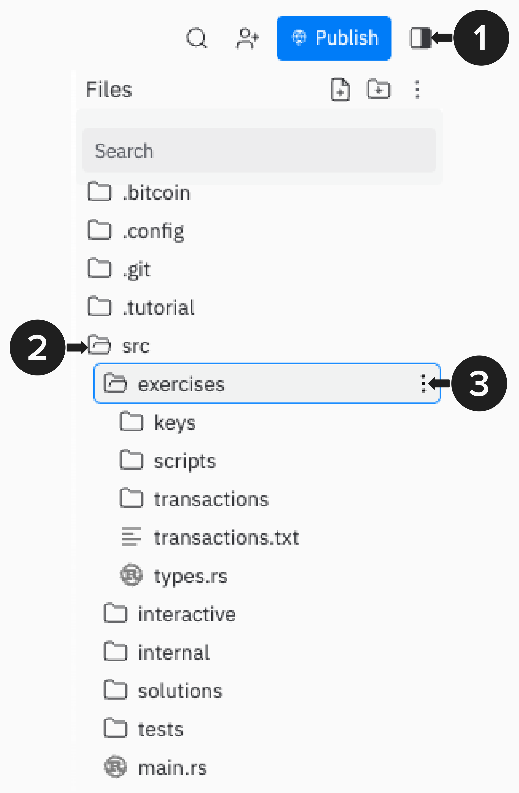

# Welcome to Programming Lightning: Intro to Payment Channels

Welcome to Programming Lightning, a comprehensive course that teaches you how to program a Lightning payment channel from scratch! By the end of this course, your implementation will pass some of the major [BOLT 3 Test Vectors](https://github.com/lightning/bolts/blob/master/03-transactions.md#appendix-b-funding-transaction-test-vectors). Test Vectors are pre-defined inputs and expected outputs that verify your code correctly implements the protocol. Passing these tests means your implementation is well on its way to being interoperable with production Lightning implementations like LND, LDK, Eclair, and Core Lightning.

In this course, we'll build payment channels from the ground up, starting with our Lightning wallet. Once we have that foundation, we'll explore the simplest possible payment channel and examine its limitations. Then, step by step, we'll address each weakness and build toward a full, BOLT-compliant Lightning channel in all its glory.

# Prerequisites

This course assumes you have already read or understand the information contained in **Mastering Bitcoin** and/or **Programming Bitcoin**. To get the most out of this course, you should have a working understanding of Bitcoin transactions and script. If you'd like to brush up beforehand, here are a few excellent resources:
- Script (Free): https://learnmeabitcoin.com/technical/script/
- Transactions (Free): https://learnmeabitcoin.com/technical/transaction/
- Transactions + Script ($120): https://www.udemy.com/course/base58-bitcoin-transactions-one/

# Replit

While Programming Lightning is open source and can be completed locally on your machine, it's likely easiest to complete the course on Replit. Once you fork (aka "Remix") the **Programming Lightning: Intro to Payment Channels** Repl, you'll be able to open the course. It's recommended to use a **2-pane setup** with the **Tutorial** on one side and the following tabs on the other side:
- `src/exercises/transactions.txt`
- Replit Shell
- Replit Console

**This is what that would look like**:
<p align="center" style="width: 50%; max-width: 300px;">
  
</p>

# Rust
This course relies heavily on the Rust programming language and ecosystem. For this section of Programming Lightning, **Intro to Payment Channels**, we will be using [**Rust Bitcoin**](https://github.com/rust-bitcoin/rust-bitcoin) and do not assume *any* prior knowledge of Rust. 

# Course Exercises

As you work through the course, you will come across emojis that signal an exercise is coming up.  Here's a quick overview of what you will see and what each emoji means:

### Command Line Exercises

👉 This emoji means the following console command should be copied and pasted into your **Shell**:
```
// some command or code will be here, with a copy button on the right ->
```

### Coding Exercises
⚡️ You'll see a lightning bolt when it's time to start a programming exercise. All programming exercises in this course will have the following two types of dropdowns, which you can use to help you complete each exercise.
1. **💡 Hint 💡**: Provides useful tips and direction to help you complete the exercises, but it does not provide the full answer itself.
2. **Step-By-Step Instructions**: Provides detailed directions for how to complete the exercise.

All coding exercises are located within the `src/exercises` folder. To find this folder, open Replit's File Explorer in the top right of this workbook. An image has been provided below to help.
<p align="center" style="width: 50%; max-width: 300px;">
  
</p>

> 💡 NOTE: If you get stuck, don't worry! There is a `src/solutions` folder which contains the answers for each coding exercise.

# A Special Thanks
First, a special thanks to John Cantrell who began working on a Programming Lightning workshop a few years ago. This course builds on John's initial template.

Second, throughout this course, you'll see many transaction diagrams designed to help you understand what's going on "under the hood" while providing enough abstraction to see the bigger picture. These diagrams are based on ones created by Elle Mouton in her article, [Opening and announcing a pre-taproot LN channel](https://ellemouton.com/posts/open_channel_pre_taproot/). Elle's diagrams are the clearest and most concise transaction visuals I've seen. I encourage you to visit her blog!

Finally, this course was made possible through grants from [Spiral](https://spiral.xyz/) and, recently, the [Human Rights Foundation (HRF)](https://hrf.org/).

# Version History

**Current Version: v1.0.0** (January 2026)

This course is actively maintained. If I make any updates, they will be documented here in future versions.
