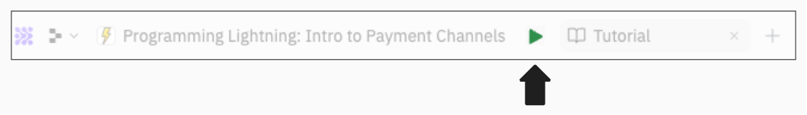
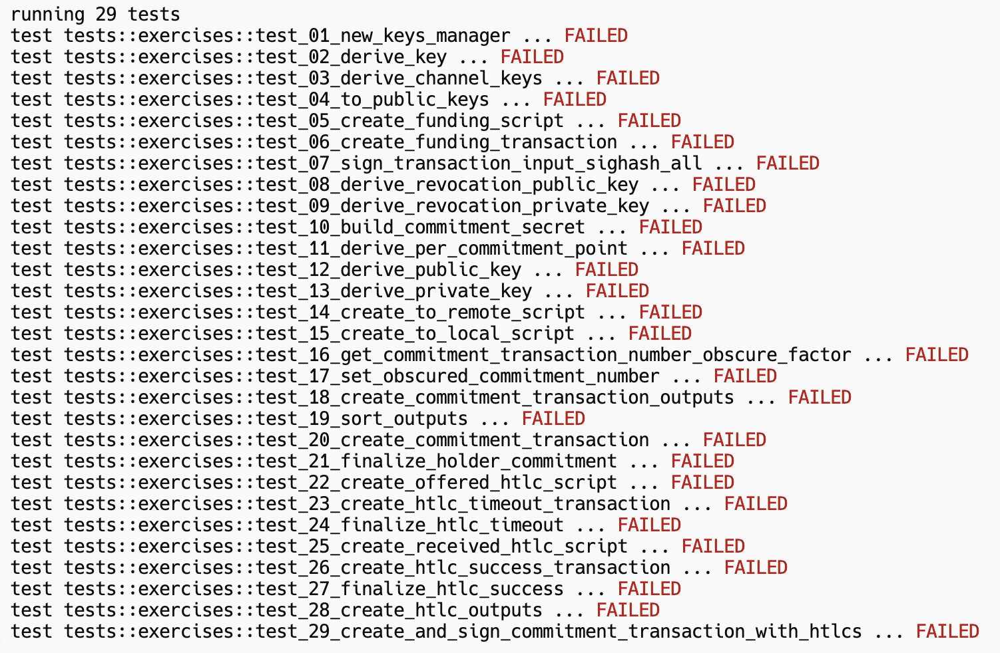
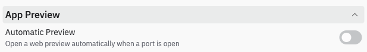

#  Environment Setup

For some of the exercises in this course, we'll need the **Bitcoin Core daemon (bitcoind)** running on Regtest. Lucky for us, Replit makes everything easy - all we have to do is run the below command, and Replit will set everything up for us.

👉 Run this in your **Shell** to get your environment set up:
```
./start.sh
```

When you run this command, the Repl will first check if bitcoind is running. If it's not, it will start it up. If it's already running, the console will simply return `bitcoind already running.`.

<details>
  <summary>What is bitcoind?</summary>

**bitcoind** is a **daemon** (background process) that runs Bitcoin Core on your computer or, in this case, within this Repl. A background process operates behind the scenes, without requiring direct user interaction. For **bitcoind**, this means running a full Bitcoin node to handle tasks such as validating new blocks, propagating transactions to other peers, and storing newly validated blocks and UTXOs (unspent transaction outputs). Bitcoin Core also provides a **command-line interface** (**CLI**) tool called **bitcoin-cli** that lets us interact with the bitcoind daemon. For example, we can use it to sign transactions with Bitcoin Core's wallet, broadcast transactions, retrieve mempool information, and much more.

To interact with **bitcoind**, you'll type `bitcoin-cli` in your terminal followed by a command (more on this soon!).

</details>

#  Testing
As we continue through this course, we'll build our intuition for how Lightning works by implementing it ourselves. To help you verify your work, each function that we implement in this course will have a test associated with it. If your implementation is correct, you should see that you've passed the test for that function.

Try clicking the **Run** button at the top-left of our Repl.

<p align="center" style="width: 50%; max-width: 300px;">
  
</p>

Once you click it, check the **Console** tab - you should see that all tests are failing. This makes sense, since we haven't completed anything yet.

<p align="center" style="width: 50%; max-width: 300px;">
  
</p>

## (Optional) Turn Off Automatic Webview
When we start Bitcoin Core, Replit detects that a port has been opened, so it opens a "Webview". You can easily close this window and move on with the rest of the course. However, if you'd like to stop Replit from automatically opening a "Webview", you can follow the below steps. Note, this will turn off webviews from opening across ***all*** of your Repls, so make sure to turn it back on if you need it later.

#### Step 1: Open User Settings
Click to open a new tab and search for "User Settings". Once you see it, click it to open the User Settings options.
<p align="center" style="width: 50%; max-width: 300px;">
  
</p>

#### Step 2: Disable Automatic Preview
Toward the bottom of the User Settings, you should see App Preview. Under "Automatic Preview", click the toggle such that the toggle is **not** blue anymore.
<p align="center" style="width: 50%; max-width: 300px;">
  
</p>


##  If you see this error...
Chances are pretty good that your Replit will go idle when completing this course. When this happens, Replit may shut down Bitcoin Core in an effort to reduce resource usage, since it assumes you're no longer here. This is much more likely to happen if you have a free account.

If this happens to you, you'll notice it because you may see the error below when completing a command line exercise.

<p align="center" style="width: 50%; max-width: 300px;">
  
</p>

If you see this, no need to worry! Just run the below command in your **Shell** to get bitcoind running again:

```
./start.sh
```