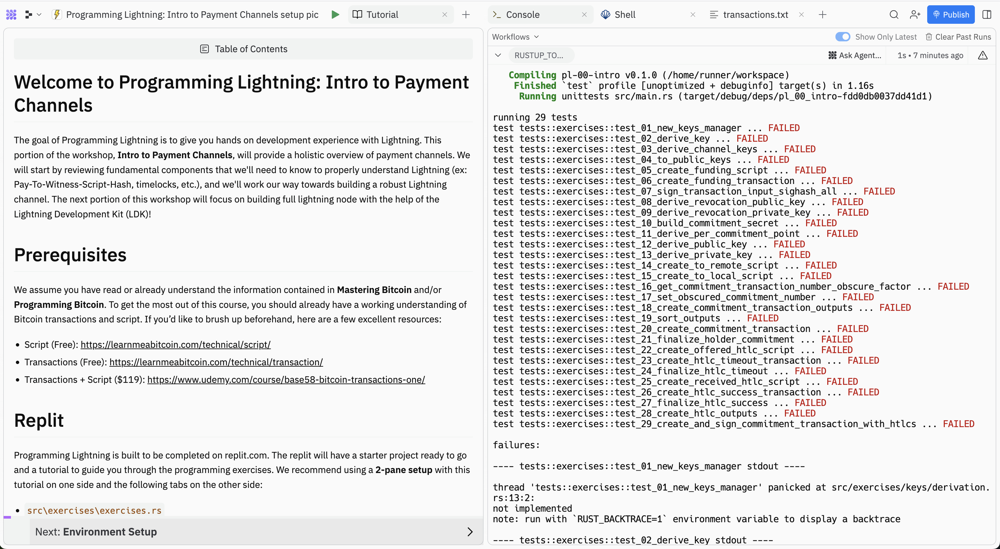

# Welcome to Programming Lightning: Intro to Payment Channels

Welcome to Programming Lightning! This course, inspired by [Programming Bitcoin](https://github.com/jimmysong/programmingbitcoin), is to learn how Bitcoin's Lightning Network works by programming it ourselves. Of course, we won't program a fully-functioning Lightning node. Instead, we'll build some of the core components from scratch, helping us develop a deep understanding and intuition for how Lightning works.

This portion of the course, **Intro to Payment Channels**, will provide a holistic overview of payment channels. We'll start by introducing a very naive payment channel - one that won't really work in the "real world". Then, step by step, we'll improve our payment channel, ultimately building a full Lightning payment channel ourselves. To successfully complete this portion of the course, you'll need to pass test vectors outlined in [BOLT 3](https://github.com/lightning/bolts/blob/master/03-transactions.md), meaning that your code is compliant with the Lightning specification! If this doesn't make sense to you, don't worry. We'll learn more about the Lightning Specification during this course. In the meantime, strap in - this is going to be a wild ride!

# Prerequisites

This course assumes you have already read or understand the information contained in **Mastering Bitcoin** and/or **Programming Bitcoin**. To get the most out of this course, you should have a working understanding of Bitcoin transactions and script. If you’d like to brush up beforehand, here are a few excellent resources:
- Script (Free): https://learnmeabitcoin.com/technical/script/
- Transactions (Free): https://learnmeabitcoin.com/technical/transaction/
- Transactions + Script ($120): https://www.udemy.com/course/base58-bitcoin-transactions-one/

# Replit

While Programming Lightning is open source and can be completed locally on your machine, it's likely easiest to complete the the course on Replit. Once you fork (aka "Remix) the **Programming Lightning: Intro to Payment Channels** Repl, you'll be able to open the workshop. It's recommend to use a **2-pane setup** with the **Tutorial** on one side and the following tabs on the other side:
- `src\exercises\transactions.txt`
- Replit Shell
- Replit Console

**This is what that would look like**:
<p align="center" style="width: 50%; max-width: 300px;">
  
</p>


# Rust

This workshop relies heavily on the Rust programming language and ecosystem. For this section of Programming Lightning, **Intro to Payment Channels**, we will be using **rust-bitcoin** and do not assume *any* prior knowledge of Rust. 

# Using the Workshop

Along the way you will come across emojis that signify something important.  Here's a quick overview of what you will see and what they mean:
<br/><br/>
👉 This emoji means the following console command or should be copy-and-pasted into your **Shell** and executed:
```
// some command or code will be here, with a copy button on the right
```
⚡️ You'll see a lightning bolt when it's time to start a programming exercise
<br/><br/>

# A Special Thanks
- During this workshop, you'll see many transaction diagrams that are meant to help you understand what is going on "under the hood" while also providing enough of an abstraction so that it's easier to see the bigger picture. Please note, these transaction diagram are based on the diagrams created by **Elle Mouton** in her article, [Opening and announcing a pre-taproot LN channel](https://ellemouton.com/posts/open_channel_pre_taproot/). Elle's diagrams are, by far, the most clear and concise transaction visuals I've seen. I encourage you to visit her blog!
- In the same transaction diagrams mentioned above, you'll also notice that icons are used to represent *locking to a public key* and *provding a signature*. These icons are inspired by [Base58's LARP](https://www.base58.info/classes/larp). These diagrams are meant to provide a visual aid so that it's easier to keep track of which key is used in various locking scripts. If you're interested in learning more about the Bitcoin protocol, I encourage you to check out Base58's website!