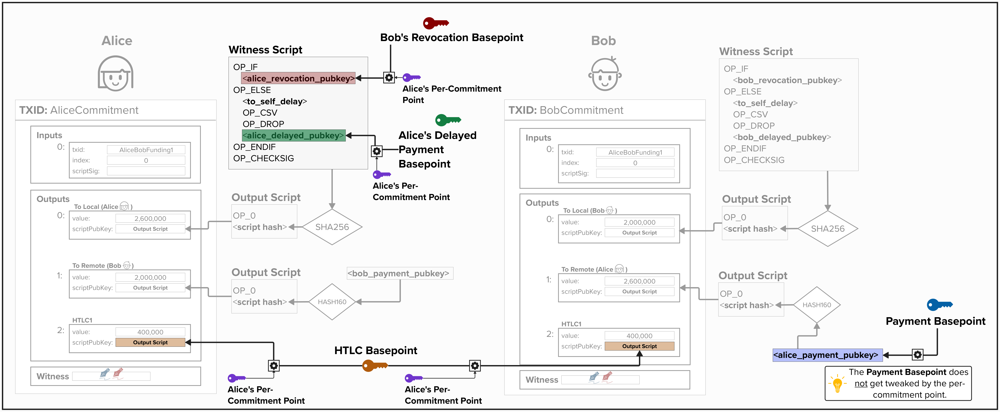
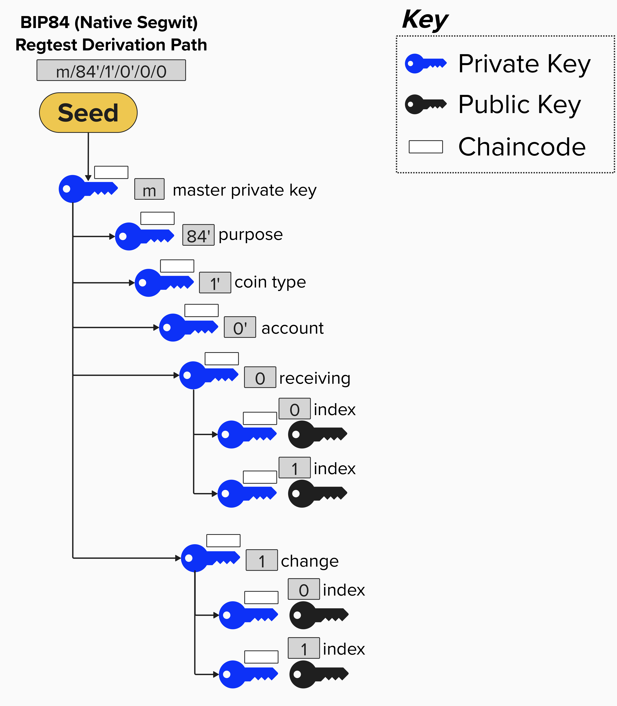

# Lightning Wallet
Before we begin our journey into Lightning Network transactions themselves, we'll need to build a **wallet** that can provide us with all of the cryptographic material (ex: public and private keys) we'll need! If you own self-custody bitcoin, then you already have a wallet! However, as we'll soon learn, the Lightning protocol utilizes many different keys, so we'll need to create a specific wallet just for our Lightning channels. If you'd like a quick refresher on elliptic curve cryptography and what a public/private key is, **learn me a bitcoin** provides an excellent resource [here](https://learnmeabitcoin.com/technical/cryptography/elliptic-curve/).

This section is a little like eating your vegetables; it may not be your favorite thing to do, but it's a required pre-requisite to gain a strong and intuitive understanding of how Lightning works. 

## Starting With The End In Mind
Let's start with a brief spoiler alert! At it's core, the Lightning Network is a protocol that defines how multiple parties can *update* bitcoin transactions such that bitcoin is trustlessly transfered between and across parties. These transactions have multiple spending paths, each representing a specific condition under which bitcoin can be spent. Crucially, each spending path will utilize a unique public key.

The diagram below should help provide some intuition for this concept. If the diagram doesn't make sense to you, don't worry. At this point in the course, we haven't reviewed anything yet! For now, the key takeaway is that the bitcoin transactions have multiple spending paths with muliple public keys. For example, imagine Alice has a Lightning channel with Bob. Alice, on the left side in the below diagram, will have two outputs on her bitcoin transaction. One output is simply locked to a **Pay-To-Witness-Public-Key-Hash**. The other output is locked to a **Pay-To-Witness-Script-Hash** output, which has two spending paths. Each spending path has its own unique public key embdedded in it. If you have good attention to detail, you'll notice that both Alice and Bob are providing public keys in the diagram below. We'll learn more about all of these nuances in a moment!

The most important thing to take away from this diagram is the following:
- We'll need **different** public keys - one for each spending path.
- *Most* of the public keys that are placed in each spending path are a **combination** of two public keys: a **basepoint** and a **per commitment point**. We'll cover both of these shortly.

💡 PRO TIP: There will be a LOT of diagrams throughout this course. They may be hard to see at first, but if you zoom in, they should render quite nicely!

<p align="center" style="width: 50%; max-width: 300px;">
  
</p>

Below is a list of the **basepoints** and **basepoint secrets** used in the Lightning Network. A "basepoint" is simply a bitcoin public key (a point on the secp256k1 elliptic curve). However, it's called a "basepoint" in the protocol because the public key is, usually, not used directly in a bitcoin transaction. Instead, it's combined with other public keys, creating a unique public key for each transaction.

Since we haven't learned how Lightning works yet, it's hard to descrine what each of these keys is used for. Therefore, at this point, we'll just specify each basepoint and data structure. As we begin to program our Lightning channels, we'll learn *much* more about each and its specific purpose.
  - **Revocation Basepoint Secret**: Secret Key
  - **Revocation Basepoint**: Public Key
  - **Payment Basepoint Secret**: Secret Key
  - **Payment Basepoint**: Public Key
  - **Delayed Payment Secret**: Secret Key
  - **Delayed Payment**: Public Key
  - **HTLC Basepoint Secret**: Secret Key
  - **HTLC Basepoint**: Public Key
  - **Commitment Seed**: The commitment seed is a 256-bit scalar used to generate a series of secrets **for each state**. As we'll soon learn, these secrets will combined with the above basepoints/secrets to generate the private and public keys used in each Lightning transaction's output script.

#### Question: Now that we've reviewed the various types of public and private keys we'll need to program our Lightning implementation, can you think of an effective way to organize these keys?
<details>
  <summary>Answer</summary>

The naive approach would be to generate a new random private key for each key type (Revocation, Payment, Delayed Payment, HTLC, and Commitment Seed). But that would mean we need to back up five separate secrets *per channel*. That doesn't sound efficient or safe!

A better option is to leverage **BIP32 hierarchical deterministic (HD) key derivation**, whereby we can use one single seed and deterministially generate a series of *child* public and private keys from that seed. This is much more efficient and safe, as we only need to safely manage one seed.

Next, we'll explore using BIP32 to derive all of the keys we'll need to implement our Lightning channel.

</details>

## Lightning Off-Chain Wallet Strucure
At this point, we have a general idea of *which* keys we'll need to use in our Lightning implementation. That said, we don't yet know what they will be used for, but that will come in due time! Let's set the scene by briefly reviewing **Bitcoin Improvement Proposal (BIP) 32**.

BIP 32  describes a **hierarchical deterministic** (**HD**) wallet structure and introduces the following characteristics for key management:
- **Single Source**: All public and private keys can be derived from a single seed. As long as you have access to the seed, you can re-derive the entire wallet.
- **Hierarchical**: All keys can be organized into a tree structure.
- **Deterministic**: All keys are generated the same exact way. Each time you restore you wallet from your seed, you'll get the exact same result.

### Derivation Paths
A few important BIPs, such as [BIP 43](https://bips.dev/43/) and [BIP 44](https://bips.dev/44/), build on BIP 32 and describe the following derivation scheme that can be used to organize keys.

```
m / purpose' / coin_type' / account' / change / address_index
```

<p align="center" style="width: 50%; max-width: 300px;">
  
</p>

Here is how to interpret the above scheme:
- `m`: This is the master extended key for the wallet.
- `/`: Whenever you see this, we are deriving a new child key.
- `purpose'`: The purpose specifies the wallet structure. The value in this field reflects the BIP that describes the wallet scheme for a specific output type. For example, `m/84'` means that this wallet structure follows the derivation scheme described in [BIP 84](https://bips.dev/84/) and uses Pay-To-Witness-Public-Key-Hash (P2WPKH) serialization format. Since there is a `'`, we know this path is [hardened](https://learnmeabitcoin.com/technical/keys/hd-wallets/extended-keys/#extended-private-key-hardened).
- `coin_type'`: This represents the cryptocurrency that we're derving keys for. A coin type path was included in the BIP so that hardware wallets can support multiple cryptocurrencies using a single seed. For example, `0` is Bitcoin, `1` is also Bitcoin (Not mainnet, so testnet, regtest, etc.), `2` is Litecoin. You can see the list [here](https://github.com/satoshilabs/slips/blob/master/slip-0044.md).
- `account'`: This allows wallet users to create separate "accounts" to separate their funds.
- `receiving/change`: This field separates into a **receiving** (`0`) index and **change** (`1`) index such that users can generate separate addresses, depending on if they are receiving payments or generating change addresses. NOTE: these are **normal children**, meaning they will have corresponding **extended public keys** which can derive child public keys without needing to know the private key.
- `index`: The index field specifies the actual keys used to generate addresses and receive bitcoin. The above levels in the HD wallet provide the structure that ultimately points to one of these keys, enabling efficient and deterministic organization.

Fun Fact: The above key derivation scheme is actually very similar to how the [Lightning Network Deamon (LND)](https://github.com/lightningnetwork/lnd) derives Lightning keys.

### Implementing Our Wallet
We'll leverage the HD wallet structure to build our Lightning wallet, as this will enable us to derive all of the keys we need from a single seed. Below is an image depicting our wallet architecture. 

<p align="center" style="width: 50%; max-width: 300px;">
  
</p>

Here is how to interpret the above scheme:
- `m`: This is the master extended key for the wallet, derived from our wallet's seed.
- `purpose'`: We'll use `1017'` for the purpose. This is the value that LND uses. Since our key derivation scheme is LND-inspired, we'll use it too! That said, it's an arbitrary choice and not specified in any Bitcoin or Lightning protocol specification. We're simply using it as a unique value to plug into the derivation scheme.
- `coin_type'`: Since we're testing our Lightning implementation against the BOLT Test Vectors, we'll use `0` for this course. Remember, `0` is mainnet bitcoin.
- `account'`: This is where the magic happens. We'll specify a specific **key family** for each `account`. This will enable us to deterministically derive unique public and private keys for each channel our Lightning node opens.
- `receiving`: We won't be generating any change addresses with this field, so we'll keep `0` (receiving) as a default value here.
- `index`: The index will be unique for each channel we open.

By leveraging this architecture, we can create all of the public key, private key, and seed information that we'll need to operate our Lightning channel! Remember, at this point, you don't need to understand what these keys are used for yet. What's important is that you understand *how* we derive our keys.

## ⚡️ Build a KeysManager
Let's put the above theory into practice! Over the next few exercises, we're going to use [**rust bitcoin**](https://docs.rs/bitcoin/latest/bitcoin/) to implement an HD wallet that can manage and derive the keys we'll need for our Lightning channel. Cool, eh!?

We'll start by creating a new `KeysManager` from a seed (random 256-bit value). The `KeysManager` is a custom type defined in `src/exercises/types.rs` and can be seen in the dropdown below. The `types.rs` file contains all of the custom types we'll be using for this course. Feel free to check it out!

<details>
  <summary>Click to see KeysManager</summary>

As you can see below, the `KeysManager` is a simple struct that holds three major components for our HD wallet:

1. **`secp_ctx`**: The secp256k1 context that we'll use for all cryptographic operations (signing transactions, deriving public keys, etc.).

2. **`master_key`**: The root extended private key (`Xpriv`) for our HD wallet. This is derived directly from our seed and serves as the starting point for deriving all other keys we'll need. This is the master key (`m`) in the derivation path we reviewed earlier!

3. **`network`**: The Bitcoin network we're operating on (mainnet, testnet, regtest, etc.). This is important because, as we just learned, the key derivation will differ depending on the network, as changing the network will result in a different path in the tree.

```rust
pub struct KeysManager {
    pub secp_ctx: Secp256k1<All>,
    pub master_key: Xpriv,
    pub network: Network,
}
```

</details>

Head over to `src/exercises/keys/derivation.rs`, and let's implement our first function!

This function, `new_keys_manager`, will take a `seed` and Bitcoin `network`, and it will return a `KeysManager` with the master key that will anchor our entire Lightning wallet.

```rust
pub fn new_keys_manager(seed: [u8; 32], network: Network) -> KeysManager {
    let secp_ctx = Secp256k1::new();
    let master_key = Xpriv::new_master(network, &seed).expect("Valid seed");

    KeysManager {
        secp_ctx,
        master_key,
        network,
    }
}
```

<details>
  <summary>💡 Hint 💡</summary>

To complete this exercise, you'll need to ultimately return a `KeysManager` object, which contains the **secp256k1 context**, **extended master key** (from the seed), and the Bitcoin network for the HD wallet.

Rust Bitcoin re-exports the `rust-secp256k1` crate, so we can import the secp256k1 library from bitcoin using the following syntax: `use bitcoin::secp256k1::`. If you visit the [rust-secp256k1 docs](https://docs.rs/secp256k1/0.31.1/secp256k1/) for , you'll see how to create a new context. HINT: it's `let secp = ...`.

To create a new master extended private key, see the rust bitcoin docs [here](https://docs.rs/bitcoin/0.32.0/bitcoin/bip32/struct.Xpriv.html#method.new_master)!

Below is a hint to help get you started. As you can see, the return object is provided for you!

```rust
pub fn new_keys_manager(seed: [u8; 32], network: Network) -> KeysManager {

  // initialize secp256k1 context
  // create extended master key from seed

  // return KeysManager
  KeysManager {
      secp_ctx,
      master_key,
      network,
  }
}
```

</details>


<details>
  <summary>Step 1: Initialize the Secp256k1 Context</summary>
  
Since our HD wallet will need to perform cryptographic operations (key derivation, signing), we'll start by creating a secp256k1 context.

```rust
let secp_ctx = Secp256k1::new();
```

The `Secp256k1` type comes from the `bitcoin::secp256k1` module, which is imported at the top of the `derivation.rs` file.

</details>

<details>
  <summary>Step 2: Derive the Master Key from the Seed</summary>

Remember, our function takes a 32-byte `seed` as input, so we can use it to generate a BIP-32 extended private key (master key) from which all other keys will be derived!

To do this, we'll leverage the `Xpriv` type, provided by the `bip32` module in rust-bitcoin. Since extended keys include network-specific version bytes in their serialization, we'll need to pass `network` to the `new_master` function available on the `Xpriv` type.

This function will return a `Result` type, so we'll need to unwrap it before we can use it. In a robust application, we will want to handle this error more precisely.

```rust
let master_key = Xpriv::new_master(network, &seed).unwrap();
```
</details>

<details>
  <summary>Step 3: Construct and Return the KeysManager Struct</summary>

Finally, let's assemble all the above components into our `KeysManager` struct and return it!

```rust
KeysManager {
    secp_ctx,
    master_key,
    network,
}
```
</details>


## ⚡️ Derive Private Key
Now that we have our `KeysManager`, which holds our master key, `m`, let's implement a function that can derive a private key from the derivation path we reviewed earlier (also seen below). This function will enable us to derive all of the private keys (and, subsequently, public keys) that we'll need to use for our Lightning transactions.
```
m / purpose' / coin_type' / key_family' / change / channel_id_index
```
To complete this exercise, you'll need to implement the `derive_key` function on the `KeysManager` that we initialized in the prior exercise. In Rust, we implement methods on a struct using the `impl` keyword. Within an `impl` method, you'll have access to the struct's internal fields. For example, in this case, you'll have access to the master key, which you can use to derive new child private keys at the specified derivation path!

Speaking of derivation paths, there is a new type that we'll need to use for this exercise: `KeyFamily`. As we learned earlier, the **key family** acts as the `account` in our derivation path and specifies the use of the keys being derived. Similar to `KeysManager`, `KeyFamily` is a custom type defined in `src/exercises/types.rs`. Click the dropdown to learn more.

<details>
  <summary>Click to see KeyFamily</summary>

The `KeyFamily` enum defines the different **types** of keys our Lightning node needs to derive. Each variant corresponds to a specific use case in Lightning channels. Again, don't worry if you don't know what these keys are used for yet - we'll get to that later!

```rust
#[derive(Debug, Clone, Copy, PartialEq)]
pub enum KeyFamily {
    MultiSig = 0,
    RevocationBase = 1,
    HtlcBase = 2,
    PaymentBase = 3,
    DelayBase = 4,
    CommitmentSeed = 5,
    NodeKey = 6,
}
```
Each variant has a numeric value that slots into the **account** position of our derivation path:
```
m / 1017' / 0' / <key_family>' / 0 / <channel_id_index>
                      ↑
                    Here!
```
For example, when we need to derive a key for the funding multisig, we'd use `KeyFamily::MultiSig` (which equals `0`), giving us the path `m/1017'/0'/0'/0/<channel_id_index>`.
</details>

```rust
impl KeysManager {
    pub fn derive_key(&self, key_family: KeyFamily, channel_id_index: u32) -> SecretKey {
        // Path: m/1017'/0'/<key_family>'/0/<channel_id_index>
        let path_str = format!("m/1017'/0'/{}'/0/{}", key_family as u32, channel_id_index);
        let path = DerivationPath::from_str(&path_str).expect("Valid derivation path");

        let derived = self
            .master_key
            .derive_priv(&self.secp_ctx, &path)
            .expect("Valid derivation");

        derived.private_key
    }
}
```

<details>
  <summary>💡 Hint 💡</summary>

To complete this exercise, you'll need to return the `SecretKey` that corresponds to the `KeyFamily` and `channel_id_index` that is passed into the function. For example, if the following values are passed into the `derive_key` function...
- `key_family`: `KeyFamily::MultiSig`
- `channel_id_index`: `0`

... then you would need to return the private key associated with the `MultiSig` key type for Channel Index 0. The derivation path would be the following:
```
m / 1017' / 0' / 0' / 0 / 0
```
The below two docs should be very helpful in this exercise.
1. You can define a derivation path using the [`from_str` method available on the `DerivationPath` struct](https://docs.rs/bitcoin/0.32.0/bitcoin/bip32/struct.DerivationPath.html) in Rust Bitcoin.
2. You can derive a new private key using the [`derive_priv` method available on the `Xpriv` struct](https://docs.rs/bitcoin/0.32.0/bitcoin/bip32/struct.Xpriv.html#method.derive_priv).

> Note that `derive_priv` returns an extended private key (`Xpriv`), but the function that we're completing in this exercise returns a `SecretKey`. To  extract the secret key from the extended private key, you can use the below notation.

```rust
extended_priv_key.private_key
```

</details>


<details>
  <summary>Step 1: Construct the Derivation Path String</summary>

The first thing we need to do is define the derivation path for the given Key Family and Channel ID Index. One intuitive and straightforward way to do this is by using the `from_str` method available on the `DerivationPath` struct. 

To do this, we can first define a string that represents the derivation path. Remember, our path follows this structure:
```
m / 1017' / 0' / <key_family>' / 0 / <channel_id_index>
```

We can use Rust's `format!` macro to build this string dynamically, plugging in our `key_family` and `channel_id_index` values. Note that we need to cast `key_family` to a `u32` to get its numeric value!

```rust
let path_str = format!("m/1017'/0'/{}'/0/{}", key_family as u32, channel_id_index);
```

</details>

<details>
  <summary>Step 2: Parse the String into a DerivationPath</summary>

Now that we have our path as a string, we need to convert it into a `DerivationPath` type that Rust Bitcoin can actually use for key derivation. As mentioned earlier, we can use the `DerivationPath::from_str()` function to do this for us.

This function returns a `Result`, so we'll use `.expect()` to unwrap it.

```rust
let path = DerivationPath::from_str(&path_str).expect("Valid derivation path");
```

</details>

<details>
  <summary>Step 3: Derive the Child Private Key</summary>

Here's where the magic happens! Now that we have the derivation path specified, we'll use our `master_key` to derive a child private key at the specified path. The `derive_priv` method takes two arguments: our secp256k1 context and the derivation path we just created.

Since this is an `impl` function, we can access the `KeysManager`'s internal fields using `self`.

```rust
let derived = self
    .master_key
    .derive_priv(&self.secp_ctx, &path)
    .expect("Valid derivation");
```

</details>

<details>
  <summary>Step 4: Extract and Return the Secret Key</summary>

The `derive_priv` function returns an `Xpriv` (extended private key), but we just need the raw `SecretKey` for our Lightning operations. We can extract it from the `private_key` field and return it!

```rust
derived.private_key
```

</details>

## ⚡️ Derive Channel Keys
Great work! We're well on our way to building a wallet that can power our Lightning implementation. Let's continue our journey by creating a function that generates all of the keys and cryptographic material we'll need during the rest of this course.

To complete this exercise, you'll need to implement the `derive_channel_keys` function on our `KeysManager`. It takes a `channel_id_index`, which represents a unique index for each Lightning channel that we open, and passes it into the `derive_key` function we implemented in the prior exercise.

The function returns a `ChannelKeyManager`, which is a struct that holds all of the cryptographic material we need for a given channel. You'll derive the correct key for each key family using `derive_key`, then assemble them into a `ChannelKeyManager`.

<details>
  <summary>Click to see ChannelKeyManager</summary>

The `ChannelKeyManager` holds the specific set of keys for a **single Lightning channel**.
```rust
pub struct ChannelKeyManager {
    pub funding_key: SecretKey,
    pub revocation_basepoint_secret: SecretKey,
    pub payment_basepoint_secret: SecretKey,
    pub delayed_payment_basepoint_secret: SecretKey,
    pub htlc_basepoint_secret: SecretKey,
    pub commitment_seed: [u8; 32],
    pub secp_ctx: Secp256k1,
}
```
</details>

```rust
impl KeysManager {
    pub fn derive_channel_keys(&self, channel_id_index: u32) -> ChannelKeyManager {
        // Use derive_key for each key family
        let funding_key = self.derive_key(KeyFamily::MultiSig, channel_id_index);
        let revocation_basepoint_secret = self.derive_key(KeyFamily::RevocationBase, channel_id_index);
        let payment_basepoint_secret = self.derive_key(KeyFamily::PaymentBase, channel_id_index);
        let delayed_payment_basepoint_secret = self.derive_key(KeyFamily::DelayBase, channel_id_index);
        let htlc_basepoint_secret = self.derive_key(KeyFamily::HtlcBase, channel_id_index);
        let commitment_seed = self
            .derive_key(KeyFamily::CommitmentSeed, channel_id_index)
            .secret_bytes();
        ChannelKeyManager {
            funding_key,
            revocation_basepoint_secret,
            payment_basepoint_secret,
            delayed_payment_basepoint_secret,
            htlc_basepoint_secret,
            commitment_seed,
            secp_ctx: self.secp_ctx.clone(),
        }
    }
}
```

Remember, at this point, it's not vital that you know what each key is used for. We're purposefully holding that information until later. Each key will be introduced when we need it, which will hopefully make for a more intuitive and fruitful learning experience.


<details>
  <summary>💡 Hint 💡</summary>

To complete this exercise, you'll need to call the `derive_key` function we implemented in the prior exercise for each key type, using the appropriate `KeyFamily` variant. Here's the mapping between `ChannelKeyManager` fields and `KeyFamily` variants:

| Field | KeyFamily |
|-------|-----------|
| `funding_key` | `KeyFamily::MultiSig` |
| `revocation_basepoint_secret` | `KeyFamily::RevocationBase` |
| `payment_basepoint_secret` | `KeyFamily::PaymentBase` |
| `delayed_payment_basepoint_secret` | `KeyFamily::DelayBase` |
| `htlc_basepoint_secret` | `KeyFamily::HtlcBase` |
| `commitment_seed` | `KeyFamily::CommitmentSeed` |

For example, to derive the `funding_key`:
```rust
let funding_key = self.derive_key(KeyFamily::MultiSig, channel_id_index);
```

> **Note:** The `commitment_seed` field expects a `[u8; 32]`, not a `SecretKey`. You can convert a `SecretKey` to its raw bytes using the `secret_bytes()` method:
```rust
let commitment_seed = self.derive_key(KeyFamily::CommitmentSeed, channel_id_index).secret_bytes();
```

Don't forget to include `secp_ctx` in your `ChannelKeyManager`! To do this, you can simply clone it from `self`. Below is a hint to help get you started. As you can see, the return object is provided for you!

```rust
impl KeysManager {
  pub fn derive_channel_keys(&self, channel_id_index: u32) -> ChannelKeyManager {
        
    // derive keys for each key family

    // return ChannelKeyManager
    ChannelKeyManager {
        funding_key,
        revocation_basepoint_secret,
        payment_basepoint_secret,
        delayed_payment_basepoint_secret,
        htlc_basepoint_secret,
        commitment_seed,
        secp_ctx: self.secp_ctx.clone(),
    }
  }
}
```
</details>

<details>
  <summary>Step 1: Derive the Funding Key</summary>

Okay, you've clicked on the step-by-step instructions... let's dig into it!

We'll start by deriving the `funding_key` using the `MultiSig` key family. Note that the order in which we derive each key doesn't really matter. What ultimately matters is that we assemble the `ChannelKeyManager` with each field assigned to the correct key.

Since we're inside an `impl KeysManager` block, we can access the `derive_key` function using `self`.

```rust
let funding_key = self.derive_key(KeyFamily::MultiSig, channel_id_index);
```
</details>

<details>
  <summary>Step 2: Derive the Revocation Base Key</summary>

Next up is the `RevocationBase`. This is very similar to the last block of code you wrote!

```rust
let revocation_basepoint_secret = self.derive_key(KeyFamily::RevocationBase, channel_id_index);
```

</details>

<details>
  <summary>Step 3: Derive the Payment Base Key</summary>

At this point, you're a pro. You know what to do!

```rust
let payment_basepoint_secret = self.derive_key(KeyFamily::PaymentBase, channel_id_index);
```

</details>

<details>
  <summary>Step 4: Derive the Delayed Payment Base Key</summary>

Let's derive another!

```rust
let delayed_payment_basepoint_secret = self.derive_key(KeyFamily::DelayBase, channel_id_index);
```

</details>

<details>
  <summary>Step 5: Derive the HTLC Base Key</summary>

If you've heard that Lightning has lots of keys, you heard correctly!

```rust
let htlc_basepoint_secret = self.derive_key(KeyFamily::HtlcBase, channel_id_index);
```

</details>

<details>
  <summary>Step 6: Derive the Commitment Seed</summary>

Okay, hold on a second! The `CommitmentSeed` is a bit different from the other keys. We derive it almost the exact same way, but we need to store it as raw bytes (a 32-byte array) rather than a `SecretKey` type. Luckily, `SecretKey` has a handy `.secret_bytes()` method that gives us exactly what we need!

As we'll soon see, we store the raw bytes because we use these bytes as a **seed** and **not** a **private key**. 

```rust
let commitment_seed = self
    .derive_key(KeyFamily::CommitmentSeed, channel_id_index)
    .secret_bytes();
```

</details>

<details>
  <summary>Step 7: Construct and Return the ChannelKeyManager</summary>

Finally, let's bundle all these keys together into a `ChannelKeyManager` struct and return it! We'll also clone the secp256k1 context so our `ChannelKeyManager` can perform its own cryptographic operations.
```rust
ChannelKeyManager {
    funding_key,
    revocation_basepoint_secret,
    payment_basepoint_secret,
    delayed_payment_basepoint_secret,
    htlc_basepoint_secret,
    commitment_seed,
    secp_ctx: self.secp_ctx.clone(),
}
```

</details>