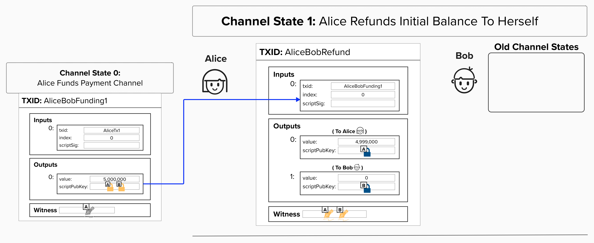
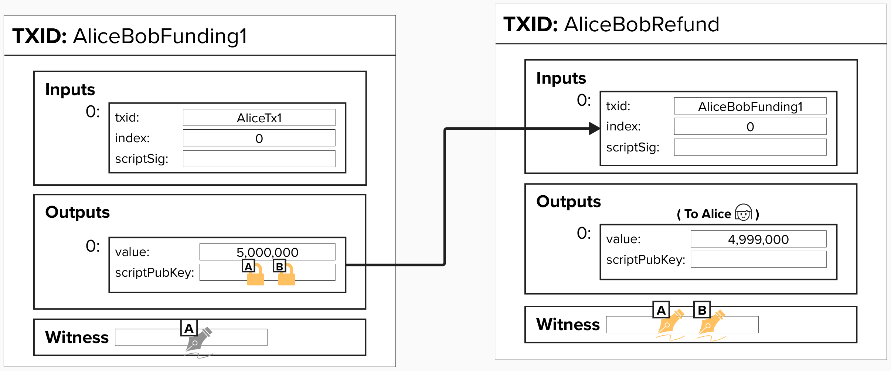
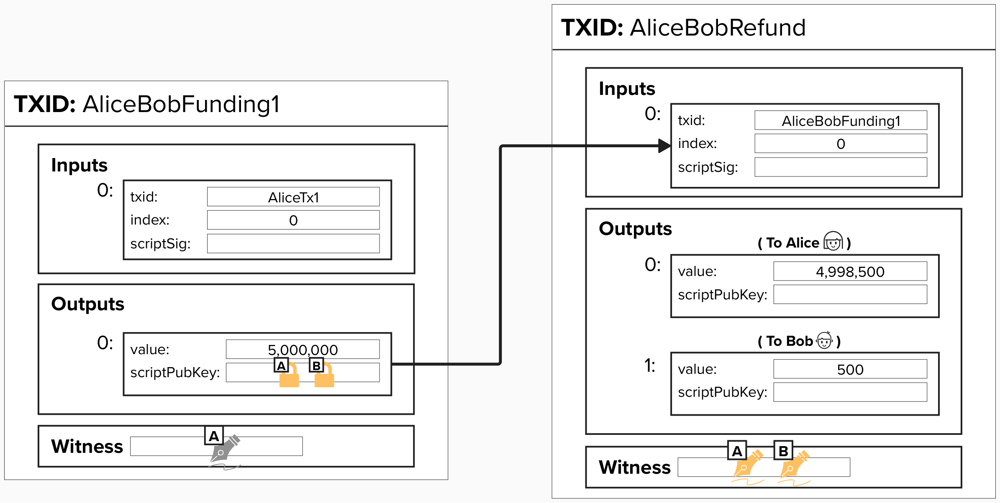
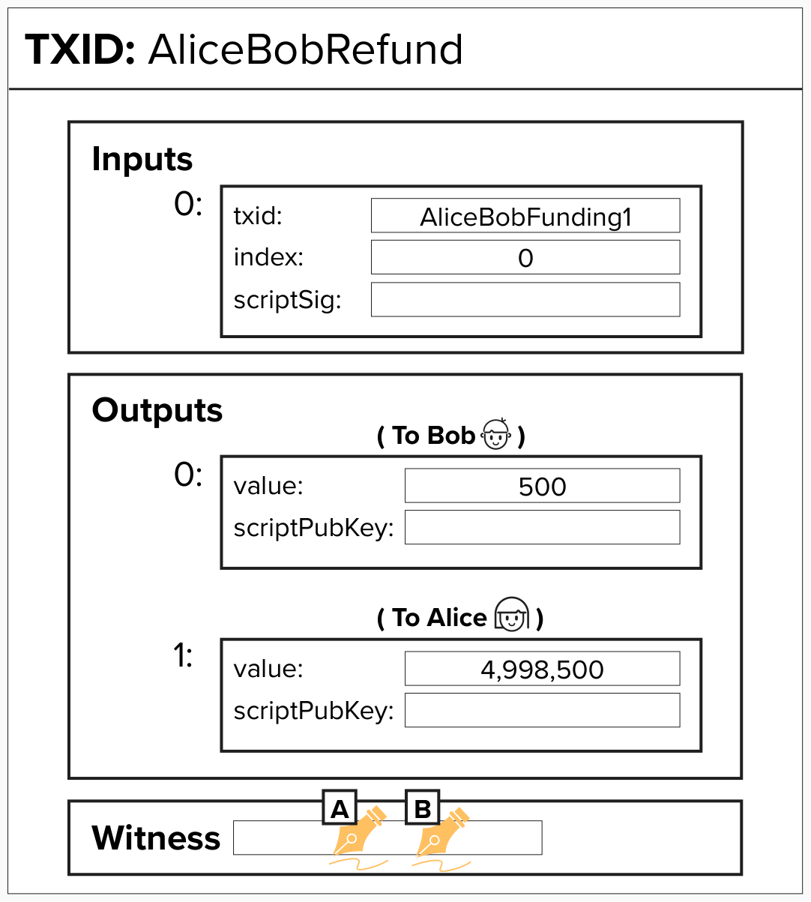
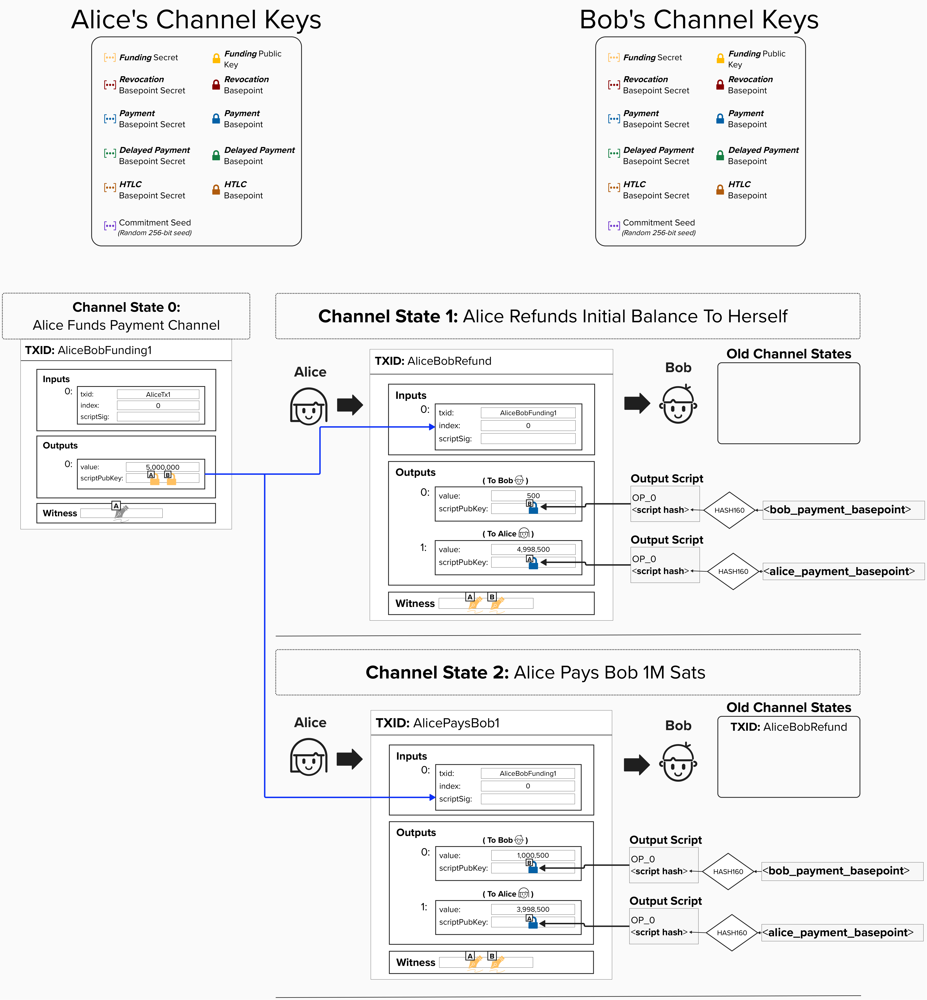
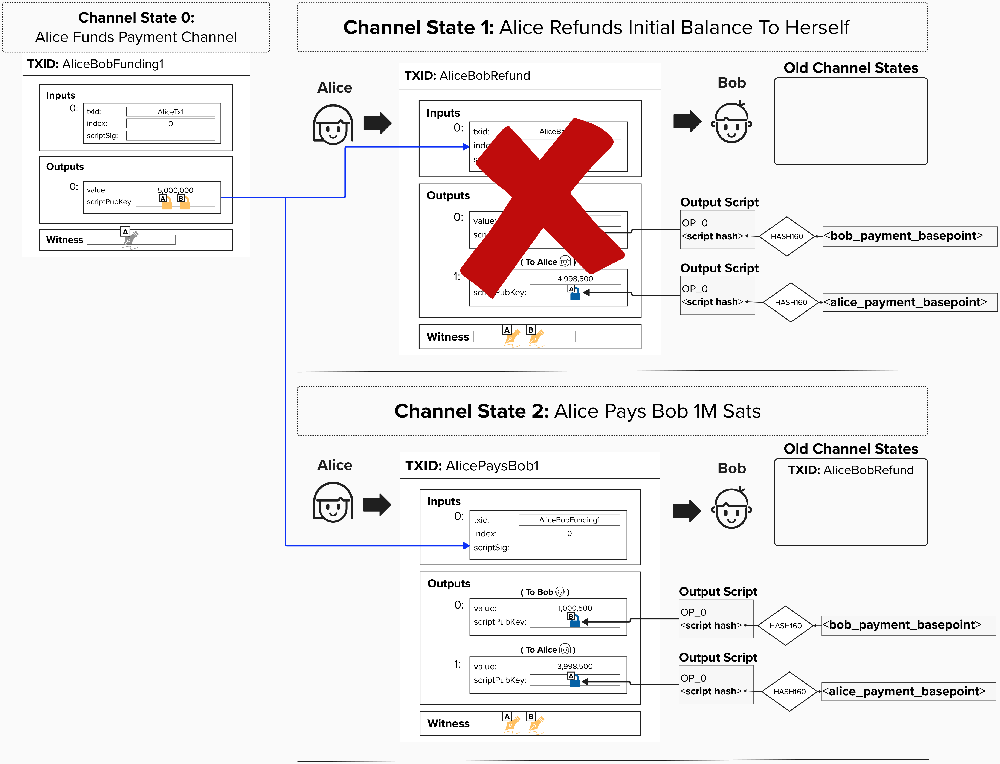

# Enhancing Our Payment Channel Refund

Okay, bear with me for a little bit! For the next few sections, we'll focus on building our intuition for how Lightning payment channels actually work. Once we have the fundamentals down, we'll get back to coding.

So far, we've learned of one construction for implementing a "refund" for our payment channel. It works, but it's not ideal, as the channel is time-bound. To address this concern, let's remove the timelock so that our channel doesn't have an arbitrary end date.

## Create A New "Refund" Transaction That Spends From The Funding Transaction

> ✅ **NOTE:** This new payment channel construction is actually how Lightning channels work, so we're back on the path to building our own modern channel from the ground up!

Another approach to ensuring Alice can retrieve her Bitcoin if Bob stops cooperating is to create a new transaction that spends from the Funding Transaction. This transaction will act as a "refund" transaction, as it will pay each channel party the amount of sats that they currently have at the time of opening the channel.

> NOTE: In the actual Lightning protocol, this transaction is not called the "refund" transaction, but we'll call it that for educational purposes.

  

#### Question: Is it safe to create the "refund" transaction *after* broadcasting the Funding Transaction?

  
Answer

**NO!**

It's vital to note that the refund transaction still needs *both* Alice and Bob's signatures to spend. Therefore, creating the refund transaction should be thought of as a critical step that needs to be completed ***before*** publishing the Funding Transaction. Otherwise, if Alice broadcasts the Funding Transaction before they have both signed the refund transaction, Bob could refuse to sign the refund transaction, effectively holding Alice's funds hostage.

#### Question: For the first channel state, Bob doesn't have any funds on his side of the channel. What should we do with his output?

  
Answer

If we tried creating a transaction with 0 sats for Bob, that would be considered non-standard and would not be relayed. Even if it was possible, it would take up extra space and make our transaction size larger, adding unnecessary fees. Since Bob has no funds on his side of the channel, we have the following two options:

1. **We can create a refund transaction with no output for Bob.**

The first option is to ***not*** include an output for Bob. This is often how Lightning payment channels begin in the "real world", as all of the funds are typically on one side of the channel when it's opened.  

  

2. **We can "push" some sats to Bob's side of the channel at the start.**

This is done by specifying an amount (in milli satoshis) in the `push_msat` field of the `open_channel` [message](https://github.com/lightning/bolts/blob/master/02-peer-protocol.md#the-open_channel-message). This can be seen as an initial payment that is sent to Bob at channel start. If you're wondering why this field was not present in the visual from earlier, remember that we simplified the `open_channel` message since we had not yet introduced all the concepts required to understand each field.

The visuals for the rest of this course will be a little smoother if Bob has an output to start, so we'll give him 500 sats because we're nice people. Fun fact: we're choosing 500 sats because it's above the [dust limit](https://github.com/lightning/bolts/blob/master/03-transactions.md#dust-limits). If it were below the dust limit, we would not generate an output for Bob, and his output would be considered [**trimmed**](https://github.com/lightning/bolts/blob/master/03-transactions.md#trimmed-outputs).

  

#### Question: Does the output order matter for the refund transaction?

  
Answer

In the context of Lightning, yes!

Remember how we ordered our public keys in the 2-of-2 Funding Transaction such that the public key that was lexicographically lesser was first? The reasoning for ordering outputs is similar. By standardizing these sorts of details, we reduce ambiguity and make it easier for channel parties in Lightning to generate signatures for each other.

For a more technical answer, note that all signatures generated for *commitment transactions* in the Lightning network will use the `SIGHASH_ALL` flag, indicating that the signature covers all of the inputs and outputs in the transaction. Therefore, if the order of the outputs were to change, it would result in a different signature!

The Lightning network spec (specifically, BOLT 3: [Transaction Output Ordering](https://github.com/lightning/bolts/blob/master/03-transactions.md#transaction-output-ordering)) specifies that outputs should be ordered in the following manner:

- First, according to their value (smallest first).
  - If there is a tie, the output with the lexicographically lesser `scriptpubkey` comes first, then selecting the shorter script (if they differ in length).
  - For HTLC outputs, if there is a tie after sorting via the above, then they are ordered in increasing `cltv_expiry` order.

If some of these words don't make sense, don't worry! We'll cover them later.

#### Now that we know how to order our outputs, below is a visual representation of what our new transaction will look like.

  

## Locking To Each Channel Party's Payment Basepoint Public Key

If you recall from our earlier exercise, when Alice makes payments to Bob, she creates new transactions that lock Bob's funds in an output only he can spend using **Bob's Payment Basepoint**. She also locks her own funds to *her* **Payment Basepoint**, which only she can spend. Since each output is locked to a public key, each output is a **Pay-To-Witness-Public-Key-Hash** (**P2WPKH**) output.

> ⚠️ **NOTE:** In the actual Lightning Network, we do not lock **both** outputs to the respective channel party's **Payment Basepoint**. However, it's useful to start with this simpler construction as we work towards understanding real Lightning channels.

In this payment channel construction, Alice creates new bitcoin transactions and sends them, along with her signature, to Bob. In the diagram below, the first channel state represents Alice's refund transaction, which allows her to claim her bitcoin if Bob disappears or refuses to cooperate. The second transaction represents a payment of 1M sats to Bob. As you can see, the sats are deducted from Alice's side of the channel and now appear on Bob's side.

In Lightning, these transactions are called **Commitment Transactions** because they "commit" to a new channel balance. Alice and Bob can pay each other as many times as they'd like. When they decide to close the channel, they simply publish the most recent transaction to the Bitcoin network.

  

## Security Flaw!

At this point, let's assume that Alice has both the Funding Transaction and Refund Transaction, which she needs to claim her funds if Bob disappears. As we learned, to send a payment, Alice simply creates a new transaction that spends from the same funding UTXO with a different channel balance distribution, representing an exchange of funds. Do you see what security issue this exposes?

  
Answer

Since each commitment transaction is a valid transaction that can be broadcast to the Bitcoin network at any time, there is nothing stopping Alice from broadcasting the refund transaction and claiming the entire refund balance! For example, she could make an **off-chain** payment to Bob and then publish her refund transaction **on-chain**. Once she does this, the 2-of-2 multisig UTXO that supports the entire channel would be "spent", rendering the rest of the **off-chain** transactions unspendable.

To mitigate this, we need to figure out a way to "cancel" old commitment transactions.

  

Unfortunately, there is no way to cancel a transaction after it's been created, so we need to come up with a clever way to *disincentivize* Alice and Bob from broadcasting old transactions.

Think back to our story of Alice and Bob splitting cake! **Is there a way to disincentivize cheating such that we can punish someone who publishes an old transaction?** See if you can think of something! 

