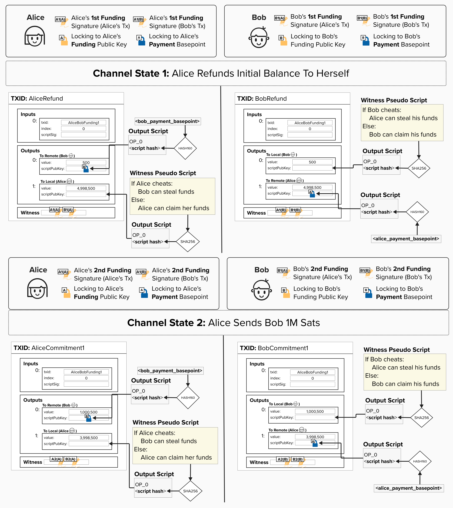
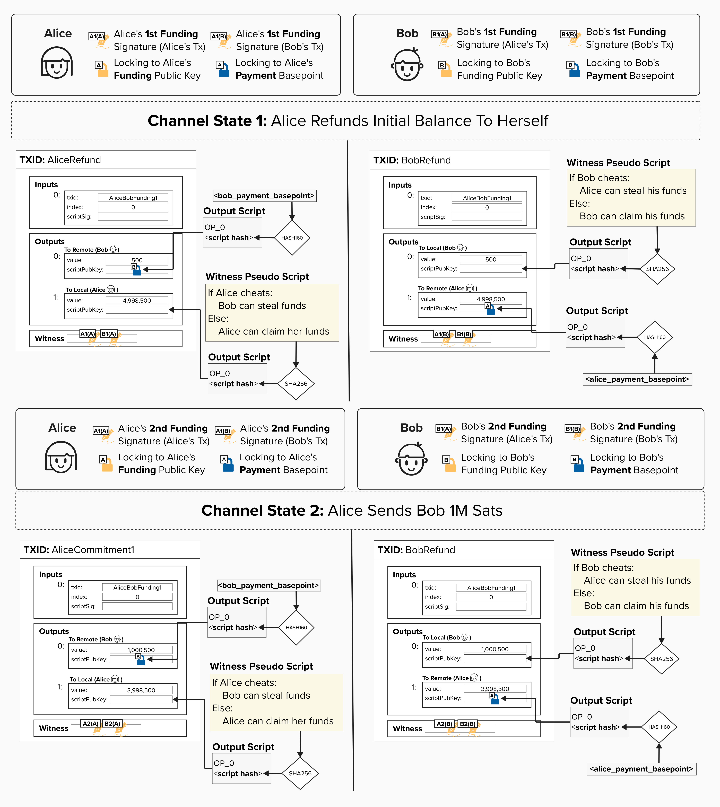
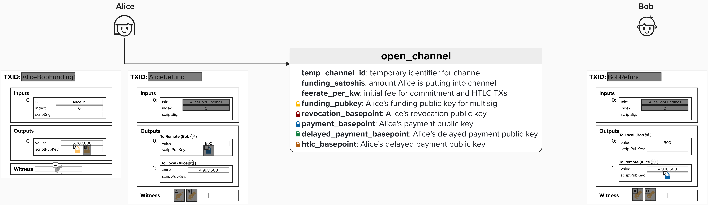
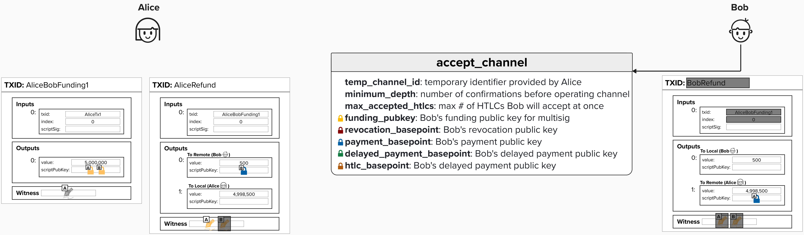
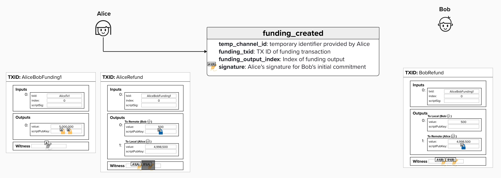
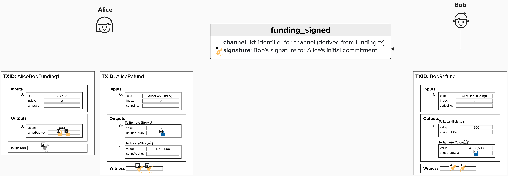

# Asymmetric Commitment Transactions 

You're probably itching to dig into advanced cryptography and punish some cheaters, but it will make our lives much easier if we introduce the concept of **asymmetric commitment transactions** first. 

To build out our robust penalty mechanism, we'll need to update our payment channel construction so that *each party has their own version of* ***each*** *commitment transaction*. They are mirror images of each other, but their output scripts are slightly different. As we'll see, **asymmetric commitment transactions provide us with a way to punish the cheating party**. 

In the below example, you can see that both Alice and Bob's versions reflect the same distribution of funds. **However, Alice's version of the transaction has a special locking script for her output, and Bob's version of the transaction has a special locking script for his output**.

<p align="center" style="width: 50%; max-width: 300px;">
  
</p>

<details>
  <summary>The concept of "asymmetric commitment transactions" is very important if you want to understand how Lightning works. To help make sure this makes sense, click here and try to validate the following...</summary>

As we mentioned above, both Alice and Bob will have their own commitment transaction **for each channel state**. Take a moment and see if you can verify the following, using the picture below. You will probably have to zoom in!

- For Channel State 1, Alice's `to_local` has the same amount as Bob's `to_remote`. Both of these represent funds that Alice owns.
- For Channel State 1, both of the `to_local` outputs contain a spending path that allows the counterparty to punish the broadcaster ***if the broadcaster cheats***. Remember, "cheating" means publishing an old channel state. In other words, if Alice publishes an old transaction, her output has a spending path for Bob to steal her funds. If Bob publishes an old transaction, his output has a spending path for Alice to steal his funds.
- For Channel State 1, Alice produces two distinct signatures: one for her version and one for Bob's. This is required since Alice and Bob's versions are technically different, so they will each have a unique signature.
- For Channel State 2, once Alice sends 1,000,000 sats to Bob, all outputs for Alice and Bob are updated to reflect this payment. From this diagram, it should be clear that each party possesses their own unique copy of the commitment transaction, with these versions being asymmetric to one another.
- For Channel State 2, once again, Alice and Bob both generate unique signatures for each version of the commitment transactions. 

<p align="center" style="width: 50%; max-width: 300px;">
  
</p>

</details>

<details>
  <summary>Why do we need asymmetric commitment transactions?</summary>

The Lightning Network fairness protocol is set up in such a way that **you protect your counterparty** from ***you*** cheating. This is why the output that has ***your*** balance (on ***your version of the transaction***) contains the penalty mechanism, while the output with your counterparty's balance is a simple **P2WPKH**. 

Remember, the way to cheat in Lightning is by publishing an old commitment state. Since all of ***your*** commitment transactions lock ***your*** bitcoin balance to a special locking script with a penalty mechanism, your counterparty will be able to claim your output if you publish an old state.

</details>

# Exchanging Signatures

As the podcasters say, let's "double-click" into the process of exchanging signatures. To do this, we'll return to BOLT 2 and the protocol messages exchanged as part of the **Channel Establishment** process. Now that we've identified that we need a Refund Transaction (which is really just the first Commitment Transaction), we can review the rest of the protocol messages and see how the information included in each message contributes to our asymmetric commitments!

> Note: The visuals and educational approach for this section were inspired by Elle Mouton's blog post [here](https://ellemouton.com/posts/open_channel_pre_taproot/). If you'd like another resource on opening a Lightning channel, I encourage you to check it out!

### Open Channel

We already reviewed the open channel message, so we won't discuss this in much depth. However, what we will draw attention to is the shaded area in the diagrams below. If an area is shaded, it means that the **"holder"** of that transaction does not yet know that information. For example, during the channel open process, Alice does not yet have **Bob's Funding Public Key** or any of the other cryptographic material needed to operate their payment channel. Therefore, she cannot construct the full 2-of-2 multisig witness script yet, which also means she does not yet know the transaction ID for the Funding Transaction. Additionally, she doesn't yet know **Bob's Payment Basepoint**, and she doesn't have his signature for the first commitment transaction.

On the other hand, once Bob receives Alice's `open_channel` message, he now has **Alice's Payment Basepoint** so he can construct the Pay-To-Witness-Public-Key-Hash (P2WPKH) output for her. That said, he still doesn't have her signature, nor does he have much information about the Funding Transaction, so he can't add the input to his version of the first commitment transaction yet.

<p align="center" style="width: 50%; max-width: 300px;">
  
</p>

### Accept Channel

As we learned earlier, if Bob accepts the channel, he will send an `accept_channel` message to Alice. In this message, he will provide, among other things, the public keys that Alice needs to complete the Funding Transaction and her version of the first Commitment Transaction, which we're calling the Refund Transaction. We haven't dug into the details regarding how each commitment state is updated yet, but it's worth noting that Bob also provides Alice with the information needed to derive the new public keys for each new commitment state.

Once Alice receives this information, she is able to add **Bob's Funding Public Key** to the 2-of-2 multisig and complete the Funding Transaction, which now means Alice has the Funding TX ID and output information.

<p align="center" style="width: 50%; max-width: 300px;">
  
</p>

### Funding Created

This is where we start building on the protocol messages we learned about earlier! Once Alice receives the `accept_channel` message, she'll want to communicate the Funding Transaction information to Bob so that he can build his version of the First Commitment Transaction, which we're calling the "Refund Transaction". Therefore, she will send him a `funding_created` message, which includes the TX ID, funding output index, and **her signature for Bob's initial commitment**.

At this point, Bob now has a version of the commitment transaction that is fully signed. However, Alice has not broadcast the Funding Transaction yet, so Bob's Refund Transaction would be rejected by the network if he tried to publish it, as the UTXO it's spending from does not yet exist.

> 💡 **REMINDER:** The signature that Alice gives Bob in this message is NOT the same signature that she uses on her version of the commitment transaction! Since the commitment transactions are asymmetrical but not exactly the same, Alice and Bob will be "signing" different transactions, resulting in different signatures. This is actually a *crucial* piece of the security model. While Bob will have **Alice's signature** for **his version** of the initial commitment transaction, Bob will never give Alice **his signature** for **his** version of the Commitment Transaction. Therefore, Alice will never be able to publish Bob's version of the commitment! This is also true in reverse: Bob will never be able to publish Alice's version of the Commitment Transaction.

<p align="center" style="width: 50%; max-width: 300px;">
  
</p>

### Funding Signed

Finally, once Bob receives the `funding_created` message from Alice, he will respond with a `funding_signed` message. This message will include **Bob's signature** for **Alice's version of the first Commitment Transaction** (Alice's version of the Refund Transaction). It's also worth noting that, at this point, we can finally calculate a durable (not temporary) `channel_id`. According to BOLT 2, the `channel_id` is "derived from the Funding Transaction by combining the `funding_txid` and the `funding_output_index`, using big-endian exclusive-OR".

<p align="center" style="width: 50%; max-width: 300px;">
  
</p>


### Summary
Hopefully, the following points are now clear:
1) Lightning leverages asymmetric commitment transactions, whereby each channel party has their own version of each commitment state.
2) Signatures are exchanged such that each party can only ever broadcast **their own version** of a commitment transaction.


## ⚡️ Generate A Signature

Now that we've reviewed how signatures are exchanged over the Lightning Protocol, let's implement a function so that we can generate one of those signatures ourselves! As we'll see later, this will be central to our implementation, and we'll use it to sign commitment transactions later in the course.

For this exercise, head over to `src/exercises/keys/channel_key_manager.rs` and find `pub fn sign_transaction_input_sighash_all`. As you can see, this function is within an `impl` block, so it has access to all of the internal components that are available via the `ChannelKeyManager` that we built in an earlier exercise. This function takes the following inputs:
- `tx`: The transaction we want to sign.
- `input_index`: The index of the input we're signing.
- `script`: The witness script that we're signing. In our case, this is often the 2-of-2 multisig witness script!
- `amount`: The value of the UTXO being spent
- `secret_key`: The private key we're signing with.

The function should return the signature as a `Vec<u8>`. **Crucially, this function should include a `SIGHASH_ALL` flag, indicating that the signature covers all of the inputs and outputs. This is the default in many wallet software implementations, as it ensures that the signature is only valid if the transaction is not changed.**

```rust
/// Exercise 7: Sign transaction input with SIGHASH_ALL
impl ChannelKeyManager {
    pub fn sign_transaction_input_sighash_all(
        &self,
        tx: &Transaction,
        input_index: usize,
        script: &ScriptBuf,
        amount: u64,
        secret_key: &SecretKey,
    ) -> Vec<u8> {

        // Compute the sighash for the P2WSH input

        // Compute the P2WSH signature hash

        // Convert sighash to Message

        // Sign the Message with secret_key

        // Serialize signature and append SIGHASH_ALL flag (EcdsaSighashType::All)

    }
}
```

<details>
  <summary>💡 Hint 💡</summary>

To successfully complete this exercise, you'll need to generate a `SIGHASH_ALL` signature for the provided transaction input. In the context of Lightning, this means you need to sign a message (the commitment transaction) with your **Funding Private Key**, and append the `SIGHASH_ALL` to the resulting signature.

Since Bitcoin specifies a specific [digest algorithm](https://github.com/bitcoin/bips/blob/master/bip-0143.mediawiki) for signatures, we'll need to process the transaction data a little before signing it. The exact algorithm is outside of the scope of this course, but, if you're interested in learning more, check out this [resource](https://learnmeabitcoin.com/technical/keys/signature/#segwit-algorithm) by Learn Me A Bitcoin.

#### 1. Create a `SighashCache`

First, you'll want to compute the signature hash message. To do this, check out Rust Bitcoin's [`SighashCache`](https://docs.rs/bitcoin/0.32.0/bitcoin/sighash/struct.SighashCache.html#method.p2wsh_signature_hash) struct - specifically, the `new` method.

#### 2. Compute the P2WSH signature hash

Next, you'll want to compute the BIP143 sighash for a P2WSH output, which is what we're generating a signature for! For this, check out Rust Bitcoin's [`p2wsh_signature_hash`](https://docs.rs/bitcoin/0.32.0/bitcoin/sighash/struct.SighashCache.html#method.p2wsh_signature_hash) method, which is available on your `SighashCache`.

#### 3. Convert the sighash to a `Message`

Once you have the sighash, you'll want to convert it to a [`Message`](https://docs.rs/secp256k1/0.29.0/secp256k1/struct.Message.html) type, which can be signed later.

> HINT: Check out the `from_digest` method available on `Message`.

#### 4. Sign with ECDSA

Now you'll want to sign the message using your secret key! Check out the [`sign_ecdsa`](https://docs.rs/bitcoin/0.32.0/bitcoin/key/struct.Secp256k1.html#method.sign_ecdsa) function, available on your `self.secp_ctx` context.


#### 5. Serialize and append the sighash type

Finally, Bitcoin signatures must be DER-encoded with the sighash type byte appended. You can convert your signature to bytes by using the following:

```rust
let mut sig_bytes = sig.serialize_der().to_vec();
```

Next, you'll just have to `.push()` the `SIGHASH_ALL` flag. Rust Bitcoin's [`EcdsaSighashType`](https://docs.rs/bitcoin/0.32.0/bitcoin/enum.EcdsaSighashType.html) enum can help you with this!

</details>

<details>
<summary>Step 1: Create a Sighash Cache</summary>
  
First, we'll create a signature hash cache (`SighashCache`) from our transaction, which can help us build the actual hash that we'll need to sign.

```rust
let mut sighash_cache = SighashCache::new(tx);
```
</details>

<details>
<summary>Step 2: Compute the P2WSH Signature Hash</summary>

Since we're signing a P2WSH (Pay-to-Witness-Script-Hash) input, we use the `p2wsh_signature_hash`method and specifiy that we're generating a `SIGHASH_ALL` signature.

```rust
let sighash = sighash_cache
.p2wsh_signature_hash(
    input_index,
    script,
    Amount::from_sat(amount),
    EcdsaSighashType::All,
)
.expect("Valid sighash");
```
</details>

<details>
<summary>Step 3: Create a Signable Message</summary>
  
Now we have our message! However, to sign it with the secp256k1 crate, we need to wrap it in a `Message` type that the signing function can work with.

```rust
let msg = Message::from_digest(sighash.to_byte_array());
```
</details>

<details>
  <summary>Step 4: Sign the Message with ECDSA</summary>
  
Now, the cryptographic magic! We'll use our secp256k1 context to create an ECDSA signature over the message using our secret key.

```rust
let sig = self.secp_ctx.sign_ecdsa(&msg, secret_key);
```
</details>

<details>
  <summary>Step 5: Serialize and Append Sighash Type</summary>
  
Finally, the grand finale - we'll serialize our signature, using DER encoding, and then append the sighash type byte (0x01 for SIGHASH_ALL) to the end.

```rust
let mut sig_bytes = sig.serialize_der().to_vec();
sig_bytes.push(EcdsaSighashType::All as u8);
sig_bytes
```
</details>
