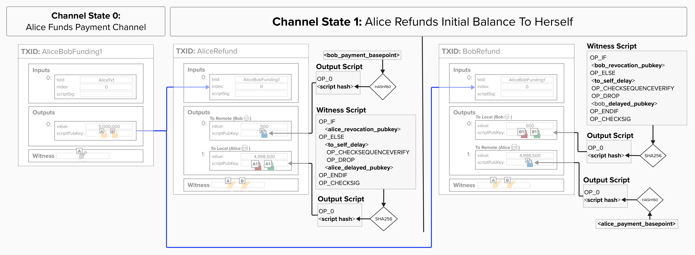

# Commitment Transaction Structure

Alright, let's take a break from cryptography for a moment. Now that we understand how to derive the keys needed for Lightning, let's return to our scripts and implement them!

Remember, Alice and Bob have asymmetric versions of the commitment transactions, meaning that Alice has a special locking script on her `to_local` output and Bob has a special locking script on his `to_local` output. As we just learned, this is how Alice and Bob protect each other from future cheating.

<p align="center" style="width: 50%; max-width: 300px;">
  
</p>

### ⚡️ Create To Remote Script

For this exercise, head over to `src/exercises/scripts/commitment.rs`! In this file, you'll find two functions: one to create the `to_remote` script and one to create the `to_local` script. Both functions will return a `ScriptBuf` type, which represents a Bitcoin script in Rust Bitcoin.

Let's start with implementing `create_to_remote_script`, which takes the remote party's `remote_pubkey`. If you recall, this is simply the remote party's **Payment Basepoint**. This *does not* change for each commitment transaction, making it easier for the remote party to spend their funds from any given channel state since they do not need to derive a private key for that specific state.

Since our counterparty should be able to spend these funds immediately, we simply create a **Pay-To-Witness-Public-Key-Hash** (**P2WPKH**) locking script, which only requires a valid signature to spend from. Below is what a P2WPKH output looks like:

- The first part is the **version byte**. In this case, it's `OP_0`, which signals that this script is either **P2WPKH** or **P2WSH**. If it were `OP_1`, this would be a **Pay-To-Taproot** (P2TR) output.
- Next, we place the hash of the public key. It's a 20-byte hash because we use HASH160 on the public key, which returns a 20-byte result.
```
OP_0 <20-byte-pubkey-hash>
```

Once complete, the function should return a `ScriptBuf` containing the P2WPKH script, locking to the remote party's Payment Basepoint.

```rust
pub fn create_to_remote_script(remote_pubkey: &PublicKey) -> ScriptBuf {
    // P2WPKH format: OP_0 <20-byte-pubkey-hash>
    let pubkey_hash = Hash160::hash(&remote_pubkey.serialize());
    Builder::new()
        .push_int(0)
        .push_slice(pubkey_hash.as_byte_array())
        .into_script()
}
```

<details>
  <summary>💡 Hint 💡</summary>

It's been a while since we had a Script exercise! Luckily, this is one of the simpler scripts we'll create. A P2WPKH script has just two elements:

```
OP_0 <20-byte-pubkey-hash>
```

Below are two hints to help you complete the exericse.

1. Hash the public key using HASH160.
   - We don't need to create a hash engine, since we're only hasing one input. You can compute the HASH160 using `Hash160::hash(&remote_pubkey.serialize())`

2. Build the script using `Builder`.
   - Start by pushing `0` for the version byte (use `.push_int(0)`)
   - Next, push the 20-byte hash (you can push a slice of data using `.push_slice()`). Make sure to push the data as a byte array `as_byte_array()`.
   - Finally, just as we did earlier, convert to `ScriptBuf` (use `.into_script()`)

</details>

<details>
  <summary>Step 1: Hash the Public Key</summary>

First, we need to create a Hash160 of the remote party's public key.

We call `.serialize()` on the public key to get its byte representation, then pass those bytes to `Hash160::hash()`.

```rust
let pubkey_hash = Hash160::hash(&remote_pubkey.serialize());
```

</details>

<details>
  <summary>Step 2: Build the P2WPKH Script</summary>

Next, we use Rust Bitcoin's `Builder` to construct our P2WPKH script, building the below script:

```
OP_0 <20-byte-pubkey-hash>
```

The `push_int(0)` method creates the `OP_0` version byte, and `push_slice()` adds our 20-byte hash. Finally, `into_script()` converts the builder into a `ScriptBuf`. 

```rust
Builder::new()
    .push_int(0)
    .push_slice(pubkey_hash.as_byte_array())
    .into_script()
```

</details>

### ⚡️ Create To Local Script

Now, let's string together many of the pieces we've been learning about and build our `to_local` script. Remember, this script defines the spending conditions for any funds that the **holder** of the commitment transaction owns. In other words, Alice locks *her* funds to this script and Bob locks *his* funds to this script.

It has the following two spending conditions:

1. **Revocation Spending Path**: If the **holder** cheats by publishing an old state, their counterparty can punish them and spend from the revocation path immediately.
2. **Delayed Spending Path**: If the **holder** publishes the current state, then their counterparty does not know the secret to spend from the revocation path. Therefore, the **holder** can spend from the delayed spending path after `to_self_delay` blocks have passed since this transaction was mined.

Below is the script structure, as defined in [BOLT 3](https://github.com/lightning/bolts/blob/master/03-transactions.md#to_local-output):

```
OP_IF
    <revocationpubkey>
OP_ELSE
    <to_self_delay>
    OP_CHECKSEQUENCEVERIFY
    OP_DROP
    <local_delayedpubkey>
OP_ENDIF
OP_CHECKSIG
```

The `create_to_local_script` takes the following inputs:
- `revocation_pubkey`: Created by combining our counterparty's **Revocation Basepoint** with our **Per-Commitment Point**
- `local_delayedpubkey`: Created by combining our **Delayed Payment Basepoint** with our **Per-Commitment Point**
- `to_self_delay`: The number of blocks we must wait before we can spend from the delayed path. This is negotiated with our counterparty when opening the channel.

Once complete, this function should return a `ScriptBuf` with the above structure.

```rust
pub fn create_to_local_script(
    revocation_pubkey: &PublicKey,
    local_delayedpubkey: &PublicKey,
    to_self_delay: u16,
) -> ScriptBuf {
    Builder::new()
        .push_opcode(opcodes::OP_IF)
        .push_slice(revocation_pubkey.serialize())
        .push_opcode(opcodes::OP_ELSE)
        .push_int(to_self_delay as i64)
        .push_opcode(opcodes::OP_CSV)
        .push_opcode(opcodes::OP_DROP)
        .push_slice(local_delayedpubkey.serialize())
        .push_opcode(opcodes::OP_ENDIF)
        .push_opcode(opcodes::OP_CHECKSIG)
        .into_script()
}
```

<details>
  <summary>💡 Hint 💡</summary>

This exercise will be very similar to the previous exercises where we've built scripts. To successfuly complete it, you'll need to build the following script:

```
OP_IF
    <revocationpubkey>
OP_ELSE
    <to_self_delay>
    OP_CHECKSEQUENCEVERIFY
    OP_DROP
    <local_delayedpubkey>
OP_ENDIF
OP_CHECKSIG
```

Most of this should be straightforward, but a few tips have been provided below to help...
1. If you need to push an opcode, use `.push_opcode()`
2. If you need to push a public key, push the serialized public key using `.push_slice(pubkey.serialize())`
3. If you need to push an integer, use `push_int()`

</details>

<details>
  <summary>Step 1: Build the Conditional Structure</summary>

Let's dive in!

We'll start by creating an IF/ELSE conditional structure. The IF branch is for the revocation case, and the ELSE branch is for the delayed case.

```rust
Builder::new()
    .push_opcode(opcodes::OP_IF)
    .push_slice(revocation_pubkey.serialize())
    .push_opcode(opcodes::OP_ELSE)
```

When spending from this output, the witness will include a boolean value that determines which branch executes. If TRUE (1), the IF branch runs and the revocation key is used. If FALSE (0), the ELSE branch runs with the timelock.

</details>

<details>
  <summary>Step 2: Add the CSV Timelock and Delayed Key</summary>

In the ELSE branch, we'll add the delays case using the OP_CSV opcode. This ensures that Alice must wait `to_self_delay` blocks before spending.

```rust
.push_int(to_self_delay as i64)
.push_opcode(opcodes::OP_CSV)
.push_opcode(opcodes::OP_DROP)
.push_slice(local_delayedpubkey.serialize())
```

</details>

<details>
  <summary>Step 3: Close the Conditional and Verify Signature</summary>

Finally, we'll close the IF/ELSE structure with `OP_ENDIF` and add `OP_CHECKSIG` to verify the signature:

```rust
.push_opcode(opcodes::OP_ENDIF)
.push_opcode(opcodes::OP_CHECKSIG)
.into_script()
```

</details>
