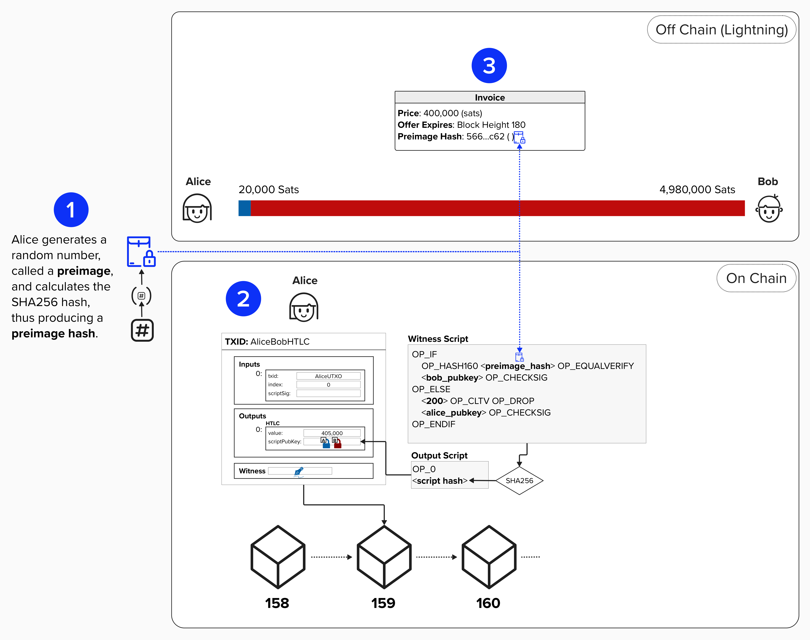

# Simple HTLC Example

Now that we have a high-level understanding of how HTLCs enable payment routing across the Lightning network, let's see how they're implemented at the **transaction level**!

> ⚠️ ***NOTE***: We'll simplify things for the moment and just focus on how we'd implement a simple HTLC between Alice and Bob in Bitcoin Script. Once we have this down, we'll do what we always do - make things more complicated!

Let's begin our journey by zooming into Alice's contract with Bob. As you can see, it has the following spending conditions:

- If Bob provides a **preimage**, he can claim the funds.
- If a **block height** is reached, then the contract expires.

<p align="center" style="width: 50%; max-width: 300px;">
  
</p>

If we were to translate the above contract into a Bitcoin transaction, we would represent it as a **script**. To simplify things a little further for this example, let's forget about "Lightning" for a second. Instead, we'll simply imagine that Alice is creating an **on-chain** HTLC contract with Bob, and she initiates this contract by mining the below transaction.

**Take a moment to examine the HTLC witness script and confirm that you understand what is going on!** This is really where all the magic happens.

> ⚠️ ***NOTE***: The signatures and public keys that are visualized in this "Simple HTLC" exercise are **NOT** meant to map back to any of the public keys we've created during this course. They are simply meant to be representations for any signature or public keys belonging to Alice or Bob. In other words, the main focus of this exercise is the HTLC script itself - not how the public keys or signatures are created.

<p align="center" style="width: 50%; max-width: 300px;">
  
</p>

<details>
  <summary>Click to learn more about the Witness Script</summary>

This witness script has the following two spending paths:

1. If the **preimage** is provided, then Bob can spend from this path and claim any funds locked in this output. Additionally, this path ends with an `OP_CHECKSIG`, meaning that Bob will have to provide a valid signature.

<details>
  <summary>Why does Bob's path also require a signature? Is the preimage not enough?</summary>

If there was no `OP_CHECKSIG`, then *anyone* who knows the **preimage** would be able to spend from this path. For this Simple HTLC, that might be okay if Bob keeps the preimage private. However, as we saw earlier, Lightning involves *routing* payments across multiple participants, **and the preimage is the same for each channel contract**. Therefore, since multiple people may eventually learn the same preimage, we also lock the funds to the recipient's public key to ensure that they are the only ones who are able to claim the funds via the **preimage path**. If this doesn't make complete sense yet, don't worry - it will soon!

</details>

2. The second path is timelocked with an `OP_CHECKLOCKTIMEVERIFY` opcode, meaning that it is only valid once we've reached block height 200. This path also requires a signature from Alice. Together, these components allow Alice to reclaim this output once the timelock expires.

</details>

Since Bob knows the preimage, he has the ability to generate a new transaction which can spend from this output and move the funds to a new UTXO that Bob unilaterally controls. Below is an example of what it would look like if Bob created a new transaction to claim this HTLC. **Take a moment to examine the witness stack and confirm that you understand what is happening!**

<p align="center" style="width: 50%; max-width: 300px;">
  
</p>

<details>
  <summary>Click to learn more about the Witness Stack</summary>

Pay-To-Witness-Script-Hash (P2WSH) evaluation involves the following steps. While the below diagram does not explicitly detail the entire script evaluation for this HTLC, it provides the majority of the information needed to understand how Bob would claim the funds.

<p align="center" style="width: 50%; max-width: 300px;">
  
</p>

</details>

## 👉 Claim The HTLC!

For this exercise, we'll change things up and pretend to be Bob. The reasoning for doing this will soon become clear! In our role acting as Bob, our job is to claim the HTLC from the transaction above and rejoice with our newfound Bitcoin.

Most of the work is already done for us. In fact, we won't be doing any coding! The main purpose of this exercise is to dig into the details of the transaction and see ***how*** Bob claims the funds using a **preimage**.

### Step 1: Initiating The Contract

As we discussed earlier, to initiate this contract, imagine Alice and Bob created an HTLC output for 405,000 sats. **NOTE**: To ensure this exercise works for everyone using this workbook, this transaction is already mined within a block in your regtest environment.
```
02000000000101a7a015aebdeba2205db63d17c7975ec0e7df930ca28e00fbfeadd1f0266bee080000000000ffffffff01082e0600000000002200208d3ae22e8fb32079a95497ee254f215500ecb1276ab3f46376b9fba4c4b788dd02473044022018f471487aa1fe83d1b9cc646c504de1a914480422c6dd0573684d9d6a2a0f1c0220757feb4134b18caf87fa8947f942a4a5cedffe86e3fa4679eaeedd63fa9dd3750121029141a3333093051ea2ea71445f651d413dd4a75369c887a46bf9f0f036e6ef5600000000
```

#### 👉 View the details of the transaction hex!

You can see the details of the transaction if you run the following command in the **shell**. You may need to click the "Run" icon (green play button) to start up Bitcoin Core if your workbook went idle!
```
bitcoin-cli decoderawtransaction tx_hex
```

There is a lot going on here, but the important piece to focus on is the **vout**. This part of the transaction lists all of the outputs, their amounts, their index, and their locking scripts. For this exercise, there is only one output, so it should be easy to find our HTLC! Once you see it, verify that it's the same as below. The HTLC output will be index 0 (`"n": 0`) and have a value of `0.00405000`.
```
"asm": "0 8d3ae22e8fb32079a95497ee254f215500ecb1276ab3f46376b9fba4c4b788dd"
```

If you forget what this is, look at the diagram above! You'll see that we put the hash of the witness script, preceded by OP_0, in the `scriptPubKey`. In other words, this is the SHA256 of the HTLC script!

### Step 2: Verify The Locking Script

Now, you may have read the above and thought, "How am I supposed to verify that locking script? I can't reverse a SHA256 hash function!". Well, I'm going to prove it to you below!

Let's go ahead and verify the locking script for the purposes of this exercise. Below, you'll see how the witness script is converted into hexadecimal. In Bitcoin, all opcodes have a hex representation so that they can be effectively communicated between computers. You can view a list of them [here](https://en.bitcoin.it/wiki/Script).

<p align="center" style="width: 50%; max-width: 300px;">
  
</p>

If we combine all of the above into a single hex representation, we get the below.
```
63a9148e0290d1ea6eca43cbcb422dca5b6e0ce847696d882103cfa114ffa28b97884a028322665093af66bb19b0cf91c81eae46e6bb7fff799aac6702c800b1752102744c609aeee71a07136482b71244a6217b3368431603e1e3994d0c2d226403afac68
```

#### 👉 Validate The Output Script

Okay, now that we've seen how to convert our witness script to hex, let's take the SHA256 of it and verify that it's the same as the output script in Alice's transaction. To do that, you can enter the below command in the **Shell**. This command passes the above hex data into a simple function within this workbook that takes the SHA256 of the provided data.
```
cargo run -- sha256 -d 63a9148e0290d1ea6eca43cbcb422dca5b6e0ce847696d882103cfa114ffa28b97884a028322665093af66bb19b0cf91c81eae46e6bb7fff799aac6702c800b1752102744c609aeee71a07136482b71244a6217b3368431603e1e3994d0c2d226403afac68
```

Is the output the same as what we saw before?
```
"asm": "0 8d3ae22e8fb32079a95497ee254f215500ecb1276ab3f46376b9fba4c4b788dd"
```

**Yes!** At this point, we've now validated that there is indeed a transaction already mined in this workbook that has an HTLC output.

### Step 3: Retrieve Preimage

Great, so we've confirmed that we can claim this output if we have the preimage. We just need to find a secret that, when hashed, equals the **RIPEMD160( SHA256(`preimage`) )** - also known as [HASH160](https://learnmeabitcoin.com/technical/cryptography/hash-function/#hash160) in Bitcoin.

One key difference between HASH160 and *just* using SHA256 is that HASH160 returns a 20-byte result while SHA256 returns a 32-byte result. Therefore, by locking to the HASH160, we reduce the size of the data that eventually needs to be stored on-chain.

#### 👉 Find The Preimage

The below command will take the **RIPEMD160( SHA256() )** of whatever string you put in the quotes. To make this exercise a little simpler, this HTLC output is locked to the hash of a string (converted to bytes) instead of a 256-bit number, which is standard for the Lightning protocol.

**Try entering in a random string and see if you can guess the preimage!**

Remember, the preimage hash is: `8e0290d1ea6eca43cbcb422dca5b6e0ce847696d`. You can verify that by looking at the witness script above!
```
cargo run -- ripemd-sha -d enter-your-guess-here
```

<details>
  <summary>Click here to see the preimage</summary>

Well, surprise surprise - the preimage is: `ProgrammingLightning`!

The below command should prove that **"ProgrammingLightning"** will provide the preimage hash that this contract is locked to.
```
cargo run -- ripemd-sha -d ProgrammingLightning
```

</details>

### Step 4: Claim HTLC

Now that we have identified the preimage, let's claim the funds!

Building an entire transaction to spend from Alice's HTLC would take some time, so a transaction has already been created for you. You can find it below.
```
020000000001015a69f41bdf1ec310c6aef64902236a56f8810f0336fb5762a96df363eca664200000000000ffffffff01082e0600000000002200208d3ae22e8fb32079a95497ee254f215500ecb1276ab3f46376b9fba4c4b788dd0448304502210083759ddf9f02594cf191f052db565fe2e8fc141044ad9177b16a903c448ae98c022078266e29026228d01d0130a466014b91c5e058b75a4058b7f99cb533d2ab7935011450726f6772616d6d696e674c696768746e696e6701016563a9148e0290d1ea6eca43cbcb422dca5b6e0ce847696d882103cfa114ffa28b97884a028322665093af66bb19b0cf91c81eae46e6bb7fff799aac6702c800b1752102744c609aeee71a07136482b71244a6217b3368431603e1e3994d0c2d226403afac6800000000
```

#### 👉 Verify The Preimage

Go ahead and decode the above transaction using the below alias. Remember, we're looking at the hex representation of Bob's claim transaction (seen below).

<p align="center" style="width: 50%; max-width: 300px;">
  
</p>

```
bitcoin-cli decoderawtransaction <tx_hex>
```

Once you do that, check out the **txinwitness** field. You should see the following:
```
"txinwitness": [
  "304502210083759ddf9f02594cf191f052db565fe2e8fc141044ad9177b16a903c448ae98c022078266e29026228d01d0130a466014b91c5e058b75a4058b7f99cb533d2ab793501",
  "50726f6772616d6d696e674c696768746e696e67",
  "01",
  "63a9148e0290d1ea6eca43cbcb422dca5b6e0ce847696d882103cfa114ffa28b97884a028322665093af66bb19b0cf91c81eae46e6bb7fff799aac6702c800b1752102744c609aeee71a07136482b71244a6217b3368431603e1e3994d0c2d226403afac68"
]
```

#### Question: Do you know what each of the above elements are? Take a guess, and click below to see the answer.

<details>
  <summary>Answer</summary>

The witness will contain all of the information needed to claim the HTLC!

- Signature: `304502210083759ddf9f02594cf191f052db565fe2e8fc141044ad9177b16a903c448ae98c022078266e29026228d01d0130a466014b91c5e058b75a4058b7f99cb533d2ab793501`
- Preimage: `50726f6772616d6d696e674c696768746e696e67`
- Path Identifier (OP_IF): `01`
- Witness Script: `63a9145f8ad6404f3f5eebbfeffd1b01d37cfc648b7f7d876702c800b17521031b84c5567b126440995d3ed5aaba0565d71e1834604819ff9c17f5e9d5dd078fac68`

</details>

So, according to the above, `50726f6772616d6d696e674c696768746e696e67` is our preimage? Is that right? Well, since we have to represent all data in hex format, then we shouldn't expect to see "ProgrammingLightning" here. Try entering the below command in your **Shell** to convert "ProgrammingLightning" to hex. Is it the same as the preimage?
```
cargo run -- to-hex -d ProgrammingLightning
```

#### 👉 Publish Transaction And Claim Funds

Great, nice job! You've successfully dug deeeeeeeep into Bitcoin Script and validated how an HTLC output works. Publish your transaction, claim your reward, and let's get back to Lightning!
```
bitcoin-cli sendrawtransaction 020000000001015a69f41bdf1ec310c6aef64902236a56f8810f0336fb5762a96df363eca664200000000000ffffffff01082e0600000000002200208d3ae22e8fb32079a95497ee254f215500ecb1276ab3f46376b9fba4c4b788dd0448304502210083759ddf9f02594cf191f052db565fe2e8fc141044ad9177b16a903c448ae98c022078266e29026228d01d0130a466014b91c5e058b75a4058b7f99cb533d2ab7935011450726f6772616d6d696e674c696768746e696e6701016563a9148e0290d1ea6eca43cbcb422dca5b6e0ce847696d882103cfa114ffa28b97884a028322665093af66bb19b0cf91c81eae46e6bb7fff799aac6702c800b1752102744c609aeee71a07136482b71244a6217b3368431603e1e3994d0c2d226403afac6800000000
```

## Recap

So, let's do a quick recap of the above exercise. We started by examining an HTLC output, and we confirmed that the locking script had the following spending paths:

1. If Bob (and only Bob) knows the **preimage**, he can claim the funds by providing the preimage with his signature.
2. Otherwise, after **block height 200**, Alice can claim the funds by providing a signature.

### ❗ The Key Takeaway ❗

While it was fun to dig into the weeds, there is one key takeaway from this exercise that will be **very important** for routing payments on Lightning! **The takeaway is that, to claim the HTLC on-chain, Bob will include the preimage within the witness**. Therefore, it will be visible **on-chain**! We'll circle back to this as we dive deeper into how HTLCs work in Lightning.

## Bonus (Submarine Swaps)

The above architecture is actually very close to how **Submarine Swaps** work on Lightning! This topic is a little more advanced and requires a basic understanding of how Lightning and HTLCs work. If you have that, feel free to click below and dig in. If not, make a note to come back after we finish reviewing HTLCs!

<details>
  <summary>Click to learn how Submarine Swaps work</summary>

Submarine Swaps are a way to atomically swap bitcoin between off-chain and on-chain without any counterparty risk.

For example, imagine Alice's channel balance is almost exhausted and she only has 20,000 sats on her side of the channel. However, Alice has plenty of Bitcoin **on-chain**, and she wants to use that to get **inbound liquidity** from Bob.

One option is that Alice can send Bob **on-chain** Bitcoin and ask him to refund her by sending her the same amount (or maybe slightly less, since Bob is providing her a service) over Lightning. If Alice and Bob trust each other, then they could do this, but we don't like trust!

Another option that is trustless is that Alice and Bob do the following:

1. Alice and Bob first agree to perform a Submarine Swap. In other words, Alice agrees to pay Bob 405,000 sats **on-chain** and, in exchange, Bob will send Alice 400,000 sats over Lightning. Bob sends Alice a public key that she can use in the **on-chain** HTLC. Alice then generates the **preimage** and **preimage hash**.
2. Alice creates an **on-chain** HTLC that locks 405,000 sats to the following spending paths:
   - If Bob provides the **preimage** to the **preimage hash** and a signature to his public key, then he can claim the bitcoin.
   - If block height **200** is reached, then Alice can claim her funds back by signing with her signature.
3. Alice will then create a **Lightning invoice** for 400,000 sats. Crucially, **she will use the same preimage** that she used in the on-chain HTLC. Therefore, if Bob pays the off-chain Lightning invoice, he is guaranteed to receive the **preimage**, which is the same preimage for the on-chain transaction.

As long as Bob has sufficient time to claim the on-chain transaction, then this operation allows Alice to trustlessly receive funds **off-chain** (in Lightning) in exchange for sending funds **on-chain**. This is a form of an **atomic swap**. It's called "atomic" because it will either fully succeed or fully fail. In other words, if Bob pays the off-chain Lightning invoice and obtains the preimage, then it's guaranteed that he will be able to claim the on-chain funds as well.

<p align="center" style="width: 50%; max-width: 300px;">
  
</p>

</details>