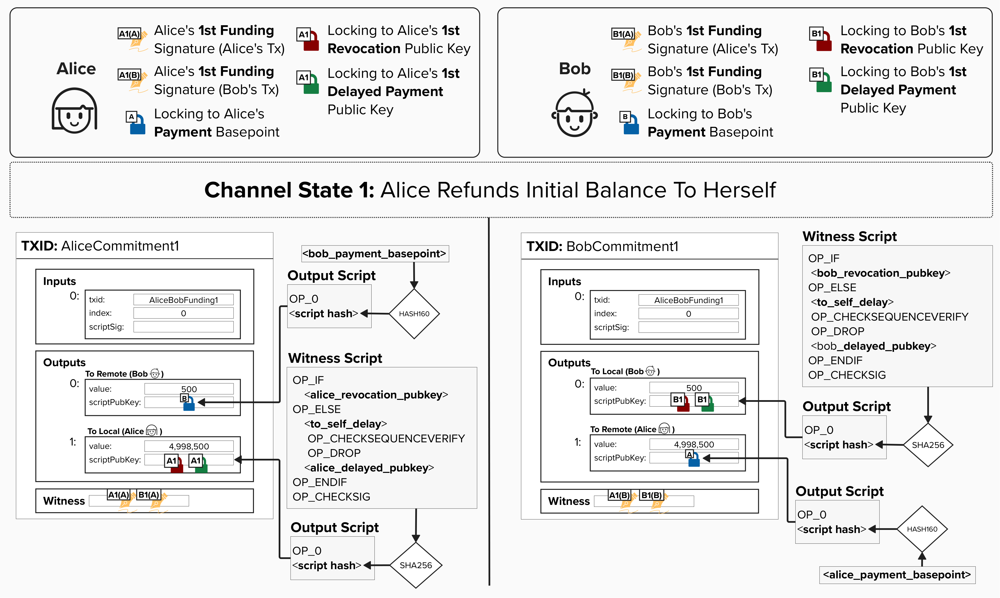
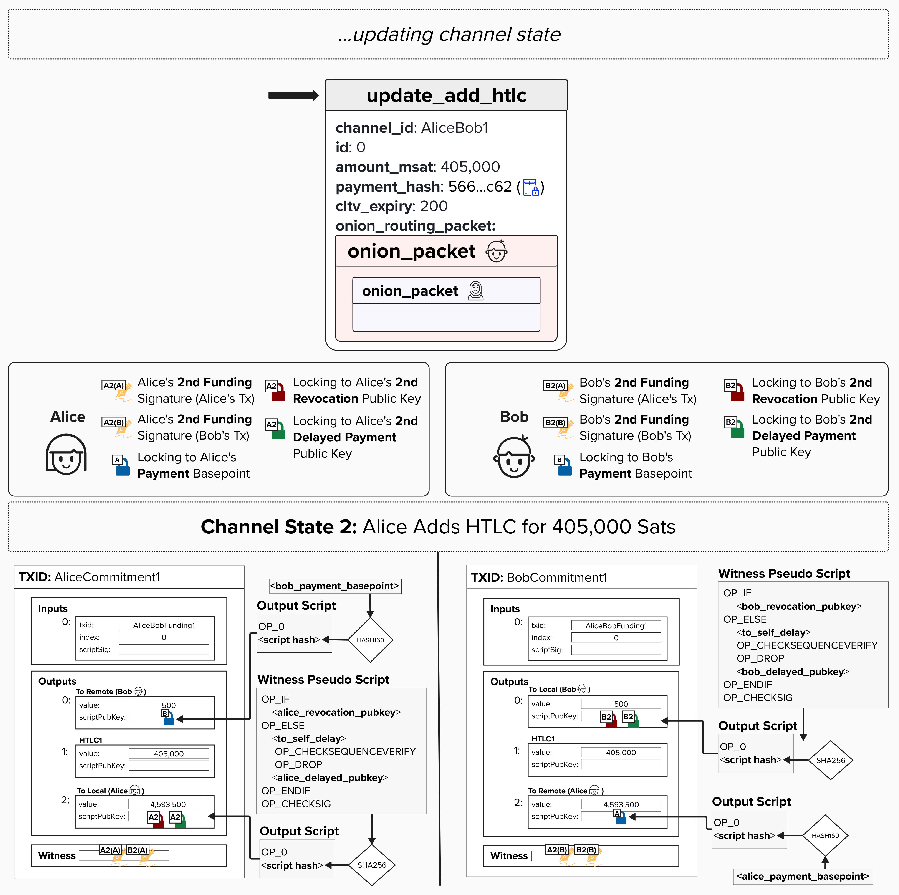
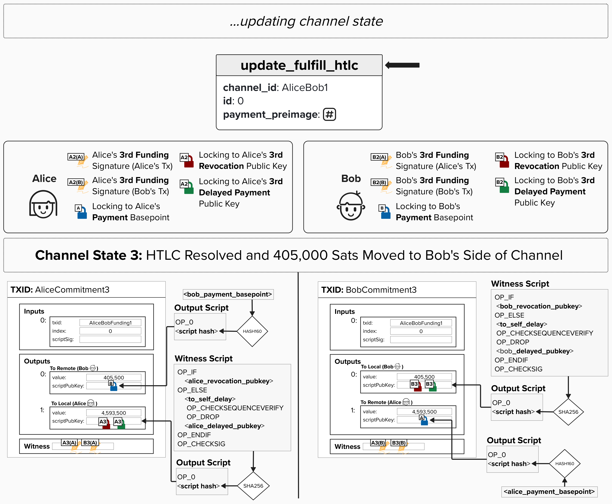

# HTLCs & Updating Channel State

Thus far, we've done a deep dive into the process of **adding** and **removing** HTLCs from commitment transactions. Now, let's reintroduce **asymmetric commitment transactions** and review how Alice and Bob's channel states progress as HTLCs are added and fulfilled.

Alice and Bob start their payment channel in **Channel State 1**. Previously, we called each of these transactions "Refund" transactions, as they allow Alice or Bob to claim their original channel funds if either party goes offline. That said, if Alice and Bob are playing "nice", these would only be broadcasted to the bitcoin network if Alice and Bob *never* move to a new channel state. To ensure you're following along, make sure to verify the following in the diagram below. Remember to zoom in if you need to!

1. In the `to_local` script, Alice uses a **Revocation Public Key** and **Delayed Payment Public Key** that are unique to Channel State 1. This is visualized with the `A1` notation on each public key icon. On the other hand, Bob also uses a unique **Revocation Public Key** and **Delayed Payment Public Key** for his `to_local` script. We learned how to create these keys earlier in the course!
2. In the `to_remote` script, Alice simply puts Bob's **Payment Basepoint**. Similarly, Bob puts Alice's **Payment Basepoint**. As we'll see, these keys are *not* changed for each new channel state. This provides an extra layer of protection for our counterparty, as they will always be able to claim their output on the remote party's commitment - even if they lose channel data and cannot obtain the **Per-Commitment Point** for the given channel state.
3. Alice will send Bob her signature for *his* commitment transaction, which is different than the signature she uses for *her* version of the commitment transaction. This should make intuitive sense, as both transactions are different at the byte level, so their signatures will not be the same.

  

Now, as we saw earlier, Alice is in a predicament... She wants to buy a double espresso with raw milk from Dianne, but she doesn't have a direct channel with Dianne. Luckily, Alice doesn't need one! Instead, she can route a payment through Bob and pay him for his service.

To start this process, she will send an `update_add_htlc` message to Bob with the necessary information that Bob needs to set up **both** his new commitment transaction with Alice **and** his new commitment transaction with Dianne. Specifically, this includes the channel ID, HTLC ID, amount, payment hash, CLTV expiry, and the encrypted onion packets. If you're wondering why Alice specifies the channel ID (isn't it obvious?), it's because Alice and Bob could have multiple channels open with each other, so Alice will want to specify *which* channel she is routing the payment over.

The below diagram represents **Channel State 2**, where there is now 405,000 sats in a new HTLC output. HTLC outputs require their own channel state because the HTLC payment contract needs to be enforceable if one party goes offline or stops cooperating.

In the below diagram, you'll notice that we use a new **Revocation Public Key** and **Delayed Payment Public Key** for both Alice and Bob's commitment transactions, which is signaled using the `A2` and `B2` notation on the public keys. Similarly, we have new signatures from both Alice and Bob.

  

Assuming Dianne provides the preimage to Bob, Bob will then turn around and provide the preimage to Alice via the `update_fulfill_htlc` protocol message. Since Alice now knows that Bob *could* claim the HTLC on-chain **and** Dianne must have provided the preimage (meaning she received the payment), Alice will work with Bob to create a new commitment transaction - **Channel State 3** - which removes the HTLC output and puts the HTLC funds on Bob's side of the channel.

  

