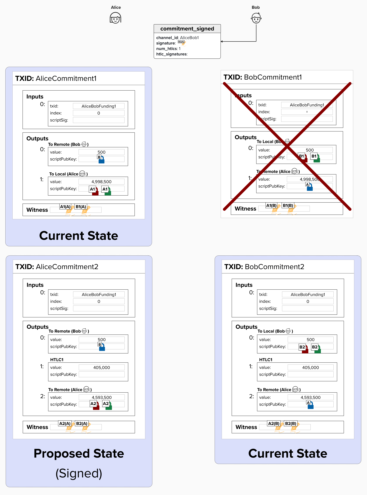

# Revoking Old Channel States

If you've made it this far, the following question may be burning a hole in your mind... **"What about revoking old transaction states!?"**

So far, we've reviewed how revoking old transactions works, but we haven't seen it in action yet! Now that we've seen how to **add** and **remove** HTLCs, we're in a perfect position to bring everything full circle and discuss how Alice and Bob revoke old states!

To do this, we'll return to the process of adding and removing HTLCs, but we'll throw in a few new protocol messages as well.

### Update Add HTLC (Alice -> Bob)

As we saw earlier, Alice will begin the payment process by sending Bob an `update_add_htlc` message. At this point in the process, Bob will put the HTLC in a **staging area**. This represents a future *possible* commitment state, but Alice has **not** yet **irrevocably committed** to this commitment state.

In Lightning, a ***new*** channel state is only considered **irrevocably committed** once both nodes revoke their old channel states. Since, at this point, Alice has *just* proposed a new HTLC, but her old commitment state without the HTLC is still valid, this HTLC is not yet considered **irrevocably committed**. If this concept doesn't make sense yet, don't worry - it should become much clearer shortly.

It's also worth noting that Bob **should not** forward the HTLC to Dianne until it's irrevocably committed. Remember, "forwarding" the HTLC means setting up a new HTLC output on Bob's commitment transaction with Dianne. 

If Bob were to forward prematurely, Alice could still publish her soon-to-be-old commitment transaction - the one without the HTLC output that still shows 405,000 sats on Alice's side. Since Bob doesn't yet know the **Per-Commitment Secret** needed to calculate the **Revocation Private Key** for Alice's output, he would be unable to punish Alice for broadcasting this old state.

This creates a dangerous situation: Dianne could claim the 405,000 sats from Bob's commitment transaction with her (because Bob already forwarded the HTLC), but Bob would be unable to refund those sats back from Alice (because Alice's old state doesn't have the HTLC, and Bob can't punish her for using it). 

  

### Commitment Signed (Alice -> Bob)

Once Alice wants to commit to a new channel state, she will send a `commitment_signed` message to Bob. This message will include Alice's **Funding Signature** for Bob's new commitment transaction. Since Alice has all the cryptographic material she needs to construct Bob's version of the commitment transaction herself, she is able to generate her signature to send to Bob.

It's worth emphasizing the following two points:

1. Alice *could* have sent multiple payments to Bob by sending multiple `update_add_htlc` messages. She could then commit to multiple HTLCs at once via one `commitment_signed` message.
2. At this stage in the payment process, Bob technically has two valid transactions that Alice **cannot** derive the revocation secret key for!

#### Question: Why are the incentives aligned such that it's safe for Alice to send her signature to Bob for the new commitment state before Bob sends Alice his signature?

  
Answer

Remember how, earlier, we said that both direct payments and routed payments follow the same protocol? In other words, regardless of whether Alice is paying Bob directly or Alice is paying Dianne (routed through Bob), it will follow the same exact protocol messages.

Therefore, the new HTLC that Alice is adding to both her and Bob's commitment transaction is either a direct payment to Bob *or* an HTLC that Bob will earn routing fees for forwarding. In both cases, Bob stands to gain by cooperating because he is either receiving a payment directly *or* earning fees. It does not make sense for him to publish the old state, which has not been revoked, as he will have less money in the old state compared to the new state.

You'll probably notice that there is a field in the `commitment_signed` that we're not discussing yet - `htlc_signatures`. We haven't yet reviewed what these are, but we'll return to this shortly. If you're familiar with Lightning already, then these are Alice's signatures for Bob's HTLC success transaction.

  

### Revoke And Ack (Bob -> Alice)

Okay, here is where the magic happens! Much of what we've been reviewing in this course leads up to this exact moment.

Now that Alice has committed to a new channel state, Bob is incentivized to revoke his transaction from the current channel state. Why? Because it's not safe for him to forward the payment or reveal the preimage (if he is the recipient of the payment) until Alice revokes her version of the current state's commitment transaction. However, she won't do that until Bob revokes his state.

Therefore, Bob will send a `revoke_and_ack` message to Alice, providing Alice with the **Per-Commitment Secret** *for the current channel state* and the **Per-Commitment Point** for the *next channel state*. With this information, Alice can now calculate the **Revocation Secret** for the **Revocation Public Key** used in **Commitment State 1**. At this point, Bob is now disincentivized from publishing that transaction, as Alice would be able to spend all of the funds from Bob's `to_local` output.

Also, note that Alice does not yet have Bob's **Funding Signature** for Alice's newest commitment version. This is another reason why Alice cannot revoke her old state yet! If she did, she would not have a *broadcastable* commitment transaction for the new state!

  

In the diagram above, there is a brief reminder of how the **Per-Commitment Secret** and **Per-Commitment Point** are generated. In short, Alice and Bob both start the payment channel with a **Commitment Seed**, which is a 256-bit seed. For each channel state, they calculate a unique **Per-Commitment Secret** and **Per-Commitment Point**, which are generated using the **Commitment Seed** and an always-decrementing index, which starts at `281474976710655`.

### Commitment Signed (Bob -> Alice)

Once Bob revokes his old channel state, he will send Alice a `commitment_signed` message. This is the same protocol message that Alice sent Bob earlier, but this time it's coming from Bob and contains Bob's **Funding Signature** for Alice's version of the new commitment transaction.

Alice now has two valid commitment transactions that she could publish, and Bob does not know the **Revocation Secret** for either. However, since Bob won't release the preimage or forward the payment until the new state is **irrevocably committed**, Alice is incentivized to revoke her old state. Otherwise, her payment will never complete.

  

### Revoke And Ack (Alice -> Bob)

Since Alice wants her payment to complete (she's been waiting on her double espresso!), she will now send Bob a `revoke_and_ack` message with the **Per-Commitment Secret** from Channel State 1, enabling Bob to calculate the **Revocation Private Key** for Channel State 1. She will also send Bob the **Per-Commitment Point** for the next channel state.

  

