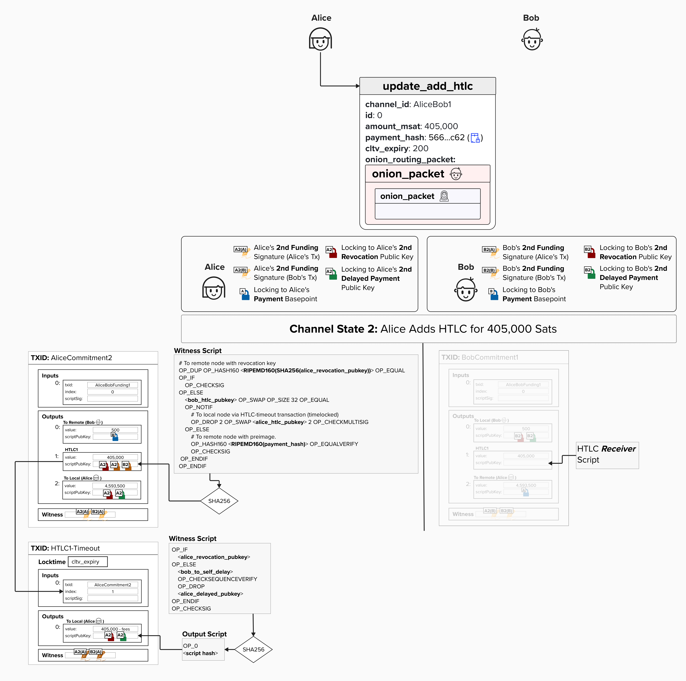
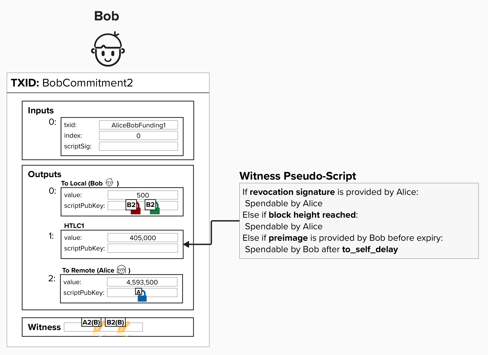
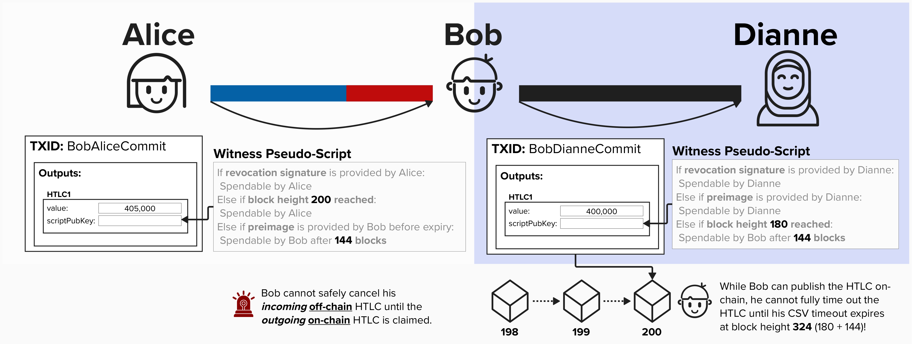
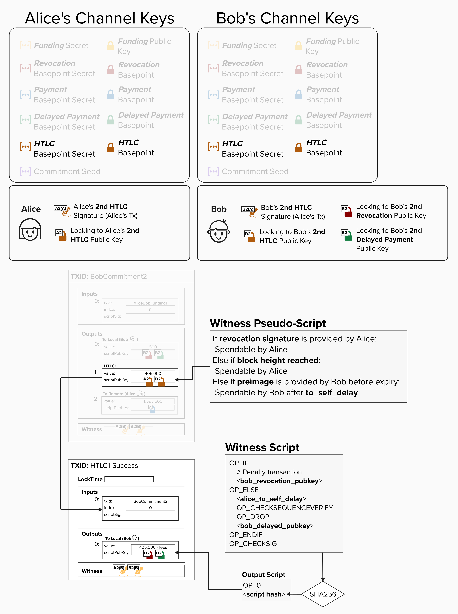

# HTLC Receiver

Now that we've reviewed Alice's HTLC script, let's take a look at Bob's - the **HTLC Receiver**!

Below is a diagram depicting the progress we've made thus far in our HTLC script journey. On the left, you can see the HTLC Offerer's (Alice's) full HTLC script. Now it's time to review Bob's!

  

Bob, the ***HTLC receiver***, has to create an output where:

- **Alice** can spend the output if she has the **Revocation Private Key**. This protects Alice in the future if Bob attempts to publish this commitment transaction after they have agreed to move to a new channel state.
- **Alice** can spend (effectively, reclaim) the output if the **HTLC expires**.
- **Bob** can spend the output if he obtains the **preimage** *before* the HTLC expires. Since this spending path involves Bob sending bitcoin to himself, it has to be timelocked by `to_self_delay` blocks.

  

However, similar to the HTLC Offerer script, there is a dilemma here! Bob's spending path must be delayed by `to_self_delay` blocks to give Alice time to sweep the output if Bob attempts to cheat in the future. 

#### Question: Looking at the simplified transaction, can you spot why these timelocks could pose a problem?

  
Answer

This is very similar to the prior dilemma we ran into - the issue lies with using both **relative** and **absolute** timelocks. However, now that we've introduced the fact that the HTLC script changes depending on whether you're offering or receiving the HTLC, we can dig into another reason that second-stage HTLC transactions are needed.

Take a look at the diagram below. Returning to our motivating example, remember that Bob is forwarding an HTLC from Alice to Dianne. Therefore, Bob has an **Incoming HTLC** from Alice and an **Outgoing HTLC** to Dianne. The HTLCs have the following expiry times:

- Alice → Bob: Expires at block height **200**
- Bob → Dianne: Expires at block height **180**

  

Now, imagine that Dianne goes offline after agreeing to transition to a new channel state which has the HTLC on her commitment with Bob. Since Dianne is now unresponsive, Bob **must** force-close his channel on-chain to ensure that he is safe and does not lose the bitcoin locked in the HTLC output.

Why is this? Imagine he does *not* close the channel on-chain and decides to wait until Dianne comes back online. If Dianne comes back online at block height 300, then Alice would have already expired the HTLC with Bob. So, if Bob's HTLC with Dianne is still pending, there is a chance that Dianne decides to claim the funds using the **preimage** path - but since Bob's HTLC with Alice is already expired, Bob cannot turn around and claim his 405,000 sats from Alice anymore. To ensure Bob does not lose funds, he'll have to expire the HTLC on-chain if Dianne goes offline!

Now, with this context, we can see the timelock issue more clearly! If we had both timelocks in the same HTLC script, then Bob would not be able to claim the HTLC output on-chain until **144** blocks ***after*** the **180** block height expiry, meaning that Dianne could actually still claim the HTLC funds using the preimage up to block height **324**.

If Bob wanted to safely put both timelocks in the same script, he would need to require that his HTLC expiry with Alice is ***after*** block height **324**. However, since `to_self_delay` values can sometimes exceed 2,000 blocks, the `cltv_expiry_delta` that nodes advertise would also need to exceed 2,000 blocks. If this were the case, then failed Lightning payments could be "stuck" for many weeks - an obvious unacceptable user experience.

By moving the HTLC expiry to a "second-stage" transaction (HTLC Timeout or HTLC Success), either party can immediately claim the HTLC funds, while still providing a revocation path in case they attempt to cheat in the future.

## Addressing The Dilemma

To fix this timelock dilemma, we'll add a second transaction for Bob, just like we did for Alice. However, this transaction will be called the **HTLC Success Transaction**. Just like the HTLC Timeout Transaction, this will use the same script as our `to_local` output, and it will have the following features:

1. The **input** for this transaction is the **HTLC output** from Bob's commitment transaction.
2. The HTLC Success Transaction will spend from a **2-of-2 multisig path in the commitment transaction's HTLC output script**. Therefore, it will require signatures from both Alice and Bob to spend. **Alice and Bob will pre-sign the HTLC Success Transaction when creating the HTLC output on their commitment transactions**.

Together, these changes allow Bob to claim the HTLC funds on-chain as long as he has the preimage before `cltv_expiry`. The funds then move to the second-stage success transaction, where they remain until Bob's `to_self_delay` passes.

  

## Putting It All Together

Putting it all together, the HTLC output has the following spending conditions:

1. **Revocation Path**: If Alice holds the revocation private key (in case Bob cheats by broadcasting an old transaction), she can immediately spend the output.
2. **Timeout Path**: If the `cltv_expiry` passes, Alice can spend the output.
3. **Preimage Path**: If Bob provides the preimage, he can spend the output via the HTLC Success Transaction, **which is set up in advance with Alice's signature for the 2-of-2 multisig condition. This allows Bob to claim the funds before the `cltv_expiry` and also enforce his `to_self_delay`**.

For the HTLC Success Transaction:

- **Revocation Path**: Alice can spend the output immediately with the revocation private key for this commitment state.
- **Delayed Path**: Bob can spend the output after the `to_self_delay`.

  

