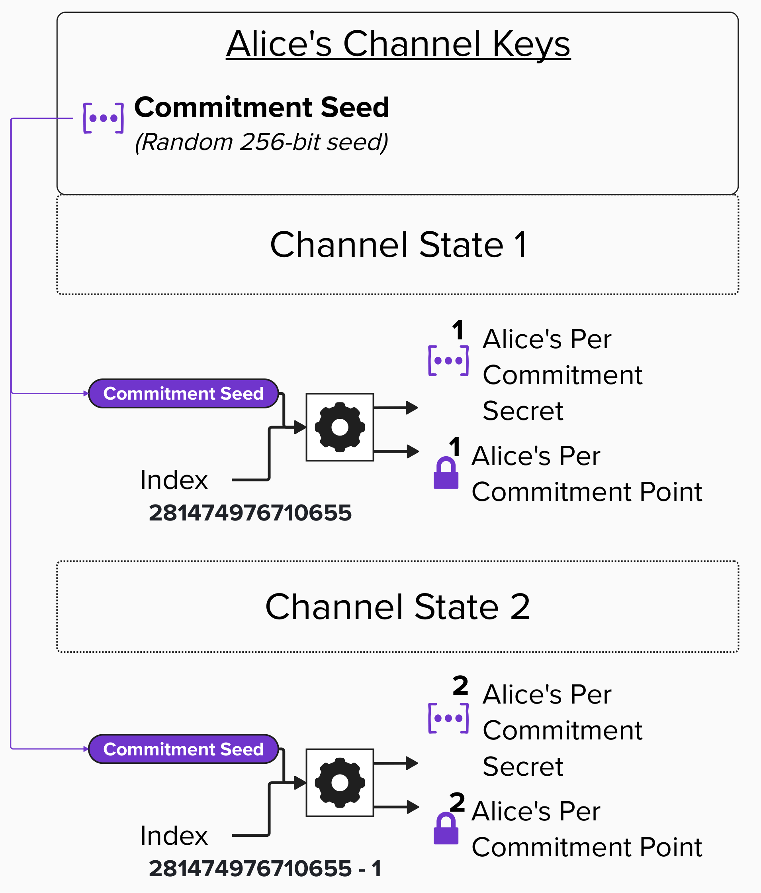
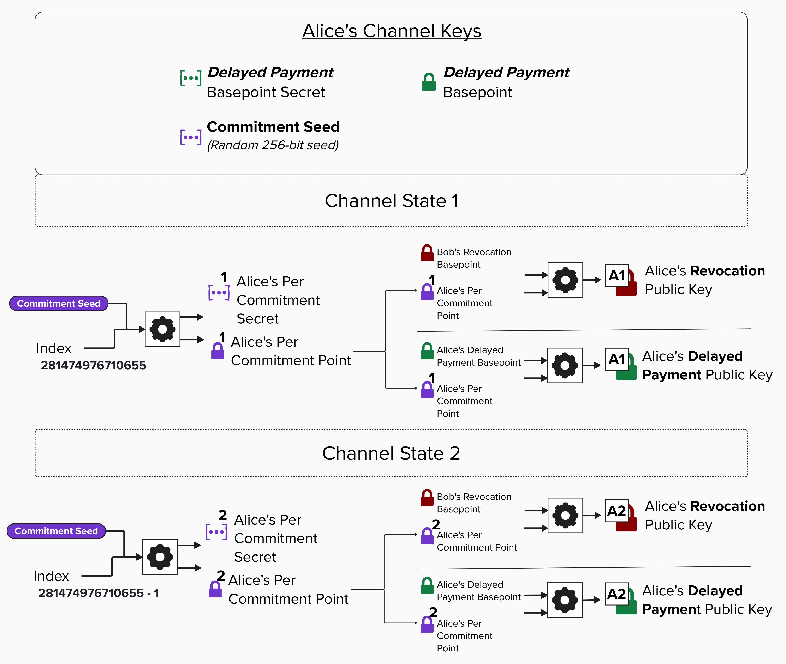
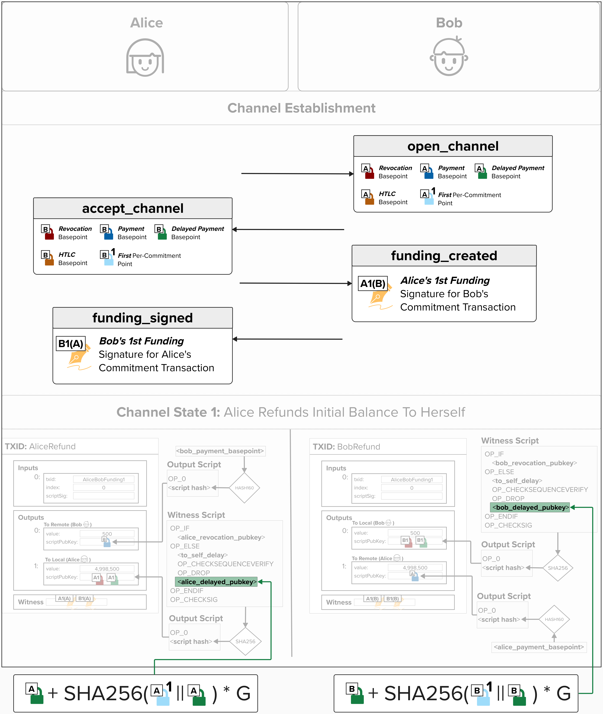
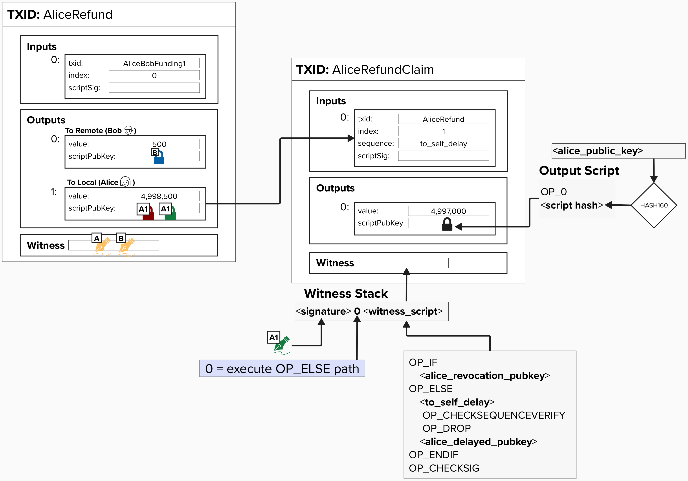

# Changing Our Public Keys For Each Commitment State

## Per-Commitment Secrets & Points

Alright, things are heating up fast. Hold on, we still have a lot to cover!

In the last exercise, we learned that Alice and Bob will each generate a series of **Per-Commitment Secrets** (private keys) and **Per-Commitment Points** (public keys) for each channel state. As we saw, these points are then used to create *unique* **Revocation Public Keys** for each channel state. Below is an image depicting this process from Alice's point of view. All she needs is a **Commitment Seed**, which she created when she opened the channel with Bob, and the **channel state index**.

> **NOTE:** In the picture below, the colors for Alice's keys have been changed back to match the colors from when we first created all of our Channel Keys.

<p align="center" style="width: 50%; max-width: 300px;">
  
</p>

So, at this point, the outstanding question on *everyone's* mind is: **"How do we create the Per-Commitment Secret from the Commitment Seed?!"** In other words, what does the gear icon actually mean?

Well, let's dig into that now.

## Deriving A Per-Commitment Secret

BOLT 3, in the [Per-commitment Secret Requirements](https://github.com/lightning/bolts/blob/master/03-transactions.md#per-commitment-secret-requirements) section, provides a specific algorithm for generating the secret for any given channel state. The algorithm, listed below, has the following two parameters:

- **seed**: The Commitment Seed for the channel
- **I**: The index. Per BOLT 3, the index starts at 281474976710655 for the first channel state, and is decremented by 1 for each new state

#### todo- explain how it works!

```
generate_from_seed(seed, I):
    P = seed
    for B in 47 down to 0:
        if B set in I:
            flip(B) in P
            P = SHA256(P)
    return P
```

### ⚡️ Build Per-Commitment Secret

Now that we've reviewed how the formula works, let's implement it ourselves! To do this, head back over to `src/exercises/keys/channel_keys_manager.rs`. Since this is where we implemented our `ChannelKeysManager`, which holds our channel keys (ex: **Commitment Seed**), it will be useful to implement the ability to generate a per-commitment secret here!

To successfully complete this function, you'll need to produce a **Per-Commitment Secret** (returned as `[u8; 32]`) that for a given `commitment_number`. The result must be in accordance with the specifications outlined in BOLT 3.

```rust
impl ChannelKeyManager {
pub fn build_commitment_secret(&self, commitment_number: u64) -> [u8; 32] {
    let mut res: [u8; 32] = self.commitment_seed.clone();
    for i in 0..48 {
        let bitpos = 47 - i;
        if commitment_number & (1 << bitpos) == (1 << bitpos) {
            res[bitpos / 8] ^= 1 << (bitpos & 7);
            res = Sha256::hash(&res).to_byte_array();
        }
    }
    res
  }
}
```

<details>
  <summary>💡 Hint 💡</summary>

#### todo - add high-level explanation "Hint" for how to complete

</details>

<details>
<summary>Step 1: Initialize the Result with the Commitment Seed</summary>

We'll start by creating a mutable variable that will hold our result. Let's initialize this variable as a copy of our `commitment_seed`, since the **Commitment Seed** is the starting point for generating all commitment secrets.

In Rust, we use the `mut` keyword to specify that a variable is mutable.

```rust
let mut res: [u8; 32] = self.commitment_seed.clone();
```

</details>


</details>
<details>
  <summary>Step 2: Loop Through 48 Bits and Check Each One</summary>
  
The BOLT 3 algorithm examines 48 bits of the `commitment_number` (giving us 2^48 possible commitments). For each iteration, we calculate the bit position starting from bit 47 down to 0, then check if that bit is set in the commitment number using bitwise operations.

The expression `commitment_number & (1 << bitpos)` checks if the bit at position `bitpos` is set to 1.

```rust
for i in 0..48 {
    let bitpos = 47 - i;
    if commitment_number & (1 << bitpos) == (1 << bitpos) {
```
</details>

<details>
<summary>Step 3: Flip the Bit and Hash</summary>

When we find a set bit, we flip the corresponding bit in our result array, then hash the entire result with SHA256.

We calculate which byte contains our bit (`bitpos / 8`) and which bit within that byte (`bitpos & 7`), then use XOR to flip it. The hash operation makes the process irreversible, which is key to the security of commitment secrets.

```rust
if commitment_number & (1 << bitpos) == (1 << bitpos) {
  res[bitpos / 8] ^= 1 << (bitpos & 7);
  res = Sha256::hash(&res).to_byte_array();
}
```
</details>

<details>
  <summary>Step 4: Return the Commitment Secret</summary>
  
After processing all 48 bits, we return the final 32-byte secret unique to this commitment_number

```rust
res
```

</details>

### ⚡️ Build Per-Commitment Point

Now that we have the ability to generate a **Per-Commitment Secret**, let's build the functionality to turn that into a **Per-Commitment Point**. To do this, we'll implement the `derive_per_commitment_point` function on our `ChannelKeyManager`.

This function takes one input: the `commitment_number`. We'll pass the commitment number into the `build_commitment_secret` function we created in the last exercise, which returns a 32-byte array. We'll then convert those bytes into a `SecretKey`. Finally, just as we've done in previous exercises, we'll convert the secret key to a public key and return it!

```rust
impl ChannelKeyManager {
    pub fn derive_per_commitment_point(&self, commitment_number: u64) -> PublicKey {
        let secret = self.build_commitment_secret(commitment_number);
        let secret_key = SecretKey::from_slice(&secret).expect("Valid secret");
        PublicKey::from_secret_key(&self.secp_ctx, &secret_key)
    }
}
```
<details>
  <summary>💡 Hint 💡</summary>

This exercise brings together concepts we've covered earlier in this course.

To successfully complete this function, you'll want to:

1. Generate the per-commitment secret using `build_commitment_secret()`, which we implemented in the last exercise. It's available via `self.` because we implemented it on `ChannelKeyManager`, the same struct this function is on.

2. Convert the 32-byte array to a `SecretKey`
   - Use `SecretKey::from_slice(&secret).expect("Valid secret")`

3. Derive the public key from the secret key
   - Use `PublicKey::from_secret_key(&self.secp_ctx, &secret_key)`

That's it!

</details>

<details>
  <summary>Step 1: Generate the Commitment Secret</summary>

First, we use the `build_commitment_secret` function we just implemented to generate the unique secret for this commitment number

```rust
let secret = self.build_commitment_secret(commitment_number);
```
</details>

<details>
  <summary>Step 2: Convert Bytes to SecretKey</summary>

Our commitment secret is currently just a 32-byte array. To perform elliptic curve operations on it, we need to convert it into a proper `SecretKey` type that the secp256k1 library can work with.

The `from_slice` function parses our bytes and validates that they represent a valid secret key on the secp256k1 curve.

```rust
let secret_key = SecretKey::from_slice(&secret).expect("Valid secret");
```

</details>


<details>
  <summary>Step 3: Derive and Return the Public Key</summary>
    
Finally, we derive the public key from our secret key using elliptic curve multiplication. This public key is our **Per-Commitment Point**!

```rust
PublicKey::from_secret_key(&self.secp_ctx, &secret_key)
```
</details>

## Lightning Key Derivation

At this point, we should have a good intuition for how we can derive new **Revocation Public Keys** for each commitment state. However, the fun doesn't stop just yet! In Lightning, we actually derive new public keys for most of the keys used in each commitment transaction.

For example, remember how we introduced a **Delayed Payment Public Key**, which is used in the delayed spending path (after the `to_self_delay` relative timelock)? Well, somewhat similarly to the Revocation Public Key, this public key is also derived by combining its basepoint (**Delayed Payment Basepoint**) with a given state's **Per-Commitment Point**.

Take a look at the visual below. You can see that we use each state's **Per-Commitment Point** and combine it with a **Basepoint** to produce a new public key, which we place in the actual locking script.

<p align="center" style="width: 50%; max-width: 300px;">
  
</p>

However, the crucial difference here is that the **Delayed Payment Public Key** is ***not*** derived the same way as the **Revocation Public Key**. Instead, it uses the *local party's* **Delayed Payment Basepoint**. For example, Alice will use her **Delayed Payment Basepoint** and combine it with *her* **Per-Commitment Point**. She'll use the equation below to calculate the **Delayed Payment Public Key**, which she will put in *her* delayed spending path. She *won't* use Bob's Basepoint because this path is only ever meant to be spent by Alice, so it's important that she can derive the private key to spend from this path at any time.
```
pubkey = basepoint + SHA256(per_commitment_point || basepoint) * G
```

## Delayed Public Keys in Locking Scripts

Now that we know how to derive the **Delayed Payment Public Key** for a given transaction, let's review the overall flow one more time to make sure everything makes sense! Then, we'll code it up!

The diagram below shows the **Channel Establishment** message flow that we reviewed earlier. You can see all of the **Basepoints** that Alice and Bob send to each other in the `open_channel` and `accept_channel` messages. If you've been paying close attention, you may notice that we've now included the **First Per-Commitment Points** in the `open_channel` and `accept_channel` messages! Per the [BOLT 2 specification](https://github.com/lightning/bolts/blob/master/02-peer-protocol.md#the-open_channel-message), the **First Per-Commitment Points** are actually included in these messages, but we left them out earlier because we hadn't yet introduced them!

At the bottom of the diagram, you can see how we calculate Alice's **Delayed Payment Public Key** for her version of the commitment transaction by plugging *her* **Delayed Payment Basepoint** and *her* **First Per-Commitment Point** into the formula provided in the BOLT 3 specification. On the other hand, we use *Bob's* **Delayed Payment Basepoint** and *Bob's* **First Per-Commitment Point** when calculating *his* **Delayed Payment Public Key**.

<p align="center" style="width: 50%; max-width: 300px;">
  
</p>

#### Question: Why does Alice need Bob's Delayed Payment Basepoint? It looks like she only uses her Delayed Payment Basepoint to create the Delayed Payment Public Key that goes into her `to_local` witness script...

<details>
  <summary>Answer</summary>

Remember, each new transaction that Alice and Bob create spends from the 2-of-2 funding output! Since Alice and Bob each have their own version of the commitment transaction, they each require a unique signature from the other to ensure their commitment transactions are valid.

Therefore, Alice needs to recreate *Bob's* version of the commitment transaction locally so she can generate a signature for it and send that signature to Bob! Bob does the same for Alice.

To ensure that Alice and Bob can create each other's commitment transactions locally, they share their Basepoints when opening their channel.

</details>

### ⚡️ Derive Public Keys

Alright, let's get our hands dirty by implementing `derive_public_key`, a function that takes a **Basepoint** and **Per-Commitment Point** and returns a public key for a specific commitment transaction.

In case you're wondering, the function definition doesn't specify which basepoint for a few reasons. First, we can use this function to derive a **Delayed Payment Public Key** for our counterparty, which uses *their* **Delayed Payment Basepoint** and their **Per-Commitment Point**. Additionally, as we'll see later, there are other public keys that we'll derive using different **Basepoints**!

To successfuly complete this exericse, you'll need to implement the formula as defined in [BOLT 3](https://github.com/lightning/bolts/blob/master/03-transactions.md#localpubkey-local_htlcpubkey-remote_htlcpubkey-local_delayedpubkey-and-remote_delayedpubkey-derivation):
```
pubkey = basepoint + SHA256(per_commitment_point || basepoint) * G
```

```rust
pub fn derive_public_key(
    basepoint: &PublicKey,
    per_commitment_point: &PublicKey,
    secp_ctx: &Secp256k1<All>,
) -> PublicKey {
    // pubkey = basepoint + SHA256(per_commitment_point || basepoint)
    let mut engine = Sha256::engine();
    engine.input(&per_commitment_point.serialize());
    engine.input(&basepoint.serialize());
    let res = Sha256::from_engine(engine);

    let hashkey = PublicKey::from_secret_key(
        &secp_ctx,
        &SecretKey::from_slice(res.as_byte_array())
            .expect("Hashes should always be valid keys unless SHA-256 is broken"),
    );

    basepoint.combine(&hashkey).expect("Addition only fails if the tweak is the inverse of the key. This is not possible when the tweak contains the hash of the key.")
}
```

<details>
  <summary>💡 Hint 💡</summary>

This exercise is pretty similar to deriving the Revocation Keys. Feel free to look back at that exercise if you get stuck!

Here's the general approach:

1. Hash the **Per-Commitment Point** and **Basepoint** together (note the order!).
   - Just like you did in the revocation exercise, use `Sha256::engine()`, `.input()`, and `Sha256::from_engine()`

2. Convert the hash to a public key.
   - Treat the hash as a secret key and derive a public key from it

3. Add the basepoint to this hash-derived public key.
   - Use `.combine()` to add the two points together

</details>

<details>
  <summary>Step 1: Create a SHA256 Hashing Engine</summary>

Just like we did previously, let's start by creating a SHA256 hash engine. 

```rust
let mut engine = Sha256::engine();
```
</details>

<details>
<summary>Step 2: Hash the Per-Commitment Point and Basepoint</summary>

Next, let's hash the concatenation of our **Per-Commitment Point** and **Basepoint**. Remember, order matters!

Also, make to sure serialize each public key using `.serialize()`, which gives us the compressed 33-byte representation, then feed those bytes into our hash engine with `.input()`.

```rust
engine.input(&per_commitment_point.serialize());
engine.input(&basepoint.serialize());
```
</details>

<details>
<summary>Step 3: Finalize the Hash and Convert to Public Key</summary>

Now, let's finalize the hash and convert the resulting 32 bytes into a public key. To be clear, we're treating a hash output as a secret key, which we then use to derive its public key.

```rust
let res = Sha256::from_engine(engine);
let hashkey = PublicKey::from_secret_key(
    &secp_ctx,
    &SecretKey::from_slice(res.as_byte_array())
        .expect("Hashes should always be valid keys unless SHA-256 is broken"),
);
```
</details>

<details>
  <summary>Step 4: Combine the Basepoint with the Hash Key</summary>
  
Finally, let's add our basepoint to the hash key using elliptic curve point addition. The `.combine()` method performs this addition on the secp256k1 curve.

```rust
basepoint.combine(&hashkey).expect("Addition only fails if the tweak is the inverse of the key. This is not possible when the tweak contains the hash of the key.")
```
</details>

## Deriving Private Keys

Okay, so we have our public keys ready to go! But how do we generate the private keys so that we can spend from any given commitment state? For example, the diagram below depicts a situation where Alice needs to claim her funds from the first commitment state, which we've been calling the "Refund" transaction. To do this, she needs to spend from the **Delayed Payment Public Key**, which is unique to this commitment state.

<p align="center" style="width: 50%; max-width: 300px;">
  
</p>

We created the **Delayed Payment Public Key** by combining the **Delayed Payment Basepoint** with a **Per-Commitment Point**. Therefore, to generate the corresponding private key, we need to apply the same tweak to the **Delayed Payment Basepoint Secret**. BOLT 3 provides us with the equation to do just this:
```
privkey = basepoint_secret + SHA256(per_commitment_point || basepoint)
```

#### Question: Take a look at the newly added sequence field in the "input" section of Alice's refund claim transaction. What is `to_self_delay` here?

<details>
  <summary>Answer</summary>

Recall how we added a delay so that Alice had to wait `to_self_delay` (e.g., 2016 blocks or ~2 weeks) before she could claim her funds from this output, if it's mined? This was to give Bob time to claim these funds first if Alice was cheating by broadcasting this transaction *after* they had already agreed to move to a new channel state.

Well, in this example, we're assuming that Alice is playing nice and is fairly claiming these funds back. To do this, she will have to set the `sequence` field in the input, which specifies the output she's spending, to the `to_self_delay` value that was embedded in the script. If you're interested in reading the details, you can read the OP_CHECKSEQUENCEVERIFY BIP [here](https://github.com/bitcoin/bips/blob/master/bip-0112.mediawiki).

If you're busy (or intimidated by the BIP - they can be scary), here is the TLDR: The `sequence` field specifies a relative timelock on the input, meaning that a transaction cannot be mined until that number of blocks (or amount of time) has passed **since the output being spent was confirmed**. `OP_CHECKSEQUENCEVERIFY`, when evaluated on the stack, checks if the provided delay (`to_self_delay`, in our case) is less than or equal to the value in the `sequence` field. By doing this, we can restrict the delayed spending path such that Alice cannot spend from it until the relative timelock has expired. Neat, eh?

</details>

### ⚡️ Derive Private Keys

For this exercise, we'll implement `derive_private_key`, a function that takes a `basepoint_secret` (like our `delayed_payment_basepoint_secret`), a `per_commitment_point`, and returns the derived private key we can use to sign for that specific commitment.

To successfuly complete this exericse, you'll need to implement the formula as defined in [BOLT 3](https://github.com/lightning/bolts/blob/master/03-transactions.md#localpubkey-local_htlcpubkey-remote_htlcpubkey-local_delayedpubkey-and-remote_delayedpubkey-derivation):
```
pubkey = basepoint + SHA256(per_commitment_point || basepoint) * G
```

```rust
pub fn derive_private_key(
    basepoint_secret: &SecretKey,
    per_commitment_point: &PublicKey,
    secp_ctx: &Secp256k1<All>,
) -> SecretKey {
    // privkey = basepoint_secret + SHA256(per_commitment_point || basepoint)
    let basepoint = PublicKey::from_secret_key(secp_ctx, basepoint_secret);
    let mut engine = Sha256::engine();
    engine.input(&per_commitment_point.serialize());
    engine.input(&basepoint.serialize());
    let res = Sha256::from_engine(engine).to_byte_array();
    basepoint_secret.clone().add_tweak(&Scalar::from_be_bytes(res).unwrap())
        .expect("Addition only fails if the tweak is the inverse of the key. This is not possible when the tweak contains the hash of the key.")
}
```
<details>
  <summary>💡 Hint 💡</summary>

This is very similar to deriving the public key, but we're working with secrets (scalars) instead of public keys (points). The key difference is that we use **addition** instead of point combination.

Below are some tips to help you complete this exercise successfully:

1. Derive the basepoint (public key) from the basepoint secret.
   - Use `PublicKey::from_secret_key(secp_ctx, basepoint_secret)`

2. Hash the **Per-Commitment Point** and **Basepoint** together.
   - Use `Sha256::engine()`, `.input()`, and `Sha256::from_engine()`

3. Convert the hash to a `Scalar`.
   - Use `Scalar::from_be_bytes(hash)`

4. Add the scalar to the basepoint secret.
   - Use `.add_tweak(&scalar)` on the secret key

</details>

<details>
  <summary>Step 1: Derive the Basepoint Public Key</summary>

First, we need to derive the public key (basepoint) from our basepoint secret. We need this because the hash in our derivation formula includes the basepoint, not the secret!

```rust
let basepoint = PublicKey::from_secret_key(secp_ctx, basepoint_secret);
```
</details>


<details>
  <summary>Step 2: Hash the Per-Commitment Point and Basepoint</summary>
  
Just like we did for public key derivation, we create a SHA256 hash engine and input the **Per-Commitment Point** and **Basepoint** - in that order.

```rust
let mut engine = Sha256::engine();
engine.input(&per_commitment_point.serialize());
engine.input(&basepoint.serialize());
let res = Sha256::from_engine(engine).to_byte_array();
```
</details>

<details>
  <summary>Step 3: Add the Tweak to the Basepoint Secret</summary>

Next, let's add the hash (tweak) to the **Basepoint Secret** using scalar addition on the secp256k1 curve. The `.add_tweak()` method handles this securely.

To do this, We'll need to convert our hash bytes into a `Scalar` using `Scalar::from_be_bytes()`.

```rust
basepoint_secret.clone().add_tweak(&Scalar::from_be_bytes(res).unwrap())
.expect("Addition only fails if the tweak is the inverse of the key. This is not possible when the tweak contains the hash of the key.")
```
</details>