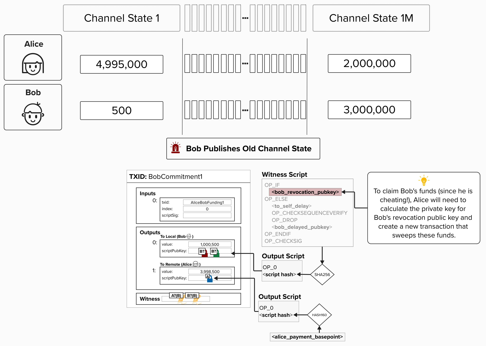
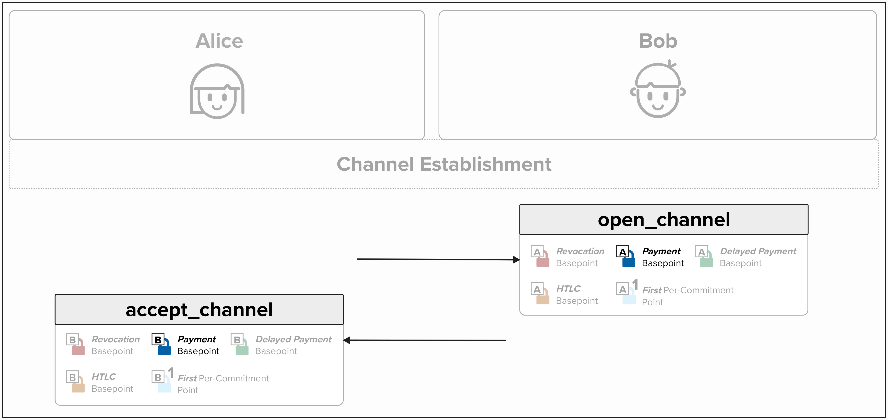
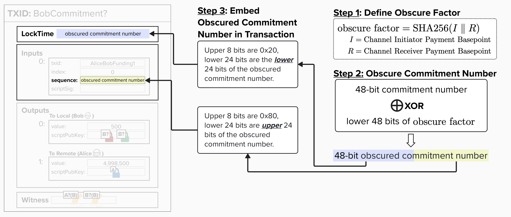

# Obscured Commitment Number

Okay, we're **very** close to implementing our first commitment transaction! We just have one piece left to review.

Imagine Alice and Bob have been sending payments back and forth for a while. They've even reached 1,000,000 payments - wow! What if Bob tries to pull a fast one and publish an old commitment transaction? Remember, each channel state uses a unique set of private and public keys! So, to spend from **Bob's Revocation Public Key**, Alice will have to derive the private key using the formula below:

```
revocationprivkey = 
    revocation_basepoint_secret * SHA256(revocation_basepoint || per_commitment_point)
        +
    per_commitment_secret * SHA256(per_commitment_point || revocation_basepoint)
```

Crucially, to derive the components above, Alice needs the right **Per-Commitment Secret**, which means she must know the channel index for this specific state!

*Don't be afraid to zoom into the diagram below!*

<p align="center" style="width: 50%; max-width: 300px;">
  
</p>

#### Question: How would we know which commitment state Bob is publishing so that we can punish him and claim all channel funds via the revocation path?

<details>
  <summary>Answer</summary>

One idea is to simply store all previous transactions so that we can iterate through our history and see which state matches the transaction Bob posted. But, that doesn't sound too efficient.

Another idea is to put the commitment number in the transaction itself! That way, just by looking at the transaction, we can identify the commitment number, generate the associated private key, and claim the funds from the revocation path. Justice is served!

This second approach - embedding the commitment number in the transaction itself - is exactly what Lightning does! Specifically, per [BOLT 3](https://github.com/lightning/bolts/blob/master/03-transactions.md#commitment-transaction), the commitment number is split and embedded within the **locktime** and **sequence** fields. Remember, the max number of commitments we can generate is 2^48 - 1, so we need **6 bytes (48 bits)** of storage space! Since the locktime and sequence fields only have 4 bytes each, we need to split the commitment index across these fields.

At this point, you may be wondering how we can embed the commitment index within the **locktime** and **sequence** fields. Don't these fields have a specific purpose? Won't putting arbitrary data in those fields cause an issue? Well, it depends on *how* you embed it, but more on that in just a moment.

<p align="center" style="width: 50%; max-width: 300px;">
  
</p>

#### Question: Should we put the raw commitment number in the transaction, which is publicly observable on the blockchain? Is this bad for privacy?

<details>
  <summary>Answer</summary>

If we embed the raw commitment number within the transaction, that would be a massive privacy leak, as anyone would be able to see how many commitment states our Lightning channel had at the time of closure.

To prevent this privacy leak, the Lightning protocol specifies that we must *obscure* the number of commitments by using an **XOR** operation with a SHA256-derived factor (based on *both channel partners'* **Payment Basepoints**). Since the **Payment Basepoints** should only be known by the channel parties, this ensures that outsiders will be unable to decipher the actual number of commitments. Remember, Alice and Bob exchange **Payment Basepoints** when setting up their channel.

<p align="center" style="width: 50%; max-width: 300px;">
  
</p>

Since the number of commitments requires up to 6 bytes to store, we separate the obscured commitment number into two 24-bit chunks:

- The upper 24 bits are placed in the **locktime** field, prefixed with `0x20` (8 bits) since this is a 4-byte field.
  - We prefix with `0x20` because it ensures the resulting locktime will be above 536,870,912 but below 546,937,241. Since anything above 500,000,000 is interpreted as a Unix timestamp, and this range corresponds to dates around 1987, the locktime will always be a valid timestamp in the past. This workaround enables us to use the locktime field for storing arbitrary data. Kinda spicy, but neat!

- The lower 24 bits are placed in the **sequence** field, prefixed with `0x80` (8 bits) since this is a 4-byte field.
  - We prefix with `0x80` because it disables any relative timelocks (in relation to the 2-of-2 multisig funding transaction). We're then free to use the remaining 24 bits to store our commitment transaction data!

<p align="center" style="width: 50%; max-width: 300px;">
  
</p>

</details>

</details>


## ⚡️ Write A Function To Generate An Obscure Factor

Let's get back to work! First and foremost, to generate an obscured commitment number, we'll need to write a function to generate an **obscure factor**. This is what we'll use to XOR our commitment number.

<p align="center" style="width: 50%; max-width: 300px;">
  
</p>

If you head over to `src/exercises/transactions/commitment.rs`, you'll find the function `get_commitment_transaction_number_obscure_factor`. This function takes the following parameters:

- `initiator_payment_basepoint` (`&PublicKey`): The Payment Basepoint of the channel opener. In our ongoing example, Alice is the channel opener.
- `receiver_payment_basepoint` (`&PublicKey`): The Payment Basepoint of the channel receiver.

To complete this exercise, implement a function that:

- Takes both parties' payment basepoints (`initiator_payment_basepoint` and `receiver_payment_basepoint`)
- Returns a `u64` containing the 48-bit obscure factor

The function should hash both payment basepoints together and extract the last 6 bytes (48 bits) of the resulting hash.

```rust
pub fn get_commitment_transaction_number_obscure_factor(
    initiator_payment_basepoint: &PublicKey,
    receiver_payment_basepoint: &PublicKey,
) -> u64 {
    let mut sha = Sha256::engine();
    sha.input(&initiator_payment_basepoint.serialize());
    sha.input(&receiver_payment_basepoint.serialize());
    let res = Sha256::from_engine(sha).to_byte_array();
    ((res[26] as u64) << 5 * 8)
        | ((res[27] as u64) << 4 * 8)
        | ((res[28] as u64) << 3 * 8)
        | ((res[29] as u64) << 2 * 8)
        | ((res[30] as u64) << 1 * 8)
        | ((res[31] as u64) << 0 * 8)
}
```

<details>
  <summary>💡 Hint 💡</summary>

To complete this function, you'll need to derive the lower 48 bits of the SHA256 hash of the two payment basepoints. For instance, the below instructions are taken directly from [BOLT 3](https://github.com/lightning/bolts/blob/master/03-transactions.md#commitment-transaction):
```
The 48-bit commitment number is obscured by XOR with the lower 48 bits of:

SHA256(payment_basepoint from open_channel || payment_basepoint from accept_channel)
```

Below are a few hints that will help you complete this exercise:

#### 1. Hash the Two Payment Basepoints

Just like we've done many times now, start by creating a hash engine and hash the two payment basepoints together. To do this, you'll want to use `Sha256::engine()`, `.input()`, and `Sha256::from_engine()`.

#### 2. Return the Lower 48 Bits

At this point, you'll have a **32-byte** hash. Our function must return the lower 48 bits of this result as an **unsigned 64-bit integer** (`u64`). We may be tempted to simply extract the lower 6 bytes from our hash, but this would give us an array of 6 elements. For a simple analogy, it would return something like this: `[1, 2, 3, 4, 5, 6]`. However, what we really want is a number like this: `123456`.

To convert the array into a number, we'll need to perform an operation that is similar to the below, but for bits instead of decimals:
```
1 × 100000 = 100,000
2 × 10000  = 20,000
3 × 1000   = 3,000
4 × 100    = 400
5 × 10     = 50
6 × 1      = 6
             ───────
             123,456
```

Since bytes are 8 bits, we'll need to extract the bytes and shift them to the left by multiples of 8 bits. Below is a visual representation of what that will look like:
```
Byte at Index 26 << 5 * 8 = Shift left by 5 bytes (40 bits)
Byte at Index 27 << 4 * 8 = Shift left by 4 bytes (32 bits)
Byte at Index 28 << 3 * 8 = Shift left by 3 bytes (24 bits)
Byte at Index 29 << 2 * 8 = Shift left by 2 bytes (16 bits)
Byte at Index 30 << 1 * 8 = Shift left by 1 byte (8 bits)
Byte at Index 31 << 0 * 8 = Shift left by 0 bytes (no shift)
```

Finally, if we bitwise OR (`|`) them all together, we effectively merge them into one number.

Below is an example showing how to combine 6 bytes into a 48-bit number (you'll need to adjust the indices to extract the *last* 6 bytes of the hash):
```rust
((res[0] as u64) << 5 * 8)
    | ((res[1] as u64) << 4 * 8)
    | ((res[2] as u64) << 3 * 8)
    | ((res[3] as u64) << 2 * 8)
    | ((res[4] as u64) << 1 * 8)
    | ((res[5] as u64) << 0 * 8)
```

</details>

<details>
  <summary>Step 1: Create the SHA256 Hash Engine</summary>

At this point, you're probably a pro at creating SHA256 hash engines!

```rust
let mut sha = Sha256::engine();
```

</details>

<details>
  <summary>Step 2: Hash the Basepoints in Order</summary>

Next, let's input both payment basepoints (remember, initiator first!).

```rust
sha.input(&initiator_payment_basepoint.serialize());
sha.input(&receiver_payment_basepoint.serialize());
```

</details>

<details>
  <summary>Step 3: Finalize the Hash</summary>

Now, we'll finalize the hash and convert it to a byte array.

```rust
let res = Sha256::from_engine(sha).to_byte_array();
```

</details>

<details>
  <summary>Step 4: Extract and Combine the Last 6 Bytes</summary>

Finally, we need to extract the last 6 bytes (bytes 26-31) and combine them into a single 48-bit number.

```rust
((res[26] as u64) << 5 * 8)
    | ((res[27] as u64) << 4 * 8)
    | ((res[28] as u64) << 3 * 8)
    | ((res[29] as u64) << 2 * 8)
    | ((res[30] as u64) << 1 * 8)
    | ((res[31] as u64) << 0 * 8)
```

**Why do we need bit shifting?**

At this point, you'll have a **32-byte** hash. Our function must return the lower 48 bits of this result as an **unsigned 64-bit integer** (`u64`). We may be tempted to simply extract the lower 6 bytes from our hash, but this would give us an array of 6 elements. For a simple analogy, it would return something like this: `[1, 2, 3, 4, 5, 6]`. However, what we really want is a number like this: `123456`.

To convert the array into a number, we'll need to perform an operation that is similar to the below, but for bits instead of decimals:
```
1 × 100000 = 100,000
2 × 10000  = 20,000
3 × 1000   = 3,000
4 × 100    = 400
5 × 10     = 50
6 × 1      = 6
             ───────
             123,456
```

Since bytes are 8 bits, we'll need to extract the bytes and shift them to the left by multiples of 8 bits. Below is a visual representation of what that will look like:
```
Byte at Index 26 << 5 * 8 = Shift left by 5 bytes (40 bits)
Byte at Index 27 << 4 * 8 = Shift left by 4 bytes (32 bits)
Byte at Index 28 << 3 * 8 = Shift left by 3 bytes (24 bits)
Byte at Index 29 << 2 * 8 = Shift left by 2 bytes (16 bits)
Byte at Index 30 << 1 * 8 = Shift left by 1 byte (8 bits)
Byte at Index 31 << 0 * 8 = Shift left by 0 bytes (no shift)
```

Finally, if we bitwise OR (`|`) them all together, we effectively merge them into one number.

</details>


## ⚡️ Set Obscured Commitment Number in Transaction

Now let's bring this full circle by implementing a function that sets the obscured commitment number for a transaction in a given commitment state.

To do this, we'll complete `set_obscured_commitment_number`, which is also located in `src/exercises/transactions/commitment.rs`.

This function takes the following inputs:

- `tx` (`&mut Transaction`): A *mutable* reference to a transaction. In Rust terms, this means we are not taking ownership of the `Transaction` and it can be changed.
- `commitment_number` (`u64`): The commitment number for the given channel state.
- `initiator_payment_basepoint` (`&PublicKey`): The Payment Basepoint of the channel opener.
- `receiver_payment_basepoint` (`&PublicKey`): The Payment Basepoint of the channel receiver.

Go ahead and give it a try! To complete this function, you'll need to use the function we created in the last exercise to calculate the obscured commitment factor. You can then use that to derive the upper and lower 24 bits of the obscured commitment number (Steps 2 and 3 in the diagram below).

<p align="center" style="width: 50%; max-width: 300px;">
  
</p>

```rust
pub fn set_obscured_commitment_number(
    tx: &mut Transaction,
    commitment_number: u64,
    initiator_payment_basepoint: &PublicKey,
    receiver_payment_basepoint: &PublicKey,
) {
    let obscure_factor = get_commitment_transaction_number_obscure_factor(
        &initiator_payment_basepoint,
        &receiver_payment_basepoint,
    );
    let obscured = obscure_factor ^ (INITIAL_COMMITMENT_NUMBER - commitment_number);

    // Lower 24 bits go in locktime (prefixed with 0x20)
    let locktime_value = ((0x20u32) << 24) | ((obscured & 0xFFFFFF) as u32);
    tx.lock_time = LockTime::from_consensus(locktime_value);

    // Upper 24 bits go in sequence (prefixed with 0x80)
    let sequence_value = Sequence(((0x80u32) << 24) | ((obscured >> 24) as u32));
    tx.input[0].sequence = sequence_value;
}
```

<details>
  <summary>💡 Hint 💡</summary>

To complete this function, you'll ultimately need to set the locktime and sequence to the appropriate values. Effectively, this means coding something like the below.

> Note: There is only one input on this transaction - the funding input. So you can set the sequence value by indexing the 0th input.

```rust
tx.lock_time = LockTime::from_consensus(locktime_value);

tx.input[0].sequence = sequence_value;
```

Below are a few hints to get you going.

#### 1. Derive Obscure Factor
Start by calculating the obscure factor using `get_commitment_transaction_number_obscure_factor()` from the previous exercise.

#### 2. XOR Commitment Number with Obscure Factor
Next, you'll need to XOR the commitment number with the **obscure factor** we derived in the last exercise. You can XOR two values by using `^`. For example: `value1 ^ value2`.

> ❗ Reminder: The "Commitment Number" counts down from 281474976710655. A constant variable, `INITIAL_COMMITMENT_NUMBER`, is defined and available to you. You'll need to subtract the `commitment_number` input into this function by the `INITIAL_COMMITMENT_NUMBER`. 

#### 3. Split the 48-Bit Obscured Value into Two 24-Bit Chunks
   - Lower 24 bits: `obscured & 0xFFFFFF`
   - Upper 24 bits: `obscured >> 24`

#### 4. Set the locktime and sequence
Check out the example at the top of this "Hint" to see how to set these values!

</details>

<details>
  <summary>Step 1: Calculate the Obscure Factor</summary>

First, let's put your prior exercise to good use. Use it to get our obscure factor!

```rust
let commitment_transaction_number_obscure_factor =
    get_commitment_transaction_number_obscure_factor(
        &initiator_payment_basepoint,
        &receiver_payment_basepoint,
    );
```

</details>

<details>
  <summary>Step 2: Calculate the Obscured Commitment Number</summary>

Next, we need to XOR the obscure factor with the commitment number. Remember, in Lightning, commitment numbers count DOWN from 281474976710655 (0xFFFFFFFFFFFF in hex, which is 48 bits of all 1s). By subtracting from `INITIAL_COMMITMENT_NUMBER`, we get a value that counts UP from 0, which is what we actually encode into the transaction. The XOR operation then obscures this value.

```rust
let obscured_commitment_transaction_number = commitment_transaction_number_obscure_factor
    ^ (INITIAL_COMMITMENT_NUMBER - commitment_number);
```

</details>

<details>
  <summary>Step 3: Encode Lower 24 Bits in lock_time</summary>

The lower 24 bits of the obscured commitment number go into the transaction's `lock_time` field.

Remember, per BOLT 3, the **locktime's** most significant byte position (leftmost byte) needs to be `0x20`.
- `0x20 << 8 * 3` puts the byte `0x20` in the most significant byte position.
- `obscured_commitment_transaction_number & 0xffffffu64` extracts the lower 24 bits (3 bytes) of our obscured number using a bitmask.
- The `|` operator combines these, giving us a 32-bit value with the marker byte and our 24 bits.

```rust
let locktime_value =
    ((0x20 as u32) << 8 * 3) | ((obscured_commitment_transaction_number & 0xffffffu64) as u32);
tx.lock_time = LockTime::from_consensus(locktime_value);
```

</details>

<details>
  <summary>Step 4: Encode Upper 24 Bits in sequence</summary>

Similar to the locktime field, we need to place `0x80` in the most significant byte position for the **sequence** field. 

Once we do that, we place the upper 24 bits of the obscured commitment number in the `sequence` field.

> Note: `obscured_commitment_transaction_number >> 3 * 8` shifts right by 24 bits (3 bytes) to get the upper 24 bits of our obscured number

```rust
let sequence_value = Sequence(
    ((0x80 as u32) << 8 * 3) | ((obscured_commitment_transaction_number >> 3 * 8) as u32),
);
tx.input[0].sequence = sequence_value;
```

</details>
