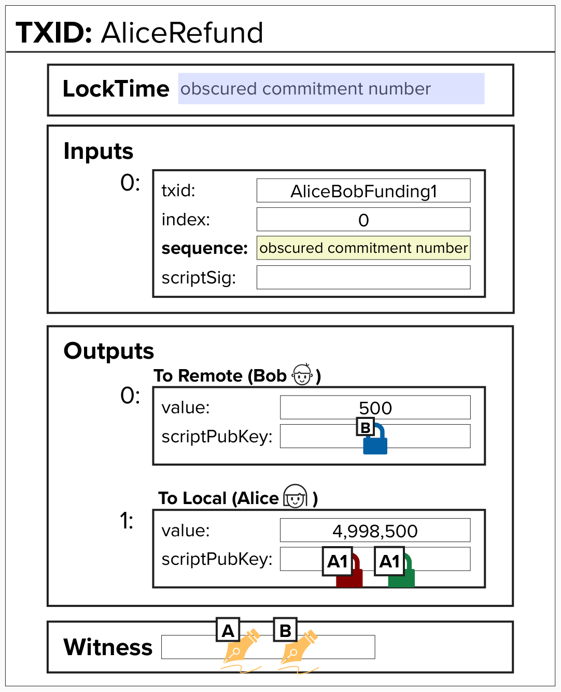
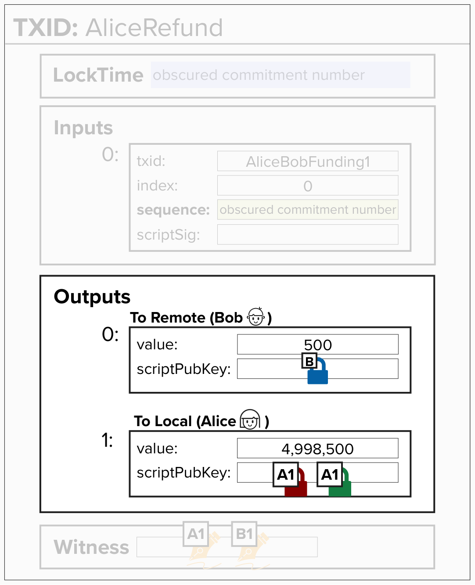
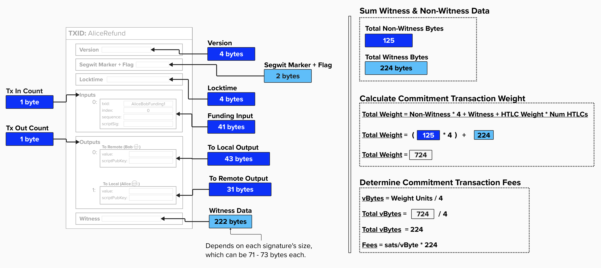
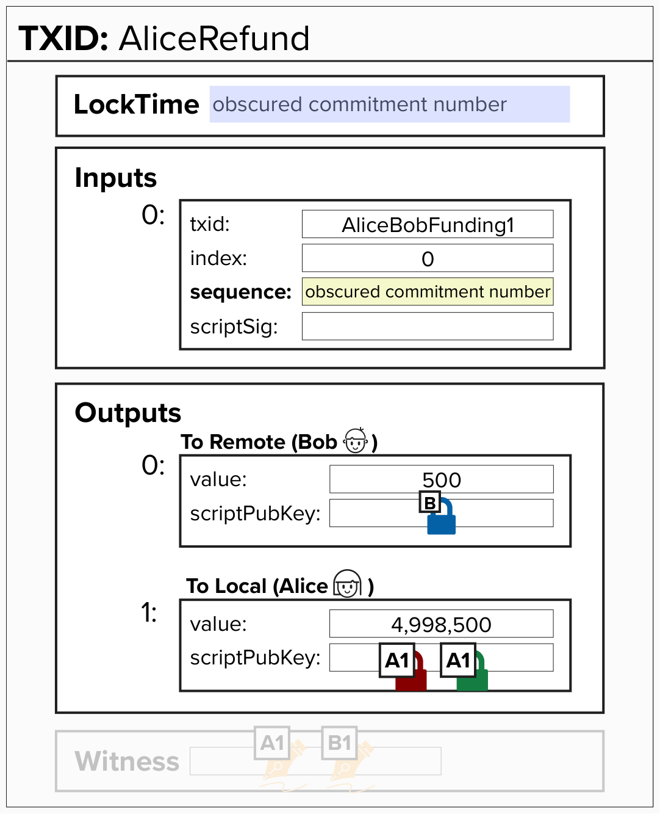
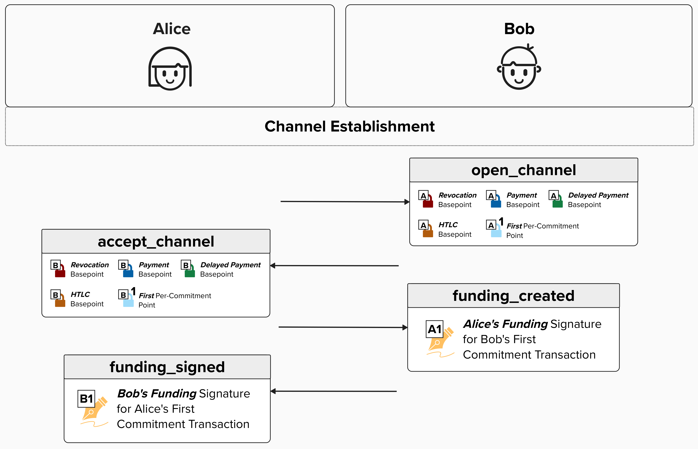
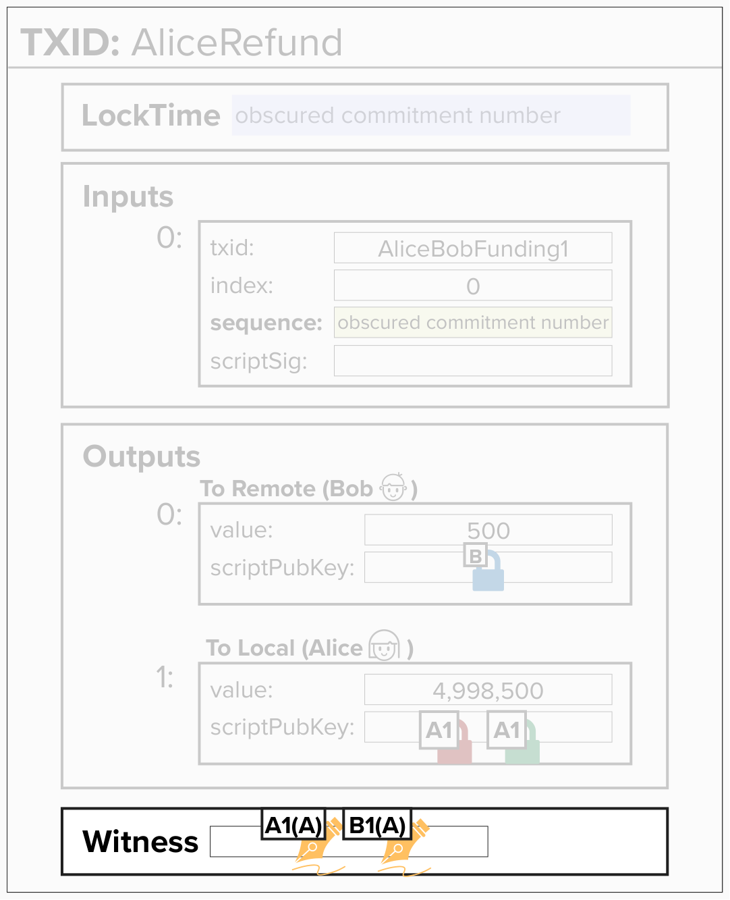

# Pulling It All Together: Build Our Commitment Transaction

We've come a long way! Let's piece together everything we've reviewed thus far and **fully** implement our first commitment transaction, which we've been referring to our "refund transaction" 😎.

Remember, we (Alice) will actually build **both** our version of the commitment transaction **and** Bob's version for each commitment state. Do you remember why we need to build Bob's version as well?

<details>
<summary>Answer</summary>

We need to build Bob's version so that we can generate a signature to send to Bob for *his* version of the commitment transaction!

</details>

Take a look at the below image... we'll be translating this into code!
<p align="center" style="width: 50%; max-width: 300px;">
  
</p>

## Commitment Transaction Outputs
We'll start by focusing on commitment transaction outputs. Below are a few questions to build our intuition and see if you've been paying attention!

<details>
<summary>Do the outputs follow a specific order?</summary>

Yes! If you recall from earlier, the Lightning network spec (specifically, BOLT 3: [Transaction Output Ordering](https://github.com/lightning/bolts/blob/master/03-transactions.md#transaction-output-ordering)) specifies that outputs should be ordered in the following manner:
- First, according to their value - smallest first.
  - If there is a tie, the output with the lexicographically lesser `scriptpubkey` comes first, then selecting the shorter script (if they differ in length).
  - For HTLC outputs, if there is a tie after sorting via the above, then they are ordered in increasing `cltv_expiry` order.

</details>

<details>
<summary>Do Alice and Bob ALWAYS have an output - one for each of them?</summary>

No! We do not produce outputs for values that fall below the [dust limit](https://github.com/lightning/bolts/blob/master/03-transactions.md#dust-limits), as these would be uneconomical to spend on-chain anyway, and, therefore, just take up space and add extra fees to our commitment transaction.

To add further nuance, each party specifies its own dust limit, informing the peer of the thresholds below which it will not create outputs. These are communicated in the [open_channel](https://github.com/lightning/bolts/blob/master/02-peer-protocol.md#the-open_channel-message) and [channel_accept](https://github.com/lightning/bolts/blob/master/02-peer-protocol.md#the-open_channel-message) messages.

If a channel party's balance is too small to have it's own output, it's added to fees and considered [**trimmed**](https://github.com/lightning/bolts/blob/master/03-transactions.md#trimmed-outputs).

</details>

<details>
<summary>Who pays the fees for this commitment transaction?</summary>

If you recall, we're following **Channel Establishment V1**, which is the simpler channel opening protocol where one party funds the channel and that same party pays the fees.

In our case, we (Alice) opened the channel, so we'll pay the fees - meaning that the fees will be subtracted from our channel balance.

</details>

<p align="center" style="width: 50%; max-width: 300px;">
  
</p>

## Commitment Transaction Fees

Now is as good a time as any to talk about fees! In bitcoin, there are two main contributors to fees:
- Transaction Weight: This is the size, in **virtual bytes** (vBytes), of a transaction.
- Demand for Blockspace: As you're likely aware, bitcoin blockspace is limited. Therefore, to get your transaction mined, you'll have to *incentivize* a miner to include your transaction in their block. Since many people are intersted in getting their transaction mined, a fee market comes into existance. In other words, to get your transaction mined, you'll need to pay for it!

#### Virtual Bytes (vBytes)
To understand a "virtual byte", let's first review a "byte". A **byte** is simply 8 bits of data. In the diagram below, you can see each field within a bitcoin transaction and its size (in bytes). By now, you should be familiar with most of these fields. However, they are a few that we haven't discussed, such as the Segwit Marker and Flag. Understanding these two fields is not imperative for this course, but, if you'd like a more technical deep dive into the entire structure of a bitcoin transaction, check out Learn Me A Bitcoin's [Transaction resource](https://learnmeabitcoin.com/technical/transaction/).

The Segregated Witness (SegWit) upgrade introduced this concept of **weight**, which is the **size** (in bytes) of certain parts of the transaction multiplied by a **multiplier**. For example, non-witness data will be multiplied by 4, while witness data will be multiplied by 1. If you add up the resulting **size** x **multiplier**, you'll get the **total weight** of a transaction. Finally, if you divide the **total weight** by 4, you get the **virtual bytes** of the transaction. This is where the term "witness discount" comes from!

The total fees that one would pay to get their transaction mined is measured by the **number of satoshis** they are willing to pay per **virtual byte** - also knowns as **sats/vByte**.

<p align="center" style="width: 50%; max-width: 300px;">
  
</p>

#### Question: Assuming no HTLCs, does the weight of a Lightning Commitment transaction change?
<details>
<summary>Answer</summary>

I'll admit, this question may be a little unfair, since we have not yet reviewed HTLCs. However, since the diagram above *mostly* answers this question pretty explicitly, maybe the question isn't unfair after all!

The answer is yes - it may change, but not by much! The weight for a commitment tranaction with no HTLCs falls, roughly, within a pretty narrow range of 720 - 724. This is because the Lightning protocol defines how Lightning transactions are structured, so there is not much room for variation. In other words, each Lightning transaction (without HTLCs or anchors) will only have a `to_local` and `to_remote` output. Additionally, the witness will always have two signatures and the standardized 2-of-2 multisig script. That said, as you may be able to see from the diagram above, each signature (and sighash flag) will likely be 71, 72, or 73 bytes, so this will cause the total weight to vary slightly.

Therefore, the maximum **weight** (assuming 73 byte signatures) of a simple (no HTLC or anchor) Lightning transaction is **724**. If you don't believe me or the diagram above, take a look at the [Fee Calculation](https://github.com/lightning/bolts/blob/master/03-transactions.md#fee-calculation) section of BOLT 3 (also shown below). Since we have no HTLCs, the weight is simply 724.

```
Commitment weight (no option_anchors):   724 + 172 * num-untrimmed-htlc-outputs
```

</details>

## ⚡️ Write A Function To Create Commitment Transaction Outputs

Alright, let's get to work! We'll start by completing `create_commitment_transaction_outputs`, which is located in `src/exercises/transactions/commitment.rs`. 

To complete this exercise, you'll need to return a `Vec` of `OutputWithMetadata` - a custom Rust Type which represents a commitment transaction output.

<details>
  <summary>Click to see the OutputWithMetadata Type</summary>

The OutputWithMetadata is a custom Type that represents a commitment transaction output. To be clear, this Type is not provided by Rust Bitcoin. It's something that is specific to the Programming Lightning course.

If you're familiar with Lightning and Hash Time-Locked Contracts (HTLCs), all of these fields may look familiar to you. If not, no worries at all! Below is a brief overview of what you'll need to know *for the purposes of this exercise*.
- `value`: This is simply the amount of bitcoin locked to this output.
- `script`: This is the script we're locking the bitcoin to. Since we've only learned about `to_local` and `to_remote` outputs thus far, you can imagine this holding the `ScriptBuf` type for those outputs.
- `cltv_expiry`: This .... is a surprise for later! If you know how HTLCs work, then this the expiry! It makes things easier and more intuitive if we include this in the OutputWithMetadata since we'll need to use it for sorting our outputs. Since we haven't covered HTLCs yet (and there is no expiry for `to_local` and `to_remote` outputs), we'll simply set this value to `None` for this exercise.

```rust
pub struct OutputWithMetadata {
    pub value: u64,
    pub script: ScriptBuf,
    pub cltv_expiry: Option<u32>,
}
```
</details>

This function will take the following inputs:
- `to_local_value`: The amount of bitcoin being locked to the `to_local` script.
- `to_remote_value`: The amount of bitcoin being locked to the `to_remote` script.
- `commitment_keys`: This is a custom sruct that holds all of the keys you'll need to complete this transaction. You can learn more about it below.
- `remote_payment_basepoint`: This is the remote party's Payment Basepoint. You should know where this goes by now!
- `to_self_delay`: This is the number of blocks that the transaction holder needs to wait before they can claim their funds.
- `dust_limit_satoshis`: This is the dust limit, which is specific to each party. Remember, Alice and Bob specify their own dust limits when they open the channel to each other.
- `fee`: This is the fee that needs to be paid for this transaction. It's the sats/vByte, where vByte is our transaction's Weight Units / 4 (~724).

 <details>
   <summary>Click to see the CommitmentKeys Type</summary>

The CommitmentKeys type is meant to hold all of the public keys we'll need for any given channel state. In other words, these keys have already been tweaked by the **Per Commitment Point** and are unique to a specific channel state.

 ```rust
pub struct CommitmentKeys {
    /// The per-commitment point used to derive the other keys
    pub per_commitment_point: PublicKey,

    /// The revocation key which allows the broadcaster's counterparty to punish
    /// them if they broadcast an old state
    pub revocation_key: PublicKey,

    /// Local party's HTLC key (derived from local_htlc_basepoint)
    pub local_htlc_key: PublicKey,

    /// Remote party's HTLC key (derived from remote_htlc_basepoint)
    pub remote_htlc_key: PublicKey,

    /// Local party's delayed payment key (for to_local output)
    pub local_delayed_payment_key: PublicKey,
}
 ```
 </details>

**PRO-TIP 1**: Since we're following **Channel Establishment V1** and we're acting as Alice, the fees should be deducted from our balance!

**PRO-TIP 2**: Remember, you should not add outputs if the channel party's balance is **below** the `dust_limit_satoshis`.

```rust
fn create_commitment_transaction_outputs(
    to_local_value: u64,
    to_remote_value: u64,
    commitment_keys: &CommitmentKeys,
    remote_payment_basepoint: &PublicKey,
    to_self_delay: u16,
    dust_limit_satoshis: u64,
    fee: u64,
) -> Vec<OutputWithMetadata> {
    let mut outputs = Vec::new();

    // Create to_remote output (goes to counterparty, immediately spendable)
    if to_remote_value >= dust_limit_satoshis {
        let to_remote_script = create_to_remote_script(remote_payment_basepoint);
        outputs.push(OutputWithMetadata {
            value: to_remote_value,
            script: to_remote_script,
            cltv_expiry: None,
        });
    }

    // Create to_local output (goes to us, revocable with delay)
    if to_local_value - fee >= dust_limit_satoshis {
        let to_local_script = create_to_local_script(
            &commitment_keys.revocation_key,
            &commitment_keys.local_delayed_payment_key,
            to_self_delay,
        );

        outputs.push(OutputWithMetadata {
            value: to_local_value - fee,
            script: to_local_script.to_p2wsh(),
            cltv_expiry: None,
        });
    }

    outputs
}
```

<details>
  <summary>Step 1: Initialize the Outputs Vector</summary>
    
First, we need to create a mutable vector to hold our commitment transaction outputs. 

```rust
let mut outputs = Vec::new();
```

We need it to be mutable (mut) because we'll be adding outputs to it as we go. Some outputs might be below the dust limit and won't be included at all.

</details>

<details>
  <summary>Step 2: Create the to_remote Output</summary>

The `to_remote` output pays the counterparty (the remote party). This output is immediately spendable by them with no delays or revocation conditions. However, we only create this output if the value meets or exceeds the dust limit.

```rust
if to_remote_value >= dust_limit_satoshis {
    let to_remote_script = create_to_remote_script(remote_payment_basepoint);
    outputs.push(OutputWithMetadata {
        value: to_remote_value,
        script: to_remote_script,
        cltv_expiry: None,
    });
}
```

</details>


<details>
  <summary>Step 3: Create the to_local Output</summary>

The `to_local` output pays us (the local party), but with important restrictions: it has a time delay and can be revoked by the counterparty if we try to broadcast an old state. The fee is deducted from our output since we're the one creating this commitment transaction.

```rust
if to_local_value - fee >= dust_limit_satoshis {
    let to_local_script = create_to_local_script(
        &commitment_keys.revocation_key,
        &commitment_keys.local_delayed_payment_key,
        to_self_delay,
    );
    outputs.push(OutputWithMetadata {
        value: to_local_value - fee,
        script: to_local_script.to_p2wsh(),
        cltv_expiry: None,
    });
}
```

</details>


<details>
  <summary>Step 4: Return the Outputs</summary>

  Finally, we return the vector containing all outputs that met the dust threshold. 

  ```rust
  outputs
  ```

  </details>


## ⚡️ Write A Function To Sort Outputs

Great, we're moving along! We now have a `Vec` of `OutputWithMetadata` Types, where each instance represents a bitcoin transaction output. Things are pretty simple now, as we only have two outputs, but, like all things in life, things will get complicated eventually.

To prepare ourselves for the future, let's implement a quick function to sort a `Vec` of `OutputWithMetadata` Types such that they follow the [Lightning Spec](https://github.com/lightning/bolts/blob/master/03-transactions.md#transaction-output-ordering). Fun fact, the Lightning specification actually follows [BIP 69](https://github.com/bitcoin/bips/blob/master/bip-0069.mediawiki), which recommends how various bitcoin applications should order inputs and outputs in transactions. By standardizing this, we help improve privacy. Otherwise, if individual applications all had their own logic for sorting inputs/outputs, they would leave a public "fingerprint" on the blockchain and it would be much easier to determine which software created which transaction.

Lightning builds on BIP 69 by adding a CLTV Expiry sort after first sorting by value and then lexicographically.

For this exercise, you'll need to complete `sort_outputs`, which will take a mutable reference to a `Vec` of `OutputWithMetadata` Types. You can click below to remind yourself of which fields are available within the `OutputWithMetadata`. To successfully complete this function, you must sort the outputs accordingly:
- First, according to their value - smallest first.
  - If there is a tie, the output with the lexicographically lesser `scriptpubkey` comes first, then selecting the shorter script (if they differ in length).
  - For HTLC outputs, if there is a tie after sorting via the above, then they are ordered in increasing `cltv_expiry` order.

<details>
  <summary>Click to see the OutputWithMetadata Type</summary>

```rust
pub struct OutputWithMetadata {
    pub value: u64,
    pub script: ScriptBuf,
    pub cltv_expiry: Option<u32>,
}
```
</details>

```rust
pub fn sort_outputs(outputs: &mut Vec<OutputWithMetadata>) {
    outputs.sort_by(|a, b| {
        a.value
            .cmp(&b.value)
            .then(a.script.cmp(&b.script))
            .then(a.cltv_expiry.cmp(&b.cltv_expiry))
    });
}
```

<details>
  <summary>Step 1: Use sort_by for Multi-Level Sorting</summary>

Rust's `sort_by` method allows us to define custom sorting logic. We'll use it to sort by multiple criteria in order of priority.

```rust
pub fn sort_outputs(outputs: &mut Vec<OutputWithMetadata>) {
    outputs.sort_by(|a, b| {
        // Sorting logic goes here
    });
}
```

The `sort_by` method takes a closure that compares two elements (`a` and `b`) and returns an `Ordering`. The function mutates the vector in place, which is why `outputs` is a mutable reference (`&mut`).
</details>

<details>
  <summary>Step 2: Sort by Value First</summary>

The primary sorting criterion is the output value. Lower amounts should come first.

```rust
a.value.cmp(&b.value)
```

The cmp method compares two values and returns:

- `Ordering::Less` if `a.value` < `b.value`
- `Ordering::Equal` if `a.value` == `b.value`
- `Ordering::Greater` if `a.value` > `b.value`


This ensures outputs are sorted in ascending order by satoshi amount.

</details>

<details>
  <summary>Step 3: Add Script as Secondary Sort</summary>

If two outputs have the same value, we need a tiebreaker. We sort lexicographically by the script bytes using the `then` combinator.

```rust
a.value
.cmp(&b.value)
.then(a.script.cmp(&b.script))
```

The `then` method only evaluates if the first comparison returns `Ordering::Equal`. The `ScriptBuf` type implements `Ord`, which compares the script bytes lexicographically (byte-by-byte, like dictionary order).

This secondary sort ensures that if two outputs have the same value but different scripts, they'll be ordered consistently.
</details>

<details>
  <summary>Step 5: Add CLTV Expiry as Final Tiebreaker</summary>

In rare cases, two HTLC outputs might have the same value AND the same script (they use the same payment hash and keys). We use the CLTV expiry as a final tiebreaker.

```rust
a.value
.cmp(&b.value)
.then(a.script.cmp(&b.script))
.then(a.cltv_expiry.cmp(&b.cltv_expiry))
```

Since `cltv_expiry` is an `Option<u32>`, Rust's Option already implements `Ord` with the following behavior:
- None is considered less than `Some(_)`
- When both are `Some`, it compares the inner values

This means non-HTLC outputs (with `None` for `cltv_expiry`) will sort before HTLCs with the same value and script, and HTLCs will be ordered by their timelock values.
</details>


## ⚡️ Write A Function To Create An Unsigned Commitment Transaction

Let's continue our coding journey by implementing `create_commitment_transaction` in `src/exercises/transactions/commitment`. We'll use the function we created in the previous exercise (`create_commitment_transaction_outputs`) to build our outputs, add those to a `Transaction` struct, and then update the `timelock` and `sequence` fields with the obscured commitment number.

In the next exercise, we'll add the witness data, and then we'll be good-to-go!

<p align="center" style="width: 50%; max-width: 300px;">
  
</p>


The `create_commitment_transaction` function takes the following inputs:
- `funding_outpoint`: OutPoint,
- `to_local_value`: u64,
- `to_remote_value`: u64,
- `commitment_keys`: &CommitmentKeys,
- `local_payment_basepoint`: &PublicKey,
- `remote_payment_basepoint`: &PublicKey,
- `commitment_number`: u64,
- `to_self_delay`: u16,
- `dust_limit_satoshis`: u64,
- `feerate_per_kw`: u64,
- `offered_htlcs`: &[HTLCOutput],
- `received_htlcs`: &[HTLCOutput]


```rust
pub fn create_commitment_transaction(
    funding_outpoint: OutPoint,
    to_local_value: u64,
    to_remote_value: u64,
    commitment_keys: &CommitmentKeys,
    local_payment_basepoint: &PublicKey,
    remote_payment_basepoint: &PublicKey,
    commitment_number: u64,
    to_self_delay: u16,
    dust_limit_satoshis: u64,
    feerate_per_kw: u64,
    offered_htlcs: &[HTLCOutput],
    received_htlcs: &[HTLCOutput],
) -> Transaction {
    // Calculate fee based on number of HTLCs
    let num_htlcs = offered_htlcs.len() + received_htlcs.len();
    let fee = calculate_commitment_tx_fee(feerate_per_kw, num_htlcs);
    let mut output_metadata = Vec::new();

    let channel_outputs = create_commitment_transaction_outputs(
        to_local_value,
        to_remote_value,
        commitment_keys,
        remote_payment_basepoint,
        to_self_delay,
        dust_limit_satoshis,
        fee,
    );

    let htlc_outputs = create_htlc_outputs(&commitment_keys, &offered_htlcs, &received_htlcs);

    // Add to_local and to_remote outputs
    output_metadata.extend(channel_outputs);

    // Add all HTLC outputs
    output_metadata.extend(htlc_outputs);

    // Sort everything once
    sort_outputs(&mut output_metadata);

    // Convert to TxOut
    let outputs: Vec<TxOut> = output_metadata
        .iter()
        .map(|meta| TxOut {
            value: Amount::from_sat(meta.value),
            script_pubkey: meta.script.clone(),
        })
        .collect();

    let mut tx = Transaction {
        version: Version::TWO,
        lock_time: LockTime::ZERO,
        input: vec![TxIn {
            previous_output: funding_outpoint,
            script_sig: ScriptBuf::new(),
            sequence: Sequence::MAX,
            witness: Witness::new(),
        }],
        output: outputs,
    };

    set_obscured_commitment_number(
        &mut tx,
        commitment_number,
        local_payment_basepoint,
        remote_payment_basepoint,
    );

    tx
}
  ```

<details>
    <summary>Step 1: Calculate the Transaction Fee</summary>

First, we need to figure out how much the commitment transaction will cost in fees. The fee depends on how many HTLCs are included, since each HTLC adds weight to the transaction.

```rust
let num_htlcs = offered_htlcs.len() + received_htlcs.len();
let fee = calculate_commitment_tx_fee(feerate_per_kw, num_htlcs);
let mut output_metadata = Vec::new();
```

We're also initializing an empty vector called output_metadata that we'll use to collect all our outputs before sorting them.

The `calculate_commitment_tx_fee` function takes the feerate (in satoshis per kiloweight) and the total number of HTLCs to determine the appropriate fee for this transaction.

</details>

<details>
  <summary>Step 2: Create the Channel Balance Outputs</summary>

Next, we create the main outputs that represent each party's balance in the channel. These are the `to_local` and `to_remote` outputs.

```rust
let channel_outputs = create_commitment_transaction_outputs(
    to_local_value,
    to_remote_value,
    commitment_keys,
    remote_payment_basepoint,
    to_self_delay,
    dust_limit_satoshis,
    fee,
);
```

This function handles several important details:
- Subtracts the transaction fee from the appropriate party's balance
- Checks if outputs are above the dust limit (omitting them if they're too small)
- Creates the `to_local` output with a revocable timelock script
- Creates the `to_remote` output that the counterparty can spend immediately

The `dust_limit_satoshis` parameter is crucial here - if an output would be smaller than this amount (plus any HTLC transaction fees if applicable), it's considered "dust" and gets trimmed from the transaction. This prevents creating outputs that cost more to spend than they're worth.

</details>

<details>
  <summary>Step 3: Create the HTLC Outputs</summary>

Now we need to add outputs for any pending HTLCs in this commitment transaction.

```rust
let htlc_outputs = create_htlc_outputs(&commitment_keys, &offered_htlcs, &received_htlcs);
```
</details>

<details>
  <summary>Step 4: Combine All Outputs</summary>

Let's gather all our outputs into one vector so we can sort them.

```rust
// Add to_local and to_remote outputs
output_metadata.extend(channel_outputs);

// Add all HTLC outputs
output_metadata.extend(htlc_outputs);
```

The `extend` method appends all elements from one vector to another. We first add the channel balance outputs, then the HTLC outputs.

</details>


<details>
  <summary>Step 5: Sort the Outputs</summary>

    Bitcoin transactions must have their outputs in a specific order for Lightning. We sort them according to BIP 69 (lexicographic order by value, then by script).

```rust
sort_outputs(&mut output_metadata);
```

</details>


<details>
  <summary>Step 6: Convert to Transaction Outputs</summary>

Now we need to convert our metadata into actual Bitcoin transaction outputs.

```rust
let outputs: Vec<TxOut> = output_metadata
.iter()
.map(|meta| TxOut {
    value: Amount::from_sat(meta.value),
    script_pubkey: meta.script.clone(),
})
.collect();
```
We iterate through each piece of metadata and create a `TxOut` for it. Remember, Rust Bitcoin requires the `value` field to be of type `Amount`, so we convert from satoshis using `Amount::from_sat()`.

</details>


<details>
  <summary>Step 7: Create the Transaction</summary>

Let's assemble all the pieces into an actual Bitcoin transaction.

```rust
let mut tx = Transaction {
    version: Version::TWO,
    lock_time: LockTime::ZERO,
    input: vec![TxIn {
        previous_output: funding_outpoint,
        script_sig: ScriptBuf::new(),
        sequence: Sequence::MAX,
        witness: Witness::new(),
    }],
    output: outputs,
};
```

Note that we make this transaction `mut` (mutable) because we need to modify it in the next step.

</details>

<details>
  <summary>Step 8: Set the Obscured Commitment Number</summary>

Finally, we need to encode the commitment number into the transaction. This is a clever way to embed the commitment number so that either party can identify which commitment transaction is being broadcast.

```rust
set_obscured_commitment_number(
  &mut tx,
  commitment_number,
  local_payment_basepoint,
  remote_payment_basepoint,
);

tx
```
</details>

## Signing A Commitment Transaction

Let's bring this to a finish by signing our commitment transaction and then adding both our signature and Bob's to the witness. Remember, as part of **Channel Establishment V1**, Bob will send Alice **his** signature for **Alice's** version of the first commitment transaction, and Alice will send Bob **her** signature for **his** version of the commitment transaction.

<p align="center" style="width: 50%; max-width: 300px;">
  
</p>

If Alice wanted to broadcast her version of the first commitment transaction, she could simply generate her own signature and add that, along with Bob's signature and the witness script, to the witness. This would satisfy the spending conditions and allow her to broadcast her version of the commitment transaction.

#### Question: When Alice receives Bob's signature, will she sign her version of the commitment transaction and save the fully signed transaction somewhere? Or will she wait to sign it?

<details>
  <summary>Answer</summary>

Lighting implementations will ***not*** fully sign their version of the commitment transactions **until** they intend to broadcast them. If they did fully sign them and stored them in memory or a database, this would put them at risk of being published early - either by accident or by a malicious actor that gets access to them.

Therefore, it's best practice to wait to sign your version of a commitment transaction until you intend to publish it.

</details>

## ⚡️ Write A Function To Sign A Commitment Transaction

For this exercise, we'll implement `sign_holder_commitmentment`. This function will take a transaction, produce a signature using the **Funding Private Key**, and add the appropriate witness data satisfy the 2-of-2 multisig spending condition. It will return the resulting transaction, ready to be broadcasted.

To successfully complete this exercise, you'll want to make use of the `ChannelKeyManager`, which we created earlier in this course. Specifically, you'll use the `ChannelKeyManager` to:
1. Obtain the **Funding Private Key**.
2. Sign the 2-of-2 multisig funding input with `sign_transaction_input`, which we completed in an earlier exercise.

<details>
  <summary>Click here to see the sign_transaction_input_sighash_all function defintion</summary>

```rust
pub fn sign_transaction_input_sighash_all(
    &self,
    tx: &Transaction,
    input_index: usize,
    script: &ScriptBuf,
    amount: u64,
    secret_key: &SecretKey,
) -> Vec<u8> {
```

</details>

<p align="center" style="width: 50%; max-width: 300px;">
  
</p>

This function takes the following inputs:
- `keys_manager`: Our `ChannelKeyManager`, which contains the channel private keys and signing functionality.
- `tx`: The current, unsigned, commitment transaction.
- `input_index`: The index of the 2-of-2 multisig output.
- `funding_script`: The 2-of-2 multisig witness script.
- `funding_amount`: The amount of funds locked in the 2-of-2 multisig.
- `remote_funding_signature`: Our remote counterparty's signature to spend from the 2-of-2 multisig input.


Go ahead and give it a try!

```rust
pub fn sign_holder_commitmentment(
    keys_manager: ChannelKeyManager,
    tx: Transaction,
    input_index: usize,
    funding_script: &ScriptBuf,
    funding_amount: u64,
    remote_funding_signature: Vec<u8>,
) -> Transaction {

    let local_funding_privkey = keys_manager.funding_key;

    let local_funding_signature = keys_manager.sign_transaction_input_sighash_all(
        &tx,
        input_index,
        &funding_script,
        funding_amount,
        &local_funding_privkey,
    );

    // Build witness stack: [0, sig1, sig2, witnessScript]
    let witness = Witness::from_slice(&[
        &[][..], // OP_0 for CHECKMULTISIG bug
        &local_funding_signature[..],
        &remote_funding_signature[..],
        funding_script.as_bytes(),
    ]);

    let mut signed_tx = tx;
    signed_tx.input[0].witness = witness;

    signed_tx
}
```

<details>
  <summary>Step 1: Get the Local Funding Private Key</summary>

First, we need to retrieve our funding private key from the keys manager. This is the key that corresponds to our funding public key in the 2-of-2 multisig.

```rust
let local_funding_privkey = keys_manager.funding_key;
```

The `funding_key` is the secret key that we use to control our side of the channel funding output. We'll use this to create our signature for the commitment transaction.
</details>

<details>
  <summary>Step 2: Sign the Transaction Input</summary>
  
Now we create our signature for the transaction input that spends the funding output.

```rust
let local_funding_signature = keys_manager.sign_transaction_input_sighash_all(
    &tx,
    input_index,
    &funding_script,
    funding_amount,
    &local_funding_privkey,
);
```
</details>


<details>
  <summary>Step 3: Build the Witness Stack</summary>
    
For a 2-of-2 multisig P2WSH output, we need to construct a witness stack with four elements in the correct order.

```rust
let witness = Witness::from_slice(&[
  &[][..],                          // OP_0 for CHECKMULTISIG bug
  &local_funding_signature[..],     // First signature
  &remote_funding_signature[..],    // Second signature
  funding_script.as_bytes(),        // The witness script
]);
```
</details>


<details>
  <summary>Step 4: Attach the Witness to the Transaction</summary>

Now we need to attach our witness stack to the appropriate input of the transaction.

```rust
let mut signed_tx = tx;
signed_tx.input[0].witness = witness;

signed_tx

```
We create a mutable copy of the transaction and set the witness field of the input. For commitment transactions, there's only one input (the funding output), so we access `input[0]`.

The witness field is what makes this a SegWit transaction - the signature data lives in the witness rather than in the `script_sig` field.

Don't forget to return the signed transaction!
</details>
