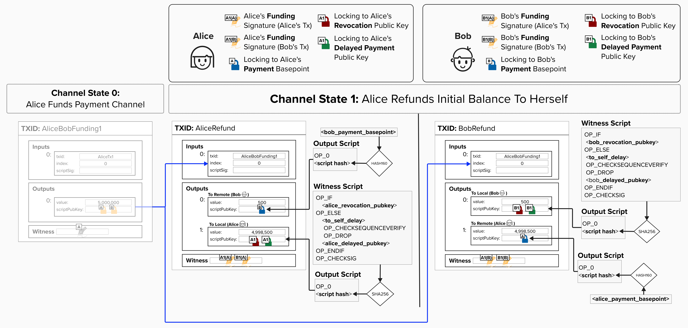
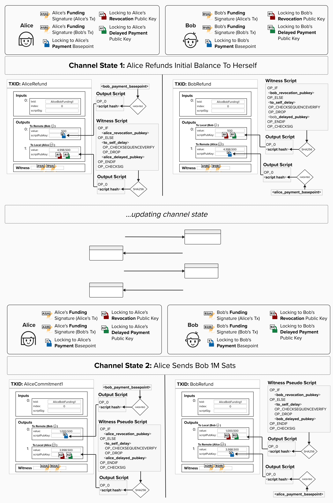
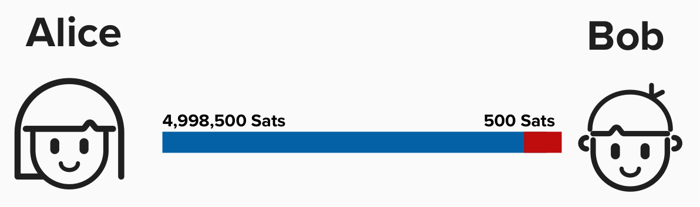
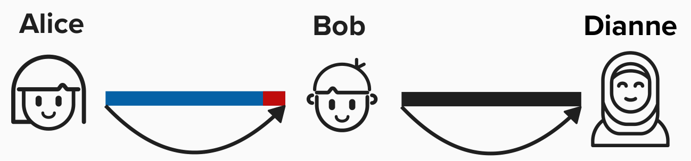
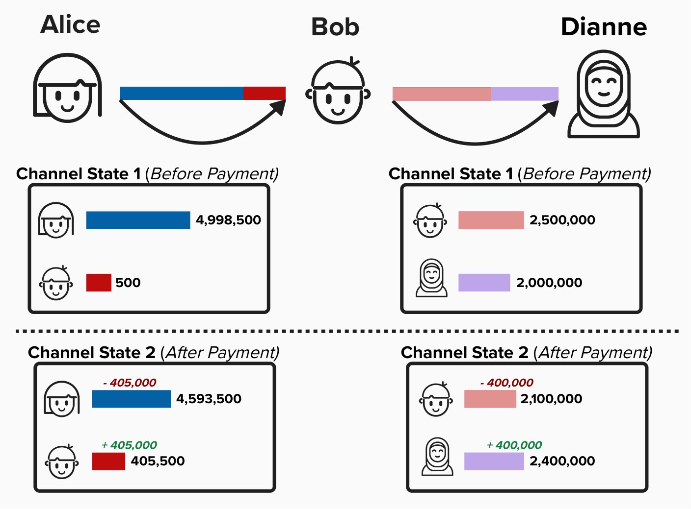

# Checkpoint

Wow, now is probably a good time to take a deep breath!

At this point, you've implemented most of the code to build fully [BOLT 3](https://github.com/lightning/bolts/blob/master/03-transactions.md) compliant Lightning funding and commitment transactions! You're part of a very small group of people in the world who have done this.

Since we're playing the part of Alice, you've now successfully built the **Funding Transaction** and Alice's version of the **Commitment Transaction**. In the real world, we would have also built Bob's version locally so that we can generate a signature to send to him, but we'll leave that as a bonus exercise for the ambitious learner.

  

# Sending Payments Across The Lightning Network

Okay, by now you're probably itching to learn about **payments**. After all, Lightning is meant to help Bitcoin realize the dream outlined in the whitepaper: a Peer-to-Peer Electronic Cash System.

Below is a diagram that we saw earlier when discussing how we can create new public keys for each commitment state. Specifically, this diagram does a good job of showing *which keys* we'll use in each commitment state. For example, if you zoom in below, you'll see that, in **Commitment State 2**:

- The **Revocation Public Keys** and **Delayed Public Keys**, which are placed in the `to_local` output script, are different than the ones in **Commitment State 1**! The diagram attempts to visualize this by incrementing the index. For example, Alice's **Delayed Payment Public Key** for **Commitment State 2** is `A2`. Remember, this is accomplished by combining the **Delayed Payment Basepoint** with the **Per-Commitment Point** for the **Second Commitment State** using the equation we reviewed earlier.
- The `to_remote` output is simply the remote party's **Payment Basepoint**. It is *not* changed with each state, making it easier for the remote party to claim their funds if a commitment transaction is published, as they do not need to derive a private key that is unique to that state.

  

So, by now, you may have the following questions:

1. How do we get from **Commitment State 1** to **Commitment State 2**?
2. What are the protocol messages that the above diagram alludes to?
3. How does this allow us to route payments *across multiple channels*?
4. When will Bitcoin hit $1M US Dollars?!

Well, let's answer questions 1-3. If you know the answer to question 4, please let me know!

To answer questions 1-3, it's easiest if we jump straight into the deep end and start with how to route payments across **multiple parties** on the Lightning Network. While it may seem counterintuitive to start with the more complex example, it's actually easier. This is because the **protocol** that defines how payments are sent is the same *regardless of whether you're sending a payment to a direct peer or across multiple channels*. **In other words, the protocol (rules of the game) will be the same regardless of whether Alice is simply paying Bob (a direct peer) OR if Alice is paying Dianne, who is connected to Bob (Alice → Bob → Dianne).**

We'll learn about the exact protocol shortly, but for now, it's worth noting that the protocol is the same in both scenarios because it simplifies things and reduces the complexity of implementing Lightning, as developers do not need to write unique code for two different use cases (direct payments and routed payments).

## Routing Payments

Enough small talk, let's dive in!

At this point, we've only implemented the **Funding Transaction** and **First Commitment Transaction**, so almost the entire channel balance is on our (Alice's) side of the channel with Bob. Below is a wildly oversimplified visualization of our channel.

  

The magic of Lightning is that participants can have many channels open to many different counterparties, and you can route payments across these channels.

Below is another wildly oversimplified diagram. Note how the following two payment channels now exist:

1. Alice & Bob
2. Bob & Dianne
   - This means that Bob and Dianne have their own **Funding Transaction** and set of **Commitment Transactions**.

  

## Starting With The End In Mind

Let's begin our journey into Lightning payments by reviewing how things work at a high level, starting with the end result in mind. Routing a payment across the Lightning network just means that the **channel balance distributions** will change for each channel, such that, ***for every channel pair***, when the payment is complete:

- The sender will have less Bitcoin on their side of the channel
- The receiver will have more Bitcoin on their side of the channel

**For example, imagine we (Alice) want to pay Dianne 404,000 sats**. While we don't have a direct channel to Dianne, we have a channel with Bob, and Bob has a channel with Dianne. We can leverage this and pay Dianne by *routing the payment through Bob*. You can see the original channel balances and updated channel balances in the visual below.

#### Take a moment and verify the following:

- **Total Channel Balances Remain Constant**: The total amount of bitcoin in each channel has not changed. More specifically, Alice and Bob's channel has 5M sats (1,000 is set aside for fees) in both channel states, while Bob and Dianne have 4.5M in both channel states. This should also make sense intuitively, considering that each channel is anchored to an on-chain 2-of-2 multisig output, and this funding output does not change during normal Lightning operations.
- **Individual Channel Balances Are Updated**: Alice now has 405,000 less sats than she had prior to the payment, while Dianne has 400,000 more.
- **Bob Has More Bitcoin**: Before the payment, Bob had a claim to 2,500,500 sats **across both channels**. After the payment, Bob has a claim to 2,505,500 sats **across both channels**. He now has 5,000 more sats.

  

#### Question: Why did Bob's balance increase by 5,000 sats? Shouldn't Alice have only sent him 400,000 sats?

  
Answer

The 5,000 sats are **fees** paid to Bob! Alice will have to pay fees to each hop along the payment route to incentivize them to forward the payment. Without this economic incentive, forwarding nodes (Bob, in this case) have little to gain (outside of altruism) when forwarding the payment.

