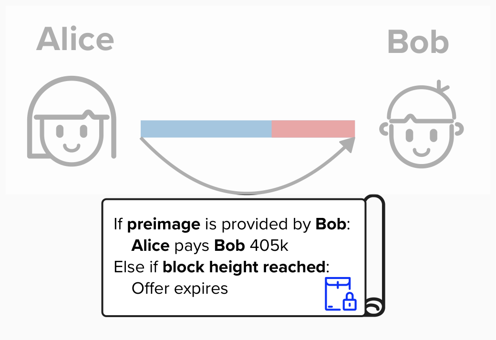
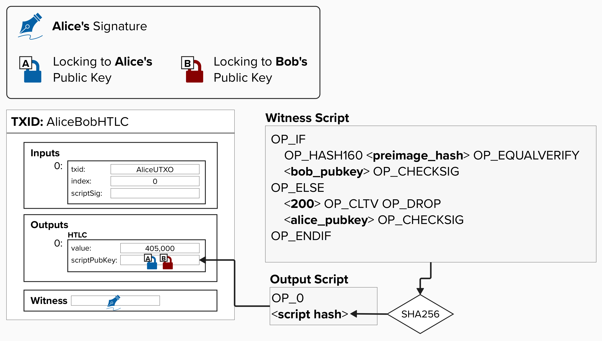
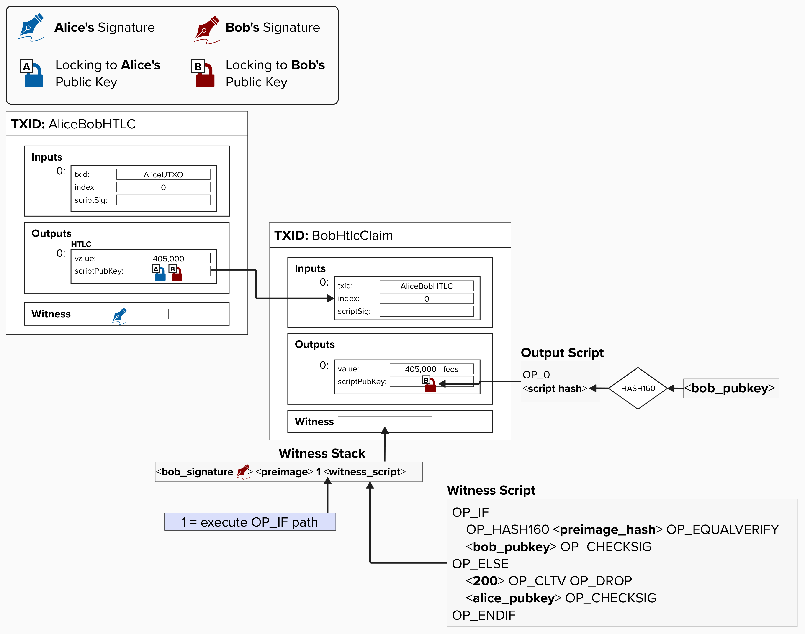
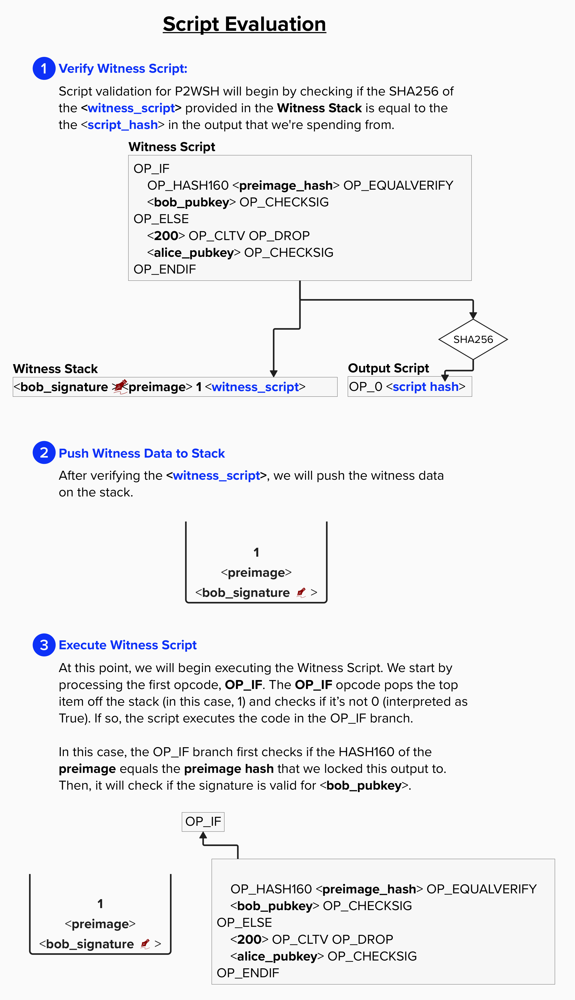
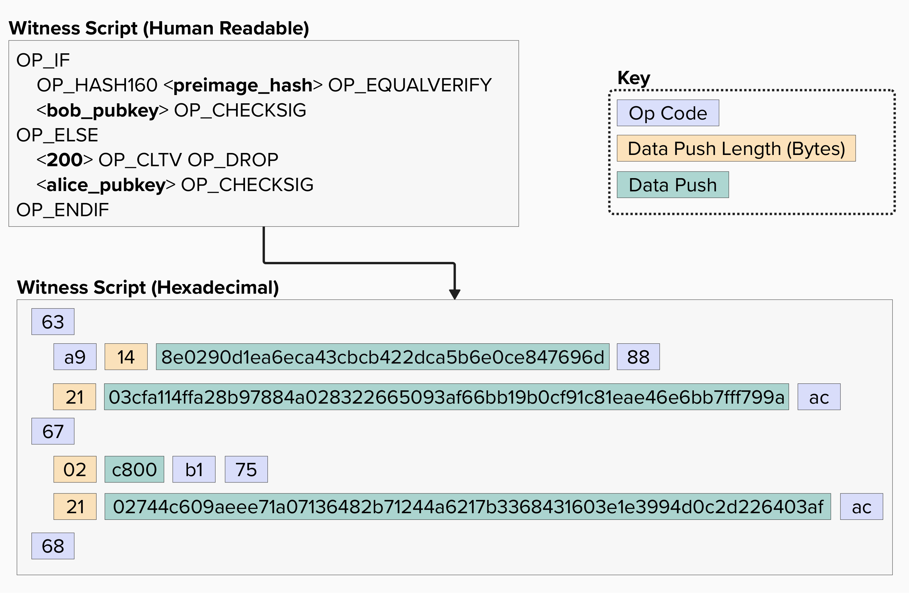
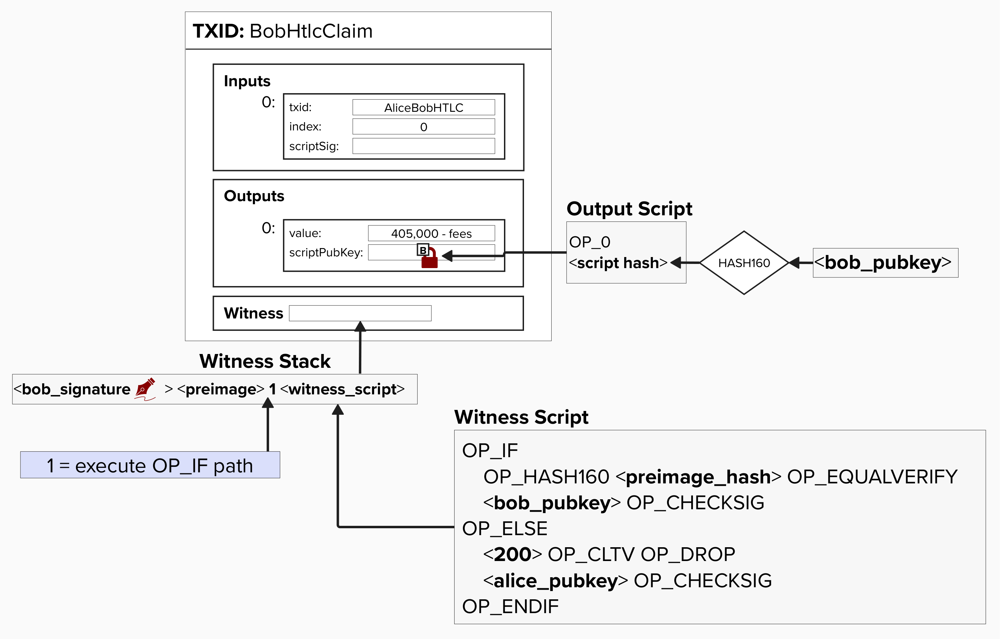

# Simple HTLC Example

Now that we have a high-level understanding of how HTLCs will be set up such that we can route payments across the Lightning network, let's see how they are implemented at the **transaction level**! We'll start with a simple HTLC and then work our way towards the complex versions that are used in the Lightning network.

Let's begin our journey by zooming into Alice's contract with Bob. As you can see, it has the following spending conditions:
- If Bob provides a **preimage**, he can claim the funds.
- If a **block height** is reached, then the contract expires.

<p align="center" style="width: 50%; max-width: 300px;">
  
</p>

If we were to translate the above contract to a Bitcoin transaction, we would represent it as an output in our commitment transaction, and it would look like the below. ***NOTE***: To allow us to focus on HTLCs, let's simplify the commmitment transaction for the moment and not worry about the revocation keys or asymmetric commitment transactions. We'll add the complexities back in later! For now, just imagine a Bitcoin transaction with the following outputs:
- Alice's balance
- Bob's balance
- HTLC balance


**Take a moment to examine the HTLC witness script and confirm that you understand what is happening!** This is really where all of the magic is happening. If Bob is able to obtain the **preimage** this is how he can claim the funds from Alice in a contractual manner. Furthermore, the only way to get the **preimage** is for Dianne to provide it.

<p align="center" style="width: 50%; max-width: 300px;">
  
</p>

<details>
  <summary>Click to learn more about the Witness Script</summary>

This witness script has the following two spending paths:
1) If the preimage is provided, then Bob can spend from this path and claim any funds locked in this output. You may be wondering why `OP_HASH160` is being used here. Wasn't the preimage hashed using SHA256? Yes! We will discuss this more shortly.
2) The second path is timelocked with an `OP_CHECKLOCKTIMEVERIFY` opcode, meaning that it is only valid once we've reached block height 200. This path also requires a signature from Alice. Together, these components allow Alice to reclaim this output once the timelock expires. 

</details>

If Bob manages to obtain the preimage, then he has the ability to generate a new transaction, which can spend from this output and move the funds to a new output that Bob unilaterally controls. Below is an example of what it would look like if Bob created a new transaction to claim this HTLC. **Take a moment to examine the witness stack and confirm that you understand what is happening!** 

⚠️ **NOTE: The below diagram is for educational purposes. While it does in fact represent a valid way to "claim" an HTLC, this is not how it's actually done in the "real" Lightning network. This is meant to be a stepping stone, helping to provide us with the intuition of how one could claim the simple HTLC we set up.**

<p align="center" style="width: 50%; max-width: 300px;">
  
</p>

You might be wondering, "Doesn't Bob claiming the HTLC with another transaction defeat the purpose of off-chain transactions?" That's would be a great question! This HTLC output is meant to be temporary. Ideally, Alice and Bob would work together to "unwind" the HTLC and shift the HTLC balance from Alice to Bob after the payment is complete. However, it's important to lock the funds in this contract while the payment is pending so that Alice or Bob can retrieve the bitcoin *on-chain* if something were to go wrong in the middle of the payment.

<details>
  <summary>Click to learn more about the Witness Stack</summary>

Pay-To-Witness-Script-Hash (P2WSH) evaluation involves the following three steps. While the below diagram does not explicitly detail the entire script evaluation for this HTLC, it provides the majority of the information needed to understand how Bob would claim the funds.

<p align="center" style="width: 50%; max-width: 300px;">
  
</p>

</details>

## ⚡️ Claim The HTLC!
For this exercise, we'll pretend to be Bob and claim the HTLC from the commitment transaction above. Most of the work is already done for us. The main purpose of this exercise is to dig into the details of transaction and see *how* we can lock/unlock funds using a preimage hash.

### Step 1: Initiating The Contract

To initiate the contract, Alice and Bob will create a new output with the payment funds locked in an output with the HTLC contract. **NOTE**, to ensure this exercise works for anyone using this workbook, this transaction is already mined within a block in your regtest environment.

```
02000000000101bdee828fd6c44d4accb08ea5eb8b7a419899d8237cff651d8f74442477df41fb0100000000ffffffff03082e060000000000220020284fae8f0d6e48cf1958e36647eab5d4e7b2f8a419f703482d58f61a059aabe734440f0000000000160014888dbbd7998f9f80d4f82b4f9ce6d5882f310aec1cd53600000000002200202f18ac783f7312976cb6a5cc83c699507c614283d14fa1840af37636fa89407902473044022050b90a9c4b1b8c8ceb46fd3ca7558d1fc58e501307cfa440fb67cc5652fc815a02204e5188505c5565aa7d16fefbe86016987054e199810ca8b5535c5cd154032d7601210282502197297c311d02f128248fa7a5f392499ca489fd87b386f6949c92a48c1400000000
```

#### ⚡️ View the details of the transaction hex!

You can see the details of the transaction if you run the following command in the **shell**. You may need to run `./start.sh` if your workbook went idle!

```
decodetx <tx_dex>
```

There is a lot going on here, but the important piece to focus on is the **vout**. This part of the transaction lists all of the outputs, their amounts, their index, and the locking script. Find the **output script** for the HTLC output and verify that it's the same as below. The HTLC output will be index 2 (`"n": 2`) and have a value of `0.00405000`.

```
"asm": "0 284fae8f0d6e48cf1958e36647eab5d4e7b2f8a419f703482d58f61a059aabe7"
```

If you forget what this is, look at the diagram above! You'll see that we put the hash of the witness script, preceded by OP_0, in the `scriptPubKey`. In other words, this is the SHA256 of the HTLC script!

### Step 2: Verify The Locking Script

Now, you may have read the above and thought, "How am I supposed to verify that locking script? I have no idea what that hash means!". Well, I'm going to prove it to you below!

In the "real" Lightning Network, Alice will give Bob all of the information he needs so that he can create the same output for his transaction as well. Remember - Lightning leverages asymmetric transactions, so Bob will have a similar HTLC output on his commitment transaction as well!

Let's go ahead and verify the locking script for the purposes of this exercise. Below, you'll see how witness script is converted into hexadecimal. In Bitcoin, all opcodes have a hex representation so that they can be effectively communicated between computers. You can view a list of them [here](https://en.bitcoin.it/wiki/Script).

<p align="center" style="width: 50%; max-width: 300px;">
  
</p>

If we combine all of the above into a single hex representation, we get the below.

```
63a9148e0290d1ea6eca43cbcb422dca5b6e0ce847696d876702c800b17521031b84c5567b126440995d3ed5aaba0565d71e1834604819ff9c17f5e9d5dd078fac68
```

#### ⚡️ Validate The Output Script

Okay, now that we've seen how to convert our witness script to hex, let's take the SHA256 of it and verify that it's the same as the output script in Alice's transaction. To do that, you can enter the below command in the **shell**. This command passes the above hex data into a simple function within this workbook that takes the SHA256 of the provided data.

```
cargo run -- sha256 -d 63a9148e0290d1ea6eca43cbcb422dca5b6e0ce847696d876702c800b17521031b84c5567b126440995d3ed5aaba0565d71e1834604819ff9c17f5e9d5dd078fac68
```

Is the output the same as what we saw before?

```
"asm": "0 284fae8f0d6e48cf1958e36647eab5d4e7b2f8a419f703482d58f61a059aabe7"
```

**Yes!** At this point, I've essentially proven to you that there is a transaction already mined in this workbook that has an HTLC output. 

### Step 3: Retrieve Preimage

Great, at this point, we've confirmed that we can claim this output if we have the preimage. We just need to find a secret that, when hashed, equals the **RIPEMD160( SHA256(`preimage`) )**.

#### Question: Per BOLT 3, which describes how HTLCs work, we learn that the preimage is the SHA256 of a random 256 bit number, but we lock the output to the **RIPEMD160( SHA256(`preimage`) )**. Why is that?

<details>
  <summary>Answer</summary>

By taking the `RIPEMD160` of the `SHA256(preimage)`, we create a 160 bit hash, which is shorter than the 256-bit hash that SHA256 produces. This results in a smaller witness script, which slightly saves on fees.

</details>

#### ⚡️ Find The Preimage

The below command will take the **RIPEMD160( SHA256() )** of whatever string you put in the quotes. To make this exercise a little simpler, this HTLC output is locked to the hash of a string (converted to bytes) instead of a 256-bit number, which is standard for the Lightning protocol.

**Try entering in a random string and see if you can guess the preimage!**

Remember, the preimage hash is: `8e0290d1ea6eca43cbcb422dca5b6e0ce847696d`. You can verify that by looking at the witness script above!

```
cargo run -- ripemd-sha -d "enter your guess here"
```

<details>
  <summary>Click here to see the preimage</summary>

Well, surprise surpise - the preimage is: `ProgrammingLightning`!

The below command should prove that **"ProgrammingLightning"** will provide the preimage hash that this contract is locked to.
```
cargo run -- ripemd-sha -d ProgrammingLightning
```

</details>

### Step 4: Claim HTLC

Now that we have identified the preimage, let's claim the funds!

Building an entire transaction to spend from Alice's HTLC would take some time, so a transaction has already been created for you. You can find it below.

```
02000000000101fd4d941188ba643c45238a80026ecc3be9833c3ee600d38bb2f7d0aa34ee5d6f00000000000000000001202a06000000000016001479b000887626b294a914501a4cd226b58b235983031450726f6772616d6d696e674c696768746e696e6701014263a9148e0290d1ea6eca43cbcb422dca5b6e0ce847696d876702c800b17521031b84c5567b126440995d3ed5aaba0565d71e1834604819ff9c17f5e9d5dd078fac6800000000
```

#### ⚡️ Verify The Preimage

Go ahead and decode the above transaction using the below alias. Remember, we're looking at the hex representation of Bob's claim transaction (seen below).

<p align="center" style="width: 50%; max-width: 300px;">
  
</p>

```
decodetx <tx_hex>
```

Once you do that, check out the **txinwitness** field. You should see the following:
- Preimage: `50726f6772616d6d696e674c696768746e696e67`
- Path Identifier (OP_IF): `01`
- Witness Script: `63a9145f8ad6404f3f5eebbfeffd1b01d37cfc648b7f7d876702c800b17521031b84c5567b126440995d3ed5aaba0565d71e1834604819ff9c17f5e9d5dd078fac68`

```
"txinwitness": [
  "50726f6772616d6d696e674c696768746e696e6721",
  "01",
"63a9145f8ad6404f3f5eebbfeffd1b01d37cfc648b7f7d876702c800b17521031b84c5567b126440995d3ed5aaba0565d71e1834604819ff9c17f5e9d5dd078fac68"
      ]
```

So, according to the above, `50726f6772616d6d696e674c696768746e696e67` is our preimage? Is that right? Well, since we have to represent all data in hex format, then we shouldn't expect to see "ProgrammingLightning" here. Try entering the below command in your **shell** to convert "ProgrammingLightning" to hex. Is it the same as the preimage?
```
cargo run -- to-hex -d ProgrammingLightning
```

#### Question: Why is the output on the claim transaction for 404,000 and not 405,000?
<details>
  <summary>Answer</summary>

You may have notice that the output on our claim transaction is 404,000 sats and not 405,000. This is because our claim transaction must also pay fees! For example, if you decoded the Tx using the `decodetx` command, you would have seen the below.

```
"vout": [
  {
    "value": 0.00404000,
    "n": 0,
    "scriptPubKey": {
      "asm": "0 79b000887626b294a914501a4cd226b58b235983",
      "desc": "addr(bcrt1q0xcqpzrky6eff2g52qdye53xkk9jxkvrl4xfg5)#m2g237pm",
      "hex": "001479b000887626b294a914501a4cd226b58b235983",
      "address": "bcrt1q0xcqpzrky6eff2g52qdye53xkk9jxkvrl4xfg5",
      "type": "witness_v0_keyhash"
    }
  }
]
```

**This is an important thing to keep in mind as we continue building our Lightning channel!** As a brief teaser, if HTLC amount is so small that it's not economically viable to claim it via another transaction, they we'll have to treat the HTLC a little differently. More on this to come!

</details>


#### ⚡️ Publish Transaction And Claim Funds

Great, nice job! You've successfully, dug deeeeeeeep into Bitcoin script and validated how an HTLC output works. Publish your transaction, claim your rewards, and let's see how HTLCs can route payments across the Lightning network!

```
sendtx 02000000000101fd4d941188ba643c45238a80026ecc3be9833c3ee600d38bb2f7d0aa34ee5d6f00000000000000000001202a06000000000016001479b000887626b294a914501a4cd226b58b235983031450726f6772616d6d696e674c696768746e696e6701014263a9148e0290d1ea6eca43cbcb422dca5b6e0ce847696d876702c800b17521031b84c5567b126440995d3ed5aaba0565d71e1834604819ff9c17f5e9d5dd078fac6800000000
```

## Recap
So, let's do a quick recap of the above exercise. We started by examining an HTLC output, and we confirmed that the locking script had the following spending paths:
1) If you know the **preimage**, you can claim the funds.
2) Otherwise, after **block height 200**, Alice can claim the funds by providing a signature.

We then examined what the claim transaction would look like, and we saw how the **preimage** would need to be provided **on-chain** to claim the funds. For context, the preferred alternative to claiming the funds on-chain is for Bob to simply send Alice the preimage in a message, proving to her that he ***could*** claim on-chain if he needed to. Alice would see this **preimage** from Bob and confirm that Bob could indeed claim on-chain. She will then simply work with Bob to update their balance in their payment channel, removing the HTLC output and putting those bitcoin on Bob's side of the channel.

# Oops!

Take another look at this HTLC transaction. Do you notice anything wrong with this setup? Can anyone else claim Bob's output?

<p align="center" style="width: 50%; max-width: 300px;">
  
</p>

<details>
  <summary>Answer</summary>

The current P2WSH output script has the following spending paths:
1) If the preimage is provided, the **provider of the preimage** can spend the funds.
2) If block height 200 is reached, **Alice** can claim the funds.

Notice that **Bob** is not explicitly defined in these payment paths. Therefore, if someone else were to figure out what the preimage is, there is nothing stopping them from claiming all of the funds in the output.

How can we fix this?

<details>
  <summary>Answer</summary>

We can update Bob's spending path to require *both* a **signature**, produced by Bob's private key, and the **preimage**. This way, Bob is the only one who can claim the funds from this spending path.

</details>

</details>