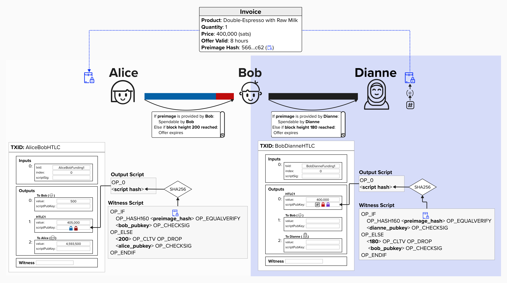
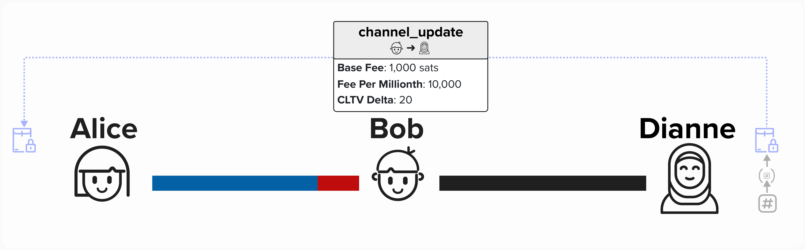
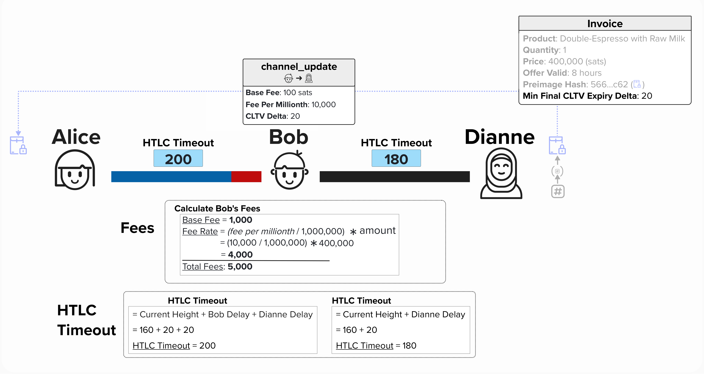
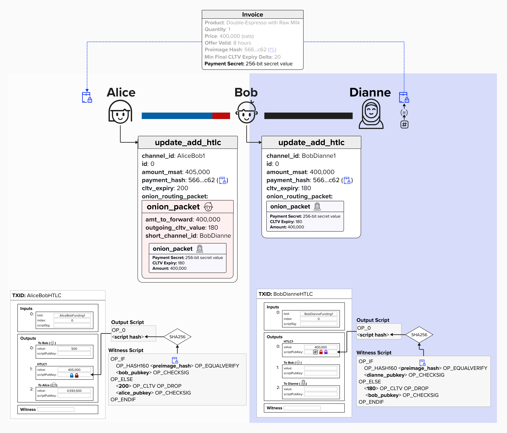
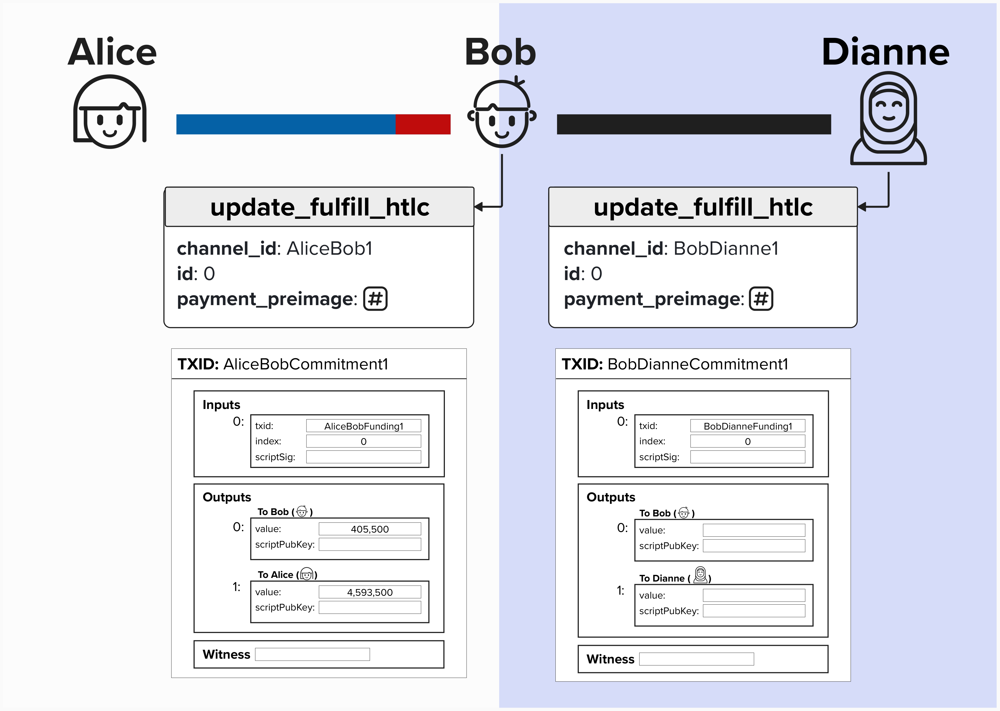

# HTLCs on Lightning

Okay, we should now be familiar with the mechanics of an HTLC! As a brief review, HTLCs are a specific type of locking condition whereby bitcoin can be claimed if:
1. You know the preimage that, when hashed, equals the hash that is embdedded in the locking script.
2. After a timeout, which can be absolute or relative, you can claim the funds by providing a valid signature.

Now that we've seen how a simple on-chain HTLC would work between Alice and Bob, let's extend this concept to see how it would work off-chain on the Lightning Network to be able to *route* payments from Alice to Dianne!

Recall from earlier that Dianne provided Alice with a **preimage hash**, which is the SHA256 hash of a randomly generated number that ***only Dianne knows***. This hash is currently included in the HTLC that Alice set up with Bob. Take a moment to re-read the last few sentences, if you need to. This is very important!

  

## Linking Preimage Hashes on Lightning

To link all of the contracts (bitcoin scripts) along the payment path from Alice to Dianne, Alice can instruct Bob to create an HTLC with Dianne that uses **the same preimage hash**.

Take a moment to examine the below diagram. Note, the payment (HTLC) between Alice and Bob is for 405,000 sats, so it is ordered *above* Bob's output on the commitment transaction. For the purposes of this example, it doesn't really matter what the channel balance is between Bob and Dianne, so we'll just order the HTLC at index 0 since. Remember, you can zoom in!

  

#### Question: You probably noticed that the block height expiry is not visible for Bob and Dianne's HTLC output. This is on purpose! What do you think it should be? Should it be before (<200), equal to (200), or after (>200) Alice and Bob's expiry?

  
Answer

This is actually a ***very*** important part of what makes Lightning payments **secure** and **atomic**, so let's take a moment to stress this point.

Imagine that Bob and Dianne's HTLC output expired at block height 200 - **the same as Alice and Bob's**. If this were the case, it would be possible for Dianne to claim the HTLC from Bob at block height 200. Remember, Dianne knows the secret, because she generated it!

Simultaneously, when Block height 200 comes around, Alice will assume the payment is going to expire, so she can reclaim her HTLC output by spending from the expiry path. If this were to happen, Dianne would have claimed the 400,000 sats from Bob, but he would **NOT** be able to claim his 405,000 sats from Alice via the preimage path, because she would have already claimed them via the expiry path. Ouch!

To protect Bob against this sort of attack, Bob may decide that he requires, at least, a **20 block delay** to claim the HTLC from Alice. Therefore, he will create an HTLC that times out at **block height 180**. This ensures that, if Dianne provides the preimage right before the HTLC expires, Bob still has **20 blocks** before his HTLC with Alice expires, giving him sufficient time to claim his HTLC.

**FUN FACT**: This **delay** is actually called `cltv_expiry_delta`, and it's something that Lightning nodes announce to the network via the `channel_update` [message](https://github.com/lightning/bolts/blob/master/07-routing-gossip.md#the-channel_update-message)

## Atomic Payments

Okay, great - we've fixed the expiry issue! Our payment is now **atomic**. In other words, it will either entirely succeed - meaning Dianne will be paid from Bob, and Bob will be paid from Alice - or it will entirely fail.

  

## Protocol Messages

Now that we've built our intuition for how HTLCs can be routed along the Lightning Network and the importance that timelocks play, let's see how HTLCs are communicated at the protocol level.

⚠️ **WARNING: While the below protocol messages are real, the HTLCs that we're visualizing are a simplified version. In other words, we're abstracting away asymmetric commitment transactions and revocation paths for now. We'll add those back in once we build a strong foundation!**

### Channel Update
The first protocol message we'll review is the `channel_update` message. We won't discuss every field in the `channel_update` message just yet (this will come in a later course that focuses on routing payments and the gossip network), but if you'd like to learn more, you can read [BOLT 7: Routing Gossip](https://github.com/lightning/bolts/blob/master/07-routing-gossip.md#the-channel_update-message).

Each node in the Lightning Network that announces its willingness to forward payments will broadcast a `channel_update` message, indicating the **fees** it charges and its **timelock** requirements, known as `cltv_expiry_delta`. For example, in the image below, Bob broadcasts a `channel_update` message that informs Alice (and anyone else who wants to send a payment through Bob) the fee and timelock requirements to route payments **across his channel with Dianne**. This is a crucial detail; `channel_update` messages are specific to a channel **and** a channel direction.

In the channel below, Bob's `channel_update` message signals the following requirements to Alice:

#### Fees
  - **Base Fee**: This is the fee that Bob will charge to route any payment across his channel with Dianne, regardless of the amount. In this case, it's 1,000 sats.
  - **Fee Per Millionth**: This is the proportional feerate that Bob will charge *per satoshi* that is sent over this channel. It's measured in millionths of a satoshi. In this case, Bob will effectively charge .01 satoshis per satoshi that is routed over his channel.

#### Timelock Requirements
- **CLTV Delta**: This is the minimum delay (or difference) that Bob requires between the following two HTLCs:
  - Bob's HTLC with Dianne
  - Bob's HTLC with Alice

Remember, the delay protects Bob by giving him sufficient time to claim his funds from his HTLC with Alice!

  

### Calculating Fees and Timelocks

Let's bring this example full circle by showing how Alice would go about calculating the total fees and timelocks for this payment. To do this, we'll need to introduce one more field; this time, in the invoice that Dianne provided to Alice.

If you look in the image below, you'll see that Dianne now specifies a **Min Final CLTV Expiry Delta** of **20 blocks** in her invoice. This is how Dianne can specify the minimum expiry that she will accept for any incoming HTLCs.

Alice can use this information, along with Bob's fees and timelock requirements, to create the HTLCs we reviewed earlier!

Since Alice wishes to send 400,000 sats to Dianne, routed through Bob, this means that she will have to pay 5,000 sats in fees to Bob. Assuming the current block height is **160**, you can see how Alice calculates the expiry timelocks below. First, Alice will take Dianne's **Min Final CLTV Expiry Delta** of **20 blocks** and add it to the current block height, so the HTLC between Bob and Dianne cannot expire earlier than block height **180**. Next, since Bob also requests a **CLTV Delta** of **20 blocks**, meaning he wants to blocks between when his HTLC with Dianne expires and his HTLC with Alice expires, Alice will set her HTLC with Bob to expire at block height **200**.

  

### Adding HTLCs

A natural question that may have arisen by now is.... "How do we add HTLCs"?

We'll, all forms of communication in the Lightning Network have standardized message formats, and HTLCs are no different! To add an HTLC, Alice
will send an [`update_add_htlc` message](https://github.com/lightning/bolts/blob/master/02-peer-protocol.md#adding-an-htlc-update_add_htlc) to Bob with the following information:
- `channel_id`: This is derived from the Funding Transaction ID and the Funding Output Index, serving as a unique identifier for the channel. 
- `id`: This is an always-incrementing identifier for HTLCs that are sent over this channel. It must start at 0.
- `amount_msat`: This is the amount we wish to add an HTLC for.
- `payment_hash`: This is the preimage hash that will be included in the HTLC bitcoin script.
- `cltv_expiry`: This is the block height for which the HTLC expires.
- `onion_routing_packet`: The onion routing packet contains specific directions that must be passed along to each node in the payment path. Since it's encrypted, ***only the recipient will be able to read the onion packet intended for them**.
  - When Bob receives the onion packet from Alice in the `update_add_htlc` message, he will decrypt the portion intended for him, which informs him *where* to forward the payment to, how much to send, and what the expiry should be.
  - By the time Dianne receives the `update_add_htlc` message, it will have a final onion that is intended for her. To prove this onion was created by Alice and mitigate "probing attacks", Alice will embed the **Payment Secret** in the final onion. If you have good attention to detail, you may have noticed the **Payment Secret** was added to the invoice at the top of the diagram! This secret is a random 256-bit value that is provided in the invoice that Alice receives. Since Alice is the only one who sees the invoice (none of the hops in the payment path do), then the only way the **Payment Secret** can be embeded in the onion is if Alice put it there. Since the onion will also include the payment amount and expiry, this allows Dianne to verify that the HTLC that Bob is sending is indeed what Alice asked him to send!
    - By embedding the **Payment Secret** in the onion, Alice prevents Bob from performing a form of a probing attack whereby he attempts to send a smaller payment to see if Dianne will accept it. The reason this *may* work (if there was no such that as a **Payment Secret**) is that it's possible for Dianne to create an invoice that does not include an amount. For example, Alice could ask Dianne for an invoice without an amount if Alice wants to tip Dianne and determine the amount herself. If this happened, then Dianne wouldn't know how much the tip was for *until she received the HTLC from Bob*, so she would have no way of knowing that Bob altered the amount. Therefore, Bob would be able to sneak extra fees without Alice or Dianne knowing.

  

Remember, the above diagram is a simplified visual of adding HTLCs. What is accurate is that we will add a new output for each HTLC (assuming it's large enough - more on that later). However, in reality, there will be an HTLC output (with a more complicated spending script) on both Alice and Bob's version of the commitment transaction.

Another caveat - there are actually a few more protocol messages taht are invovles with making payments! We'll review them shortly. As a brief teaser, if you recall, we'll have to provide the **Per Commitment Secret** each time we update our channel so that our counterparty can punish us if we attempt to cheat in the future. We'll review those protocol messages shortly.

### Fulfilling HTLCs

Okay, let's bring the HTLCs full circle by reviewing how they are fulfilled. Of course, one option is for the recipient, who knows the preimage, to simply claim the payment on-chain by publishing their commitment transaction along with a new transaction that sweeps the funds from the preimage hash path! That would be very similar to the exercise we did in the previous section. However, that would also close our payment channel, as now the 2-of-2 funding output would be spent!

Therefore, instead of claiming the payment on-chain, the recipient of the HTLC will send an `update_fulfill_htlc` message to their counterparty, which specifies the **channel** and HTLC **id** for which they have the preimage for. This *proves* to their counterparty that they *could* claim the payment on-chain, but they want to keep operating the payment channel. Therefore, both parties will work together to remove the funds from the HTLC output and add them to their new respective outputs.

For example, in the below diagram, you can see that the 405,000 sats have been removed from the HTLC output, which is now gone, and added to Bob's side of the channel. This is now the next commitment state - Commitment State 1 (the one after the refund)!

  

#### Question: If Dianne decides to NOT give Bob the preimage and, instead, claim the HTLC output on-chain, why is the payment still atomic? In other words, why can Bob still claim the HTLC from Alice? Also, can Bob claim the HTLC from Alice without closing his channel with Alice?

  
Answer

As we saw earlier, to claim the HTLC on-chain, Dianne will have to reveal the preimage **in the witness**! Since, Bob's HTLC with Dianne expires at **block height 180**, Dianne would likely try to publish on-chain before **block height 180**. Otherwise, Bob will reclaim these funds once the HTLC expires by publishing his own on-chain transaction to sweep the funds.

If Dianne does close the channel and claim the funds on-chain at **block height 180**, Bob still has until **block height 200** before Alice timeout his HTLC with her. Therefore, Bob can simply find the preimage on-chain and send it to Alice via an `update_fulfill_htlc` message, allowing him to unwind his HTLC with Alice and keep their payment channel operating smoothly.

