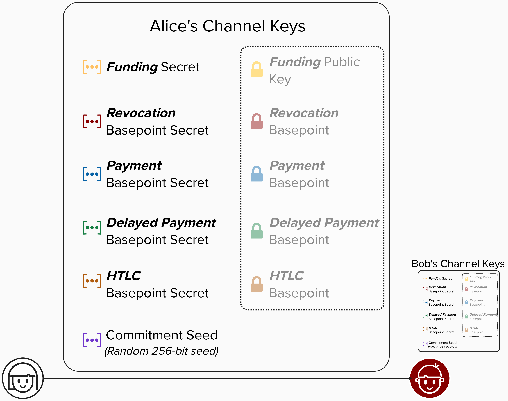
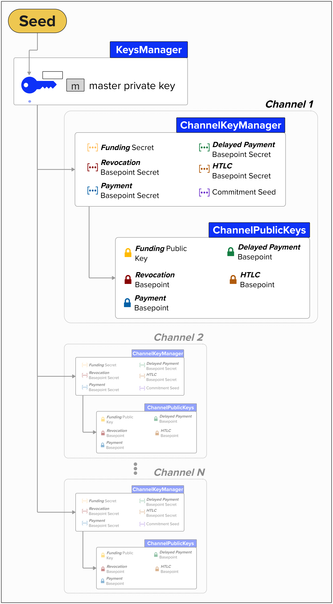

# Channel Keys
Nice, we're making solid progress! At this point, we've implemented the functionality to create the following cryptographic material. Most of these are private keys called "basepoint secrets," which will be combined with other cryptographic material to create new private keys for each Lightning transaction. We also have a "commitment seed," which is a random 256-bit number. We'll see how this is used shortly!
- **Funding Secret**: Secret Key
- **Revocation Basepoint Secret**: Secret Key
- **Payment Basepoint Secret**: Secret Key
- **Delayed Payment Secret**: Secret Key
- **HTLC Basepoint Secret**: Secret Key
- **Commitment Seed**: A 256-bit scalar used to generate a series of secrets **for each Lightning state**.

> **Note:** All of the above secrets are specifically defined in [BOLT #3: Bitcoin Transaction and Script Formats](https://github.com/lightning/bolts/blob/master/03-transactions.md) *except* for the "funding" private key. We included it in our `KeyFamily`, but it doesn't have to be. For example, LDK -- a popular API-driven Lightning implementation -- allows developers to bring their own on-chain wallet and, therefore, their own "funding" keys. This will become clearer when we open our Lightning channel.

Next, we'll need to derive the public keys associated with each private key. As we'll soon see, these public keys are not embedded directly within transaction outputs. Instead, they'll be combined with other cryptographic material to derive the actual public keys used in each output. Note that Alice, Bob, and every node on the Lightning network will have their own set of these keys, which they use to operate the channel. In other words, each node will have their own version of the wallet we're creating right now!

<p align="center" style="width: 50%; max-width: 300px;">
  
</p>

## ⚡️ Convert Private Keys to Public Keys

Now that we can derive a complete set of private keys for a channel, we need to convert them to public keys! This is because, in Lightning, we'll need to share these public keys with our counterparty, so let's implement a way to derive public keys from the private keys we created.

To complete this exercise, you'll need to implement the `to_public_keys` function that converts each private key in our `ChannelKeyManager` to its corresponding public key, bundling them into a `ChannelPublicKeys` struct.

Let's take a look at what `ChannelPublicKeys` contains:

<details>
  <summary>Click to see ChannelPublicKeys</summary>

The `ChannelPublicKeys` struct holds the set of public keys that are shared with our channel counterparty. As you can see, these keys mirror the private keys in our `ChannelKeyManager`.

```rust
#[derive(Clone, Debug, Hash, PartialEq, Eq)]
pub struct ChannelPublicKeys {
    pub funding_pubkey: PublicKey,
    pub revocation_basepoint: PublicKey,
    pub payment_basepoint: PublicKey,
    pub delayed_payment_basepoint: PublicKey,
    pub htlc_basepoint: PublicKey,
}
```
</details>

```rust
impl ChannelKeyManager {
    pub fn to_public_keys(&self) -> ChannelPublicKeys {
        ChannelPublicKeys {
            funding_pubkey: PublicKey::from_secret_key(&self.secp_ctx, &self.funding_key),
            revocation_basepoint: PublicKey::from_secret_key(
                &self.secp_ctx,
                &self.revocation_basepoint_secret,
            ),
            payment_basepoint: PublicKey::from_secret_key(&self.secp_ctx, &self.payment_basepoint_secret),
            delayed_payment_basepoint: PublicKey::from_secret_key(
                &self.secp_ctx,
                &self.delayed_payment_basepoint_secret,
            ),
            htlc_basepoint: PublicKey::from_secret_key(&self.secp_ctx, &self.htlc_basepoint_secret),
        }
    }
```

<details>
  <summary>💡 Hint 💡</summary>

To complete this exercise, you'll need to convert each private key (`SecretKey`) in our `ChannelKeyManager` to its corresponding public key (`PublicKey`) and return the keys within a `ChannelPublicKeys` struct.

In Rust Bitcoin, you can derive a public key from a secret key using the `PublicKey::from_secret_key()`, which takes two arguments:
1. A reference to the secp256k1 context (`&self.secp_ctx`)
2. A reference to the secret key (`&self...basepoint_secret`)

For example, to derive the `funding_pubkey`:
```rust
let funding_pubkey = PublicKey::from_secret_key(&self.secp_ctx, &self.funding_key);
```

You'll need to do this for each of the five keys, then assemble them into a `ChannelPublicKeys` struct:

| ChannelPublicKeys field | ChannelKeyManager field |
|-------------------------|-------------------------|
| `funding_pubkey` | `funding_key` |
| `revocation_basepoint` | `revocation_basepoint_secret` |
| `payment_basepoint` | `payment_basepoint_secret` |
| `delayed_payment_basepoint` | `delayed_payment_basepoint_secret` |
| `htlc_basepoint` | `htlc_basepoint_secret` |

**Note:** The `commitment_seed` is not included in the `ChannelPublicKeys`, as it's used for a special purpose, which we'll see later.
</details>

<details>
  <summary>Step 1: Derive the Funding Public Key</summary>

Let's start by deriving our public `funding_key` from our private key. To do this, we can use the `PublicKey::from_secret_key` function, which takes two arguments: the secp256k1 context and the secret key corresponding to the public key we wish to derive.

```rust
funding_pubkey: PublicKey::from_secret_key(&self.secp_ctx, &self.funding_key),
```

</details>

<details>
  <summary>Step 2: Derive the Revocation Basepoint</summary>

Next, we'll convert the revocation basepoint to a public key. Same pattern as earlier!
```rust
revocation_basepoint: PublicKey::from_secret_key(
    &self.secp_ctx,
    &self.revocation_basepoint_secret,
),
```

</details>

<details>
  <summary>Step 3: Derive the Payment Point</summary>

Now, let's derive the payment basepoint from our payment basepoint secret.
```rust
payment_basepoint: PublicKey::from_secret_key(&self.secp_ctx, &self.payment_basepoint_secret),
```

</details>

<details>
  <summary>Step 4: Derive the Delayed Payment Basepoint</summary>

You know the deal! Derive the delayed payment basepoint from its basepoint secret.

```rust
delayed_payment_basepoint: PublicKey::from_secret_key(
    &self.secp_ctx,
    &self.delayed_payment_basepoint_secret,
),
```

</details>

<details>
  <summary>Step 5: Derive the HTLC Basepoint</summary>

Finally, let's derive the HTLC basepoint.
```rust
htlc_basepoint: PublicKey::from_secret_key(&self.secp_ctx, &self.htlc_basepoint_secret),
```

</details>

<details>
  <summary>Step 6: Construct and Return the ChannelPublicKeys</summary>

Great work! By now, you've derived all five public keys. Now you just need to bundle them into a `ChannelPublicKeys` struct and return it. 

```rust
ChannelPublicKeys {
    funding_pubkey: PublicKey::from_secret_key(&self.secp_ctx, &self.funding_key),
    revocation_basepoint: PublicKey::from_secret_key(
        &self.secp_ctx,
        &self.revocation_basepoint_secret,
    ),
    payment_basepoint: PublicKey::from_secret_key(&self.secp_ctx, &self.payment_basepoint_secret),
    delayed_payment_basepoint: PublicKey::from_secret_key(
        &self.secp_ctx,
        &self.delayed_payment_basepoint_secret,
    ),
    htlc_basepoint: PublicKey::from_secret_key(&self.secp_ctx, &self.htlc_basepoint_secret),
}
```
</details>

## Checkpoint
Okay, let's do a quick review of what we've implemented so far!

First, we completed the function, `new_keys_manager`, which takes a **seed** and returns a `KeysManager` type, which contains the master key for our HD Lightning wallet and some other helpful context, such as the bitcoin network and a secp256k1 context for cryptographic operations.

Next, we implemented `derive_key`, which we can use to generate a new private/public key for **any** arbitrary `KeyFamily` and channel state. This is a very powerful function, and it serves as the backbone for all of the keys we'll use in Lightning!

We then completed `derive_channel_keys`, which creates a new `ChannelKeyManager` for a given `channel_id_index`. This function will create all of the private key and seed material needed to operate a Lightning channel. Furthermore, we can derive keys for many different channels by simply changing the index passed into the function.

Finally, we implemented `to_public_keys`, a method which is available on our `ChannelKeyManager`. This method will create a new structure, `ChannelPublicKeys`, which holds all of the public key material we'll need for our Lightning channel.

<p align="center" style="width: 50%; max-width: 300px;">
  
</p>