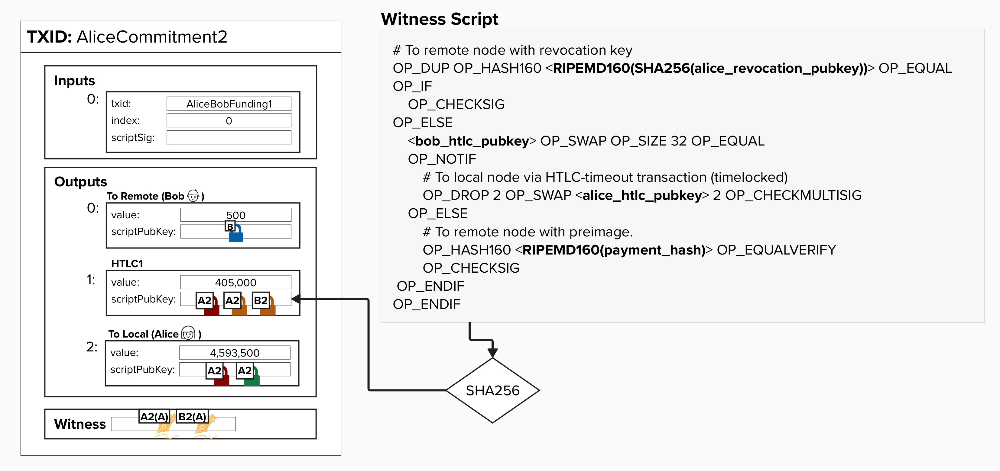

# Get Our HTLC Commitment Transaction

Alright, if you've put in the Proof-of-Work and completed all of the exercises up to this point, then you'll be able to generate your very own commitment transaction with one "outgoing" HTLC. It's called "outgoing" because it represents a payment from us (Alice) to Bob, so, if successful, bitcoin will be deducted from our channel balance and added to Bob's.

Below is a visual representation of the commitment transaction we're about to create.

<p align="center" style="width: 50%; max-width: 300px;">
  
</p>

## 👉 Get Our Commitment Transaction

Similar to the earlier command line exercises, let's open `transactions.txt` (in `src/exercises`) and get our Funding Transaction TxID. It should be recorded at the top of the file. 

If you don't have a Funding Transaction yet, you'll need to complete these steps first. You can do this by following the below:

1. Run `cargo run -- funding` in a **Shell**.
2. Record the **TxID** and **Transaction Hex** of the **Funding Transaction Hex** in your `transactions.txt` file.

Once you have your **Funding Transaction TxID**, go to a **Shell** in your Repl and type in the below command. **Be sure to replace `txid` with the TxID of your Funding Transaction**!
```
cargo run -- htlc -t txid
```

Under the hood, this command is running the code in `src/interactive/htlc.rs` - feel free to explore this file, if you'd like!

If you do check out the file, you'll see that it's creating two sets of keys - one for us (Alice) and one for Bob. To do this, it's using the functions we created earlier! Once the keys are created, it fetches the **Funding UTXO**, which it can easily do because we provided the **Funding TxID** in the command! For this course, all funding outputs are guaranteed to be at output index 0, so we don't need to provide the index in the command.

If you scroll through the rest of the code, you'll see it calls a few other functions that we've completed during this course:

- `create_commitment_transaction`: This creates an unsigned commitment transaction. **Crucially, it's now updated to add any relevant HTLCs too!**
- `create_funding_script`: This creates the 2-of-2 multisig script, which is needed to generate a signature and pass into the witness.
- `sign_holder_commitment`: This generates our (Alice's) signature and adds it to the witness (along with Bob's signature and the witness script), resulting in a fully signed transaction ready to be broadcast!

Once you run the command, you should see an output like this...
```
✅ Commitment Transaction Created

Tx ID: e0a0022dba0f494f3670eb1026b4e11402e7c08d96b0a67ae29ad6cc97a4d54c

Tx Hex: 02000000000101e80a0a05a9b6495c1a6259e450a5f339e0c615ebab523958e53360f5a9e0262600000000001ad8bb8003f4010000000000001600148c4e98f51715d292104530224efba56176fb39b1082e060000000000220020d2aeedb3a6f262cdf4a7cf7cf59e6d71d66f5574cb07a7de101d3b43b74ec5ef5c174600000000002200205ae871c433f2bc223753610b819831f5c4327168b19c5afeecb7d1d7e808b46304004730440220577d5855b17f6534d875e314e9af66a5fc4fe35731c207dd6a937bb9da70e05f02207463d3234b9c1f50a5842d0735d2d274c26187f4f247822a076c636d28f1639201483045022100e28922e44a57c1b923eebad555dfa90f826cb04522764a0b6e17649cebb38d520220706227ac148a223226c65d613bc31257e60bb3f6e6f83b18fa698e108a0407350147522102744c609aeee71a07136482b71244a6217b3368431603e1e3994d0c2d226403af2103cfa114ffa28b97884a028322665093af66bb19b0cf91c81eae46e6bb7fff799a52ae8ffe0720
```

This is our commitment transaction with 1 HTLC! Go ahead and copy the **Tx Hex** and **Tx ID** and save them in the file `src/exercises/transactions.txt` under the headings **Commitment Tx (With HTLCs) ID** and **Commitment Tx (With HTLCs) Hex**. 

# Decoding Our Commitment Transaction

Let's dig into the details! Go ahead and run the below command in your shell, replacing `raw_tx_hex` with the transaction hex we just generated.
```
decodetx raw_tx_hex
```

You should get an output like the below. We won't dig into each element like we did earlier, but we'll pay attention to the outputs!
```
{
  "txid": "e0a0022dba0f494f3670eb1026b4e11402e7c08d96b0a67ae29ad6cc97a4d54c",
  "hash": "ed57ba86d775bffb0e4c44dfd50318bc21a19ec37f705b0481502cd6cf4bcc4f",
  "version": 2,
  "size": 389,
  "vsize": 224,
  "weight": 893,
  "locktime": 537394831,
  "vin": [
    {
      "txid": "2626e0a9f56033e5583952abeb15c6e039f3a550e459621a5c49b6a9050a0ae8",
      "vout": 0,
      "scriptSig": {
        "asm": "",
        "hex": ""
      },
      "txinwitness": [
        "",
        "30440220577d5855b17f6534d875e314e9af66a5fc4fe35731c207dd6a937bb9da70e05f02207463d3234b9c1f50a5842d0735d2d274c26187f4f247822a076c636d28f1639201",
        "3045022100e28922e44a57c1b923eebad555dfa90f826cb04522764a0b6e17649cebb38d520220706227ac148a223226c65d613bc31257e60bb3f6e6f83b18fa698e108a04073501",
        "522102744c609aeee71a07136482b71244a6217b3368431603e1e3994d0c2d226403af2103cfa114ffa28b97884a028322665093af66bb19b0cf91c81eae46e6bb7fff799a52ae"
      ],
      "sequence": 2159794202
    }
  ],
  "vout": [
    {
      "value": 0.00000500,
      "n": 0,
      "scriptPubKey": {
        "asm": "0 8c4e98f51715d292104530224efba56176fb39b1",
        "desc": "addr(bcrt1q338f3aghzhffyyz9xq3ya7a9v9m0kwd3v7t2jl)#euqsj43f",
        "hex": "00148c4e98f51715d292104530224efba56176fb39b1",
        "address": "bcrt1q338f3aghzhffyyz9xq3ya7a9v9m0kwd3v7t2jl",
        "type": "witness_v0_keyhash"
      }
    },
    {
      "value": 0.00405000,
      "n": 1,
      "scriptPubKey": {
        "asm": "0 d2aeedb3a6f262cdf4a7cf7cf59e6d71d66f5574cb07a7de101d3b43b74ec5ef",
        "desc": "addr(bcrt1q62hwmvax7f3vma98ea70t8ndw8tx74t5evr60hssr5a58d6wchhsh6ew90)#damuphn7",
        "hex": "0020d2aeedb3a6f262cdf4a7cf7cf59e6d71d66f5574cb07a7de101d3b43b74ec5ef",
        "address": "bcrt1q62hwmvax7f3vma98ea70t8ndw8tx74t5evr60hssr5a58d6wchhsh6ew90",
        "type": "witness_v0_scripthash"
      }
    },
    {
      "value": 0.04593500,
      "n": 2,
      "scriptPubKey": {
        "asm": "0 5ae871c433f2bc223753610b819831f5c4327168b19c5afeecb7d1d7e808b463",
        "desc": "addr(bcrt1qtt58r3pn727zyd6nvy9crxp37hzryutgkxw94lhvklga06qgk33sj2x8v8)#5k8t7swq",
        "hex": "00205ae871c433f2bc223753610b819831f5c4327168b19c5afeecb7d1d7e808b463",
        "address": "bcrt1qtt58r3pn727zyd6nvy9crxp37hzryutgkxw94lhvklga06qgk33sj2x8v8",
        "type": "witness_v0_scripthash"
      }
    }
  ]
}
```

### Outputs

Once again, we can see the `to_local` and `to_remote` outputs! Can you tell which is which?

Even without looking at the amount, we should be able to identify the `to_remote` output pretty easily - it's the only output that is locked to a `"type": "witness_v0_keyhash"` (Pay-To-Witness-Public-Key-Hash).

Since the `to_local` and HTLC outputs are both Pay-To-Witness-Script-Hash, we will have to tell them apart by their amount (or recreate the script and hash it).

As you can see, our outputs are sorted properly, so our HTLC is right there in the middle (index 1)!
```
"vout": [
  {
    "value": 0.00000500,
    "n": 0,
    "scriptPubKey": {
      "asm": "0 8c4e98f51715d292104530224efba56176fb39b1",
      "desc": "addr(bcrt1q338f3aghzhffyyz9xq3ya7a9v9m0kwd3v7t2jl)#euqsj43f",
      "hex": "00148c4e98f51715d292104530224efba56176fb39b1",
      "address": "bcrt1q338f3aghzhffyyz9xq3ya7a9v9m0kwd3v7t2jl",
      "type": "witness_v0_keyhash"
    }
  },
  {
    "value": 0.00405000,
    "n": 1,
    "scriptPubKey": {
      "asm": "0 d2aeedb3a6f262cdf4a7cf7cf59e6d71d66f5574cb07a7de101d3b43b74ec5ef",
      "desc": "addr(bcrt1q62hwmvax7f3vma98ea70t8ndw8tx74t5evr60hssr5a58d6wchhsh6ew90)#damuphn7",
      "hex": "0020d2aeedb3a6f262cdf4a7cf7cf59e6d71d66f5574cb07a7de101d3b43b74ec5ef",
      "address": "bcrt1q62hwmvax7f3vma98ea70t8ndw8tx74t5evr60hssr5a58d6wchhsh6ew90",
      "type": "witness_v0_scripthash"
    }
  },
  {
    "value": 0.04593500,
    "n": 2,
    "scriptPubKey": {
      "asm": "0 5ae871c433f2bc223753610b819831f5c4327168b19c5afeecb7d1d7e808b463",
      "desc": "addr(bcrt1qtt58r3pn727zyd6nvy9crxp37hzryutgkxw94lhvklga06qgk33sj2x8v8)#5k8t7swq",
      "hex": "00205ae871c433f2bc223753610b819831f5c4327168b19c5afeecb7d1d7e808b463",
      "address": "bcrt1qtt58r3pn727zyd6nvy9crxp37hzryutgkxw94lhvklga06qgk33sj2x8v8",
      "type": "witness_v0_scripthash"
    }
  }
]
```