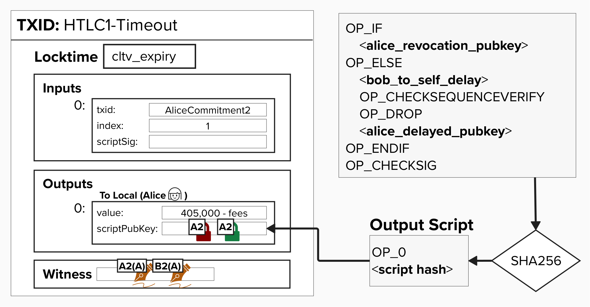

# Get Our HTLC Timeout Transaction

Let's wrap things up and generate our **HTLC Timeout Transaction**. 

Below is a visual representation of the transaction we're about to create.

<p align="center" style="width: 50%; max-width: 300px;">
  
</p>

## 👉 Get Our HTLC Timeout Transaction
Once again, let's open `transactions.txt` (in `src/exercises`). However, this time, we'll get our latest **Commitment Transaction (With HTLC)** TxID. We need this TxID because, under the hood, the code will use the TxID to fetch HTLC **output** from the commitment transaction so that it can use it as the **input** to the **HTLC Timeout Transaction**.

Once you have your **Commitment Transaction (With HTLC)** TxID, go to a **Shell** in your Repl and type in the below command. **Be sure to replace `txid` with the TxID of your Commitment Transaction (With HTLC)**!

```
cargo run -- htlc-timeout -t txid
```

Under the hood, this command is running the code in `src/interactive/htlc_timeout.rs` - feel free to explore this file, if you'd like! If you do check out the file, you'll see that it's, once again, creating two sets of keys - one for us (Alice) and one for Bob. To do this, it's using the functions we created earler!

If you scroll through the rest of the code, you'll see it calls a few other functions that we've recently completed during this course:
- `create_htlc_timeout_transaction`: This creates an unsigned **HTLC Timeout Transaction**.
- `finalize_htlc_timeout`: This generates our (Alice's) signature, using Alice's **HTLC Basepoint** and adds it to the witness (along with Bob's **HTLC Basepoint** signature and the witness script), resulting in a fully signed HTLC Timeout Transaction, which can only be broadcasted and mined *after* the timelock expires.

Once you run the command, you should see an output like this...

```
✅ HTLC Timeout Transaction Created

Tx ID: 5ac2986270151d7c7cefc31981494d467007cfbfdea2542b0dfb44d0a147aec1

Tx Hex: 020000000001014cd5a497ccd69ae27aa6b0968dc0e70214e1b42610eb70364f490fba2d02a0e0010000000000000000013c270600000000002200205ae871c433f2bc223753610b819831f5c4327168b19c5afeecb7d1d7e808b463050047304402203fd80f2eb2e4584d6829222e04b2d449cb73a98c96b330f2fda2c472d6e28c6c02205d9ee5b26700306073cecf23ba86bab870cebb781245917df0eb75e91690ce3801483045022100b65a70467fd69bbee3ed3dece19181b55b466da282d7897b3ba751f581e74e8c02200543907787f3452a6b6f293f3d35241edcfa23530b36ee42c8976ff0d90540de01008576a914f8b861c3e79f385e24a113932589a19443da0dbe8763ac6721020c76717fefcb1c635f804c0c9c16ec04232356dcbc2a589fb87f3550de64d1107c820120876475527c2103e322cd335c60831c19dbe93dc666a5a04945cbfd51a53c69894c5e79de16e9f552ae67a914b8bcb07f6344b42ab04250c86a6e8b75d3fdbbc688ac6868c8000000
```

This is our HTLC Timeout transaction! Go ahead and copy the **Tx Hex** and **Tx ID** and save them in the file `src/exercises/transactions.txt` under the headings **HTLC TimeoutID** and **HTLC Timeout Hex**. 

# Decoding Our HTLC Timeout Transaction

By now, you should know the deal! Let's decode one last transaction. Run the below command in your shell, replacing `raw_tx_hex` with the transaction hex we just generated.

```
decodetx raw_tx_hex
```

You should get an output like the below. See if you can dig through the major elements and understand what they are (`txid`, `locktime`, `vin`, `txinwitness`, and `vout`).

```
{
  "txid": "5ac2986270151d7c7cefc31981494d467007cfbfdea2542b0dfb44d0a147aec1",
  "hash": "237f5c1112d9f723146607249990d1eb2fd059a5c6d0a66a2a62b1c854a21cd9",
  "version": 2,
  "size": 378,
  "vsize": 165,
  "weight": 660,
  "locktime": 200,
  "vin": [
    {
      "txid": "e0a0022dba0f494f3670eb1026b4e11402e7c08d96b0a67ae29ad6cc97a4d54c",
      "vout": 1,
      "scriptSig": {
        "asm": "",
        "hex": ""
      },
      "txinwitness": [
        "",
        "304402203fd80f2eb2e4584d6829222e04b2d449cb73a98c96b330f2fda2c472d6e28c6c02205d9ee5b26700306073cecf23ba86bab870cebb781245917df0eb75e91690ce3801",
        "3045022100b65a70467fd69bbee3ed3dece19181b55b466da282d7897b3ba751f581e74e8c02200543907787f3452a6b6f293f3d35241edcfa23530b36ee42c8976ff0d90540de01",
        "",
        "76a914f8b861c3e79f385e24a113932589a19443da0dbe8763ac6721020c76717fefcb1c635f804c0c9c16ec04232356dcbc2a589fb87f3550de64d1107c820120876475527c2103e322cd335c60831c19dbe93dc666a5a04945cbfd51a53c69894c5e79de16e9f552ae67a914b8bcb07f6344b42ab04250c86a6e8b75d3fdbbc688ac6868"
      ],
      "sequence": 0
    }
  ],
  "vout": [
    {
      "value": 0.00403260,
      "n": 0,
      "scriptPubKey": {
        "asm": "0 5ae871c433f2bc223753610b819831f5c4327168b19c5afeecb7d1d7e808b463",
        "desc": "addr(bcrt1qtt58r3pn727zyd6nvy9crxp37hzryutgkxw94lhvklga06qgk33sj2x8v8)#5k8t7swq",
        "hex": "00205ae871c433f2bc223753610b819831f5c4327168b19c5afeecb7d1d7e808b463",
        "address": "bcrt1qtt58r3pn727zyd6nvy9crxp37hzryutgkxw94lhvklga06qgk33sj2x8v8",
        "type": "witness_v0_scripthash"
      }
    }
  ]
}
```