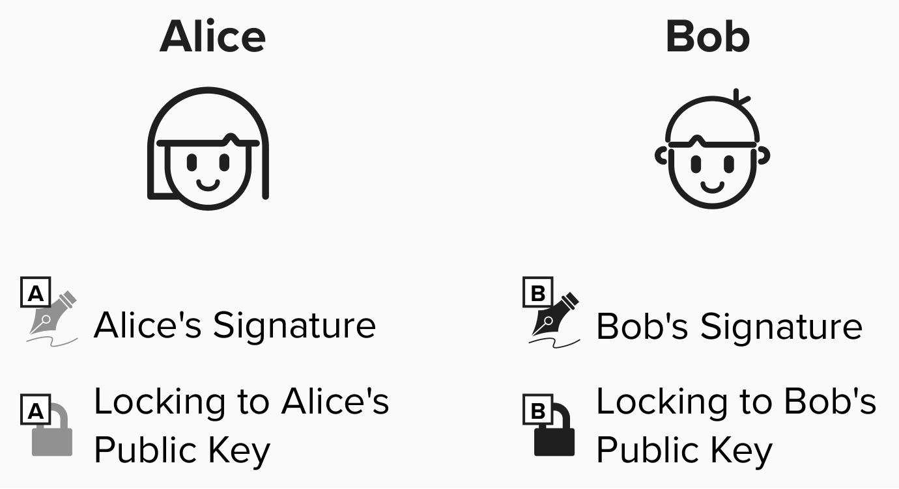
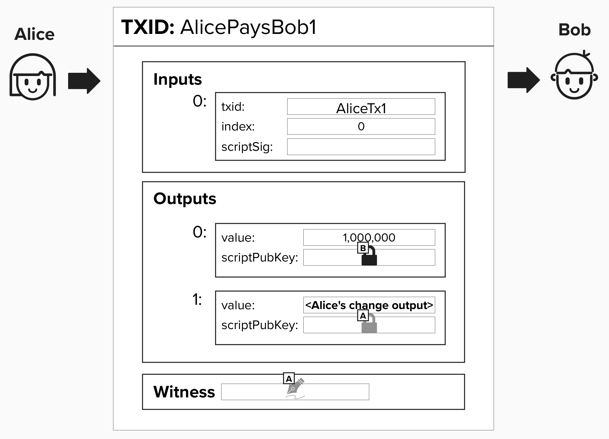
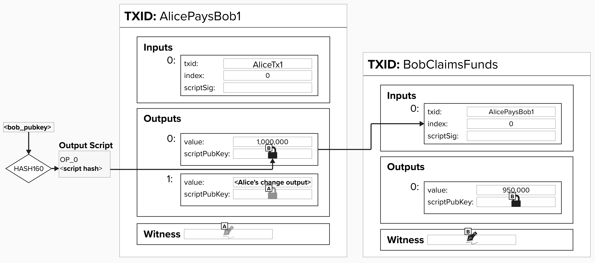
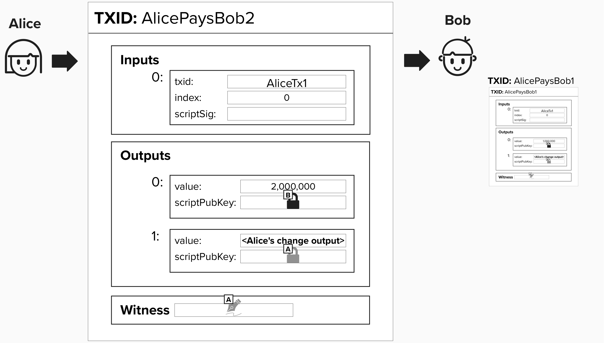
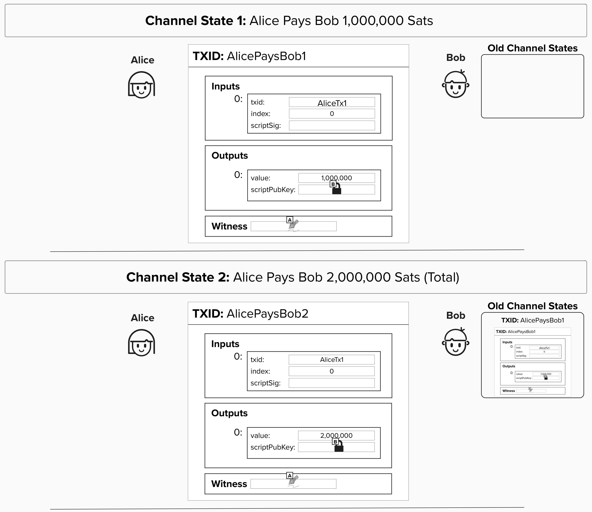

# Irresponsibly Naive Scaling
Now that we've reviewed how we can derive all of the keys we'll need to operate a Lightning channel, we're in a good position to begin our journey into Lightning transactions themselves.

At the heart of Lightning is the concept of exchanging **"off-chain"** transactions. There are various ways to design an off-chain protocol, but the main theme they all have in common is that they involve exchanging data (ex: transactions) outside the scope of the bitcoin blockchain (aka **"on-chain"**). In the context of the Lightning Network, nodes will exchange **valid** bitcoin transactions, in that they adhere to the rules of the bitcoin protocol, but the nodes choose not to publish these transactions until a later point in time. 

The Lightning protocol is quite complicated, so we'll begin with a simple example. Imagine you want to make an "off-chain" payment to your friend. To do this, you can contruct a valid transaction and send it to them - perhaps via email or text message. After all, under the hood, a transaction is just data.

This is an off-chain transaction because it's **not** broadcasted to the bitcoin network nor mined in a block. If your friend trusts you, they can simply take this transaction, accept it as a valid form of payment, and wait to publish it later.

<details>
  <summary>Click to see an example transaction!</summary>

Unless you have the Bitcoin protocol programmed into your brain, you likely won't understand the bytes below, but it's actually a valid Bitcoin transaction. All the necessary details, such as inputs, outputs, and signatures, are encoded below.

```
020000000001018d54238793c4547bb913e369a27c74bc08fc20c33197f5690f41565c7cfad12e0000000000ffffffff01784a4c0000000000220020657760ca015175e42ff5b4470563b23adcf0d2973a0506a176a5569690d64437024730440220548d3aeae38390d1d4f79b8756b5758d131051ddce223aa4f395bb88be1ccaeb02201698654ab9c29d41822771cd3a75bffec87488322a46783f64cd53aefb1f5d960121024e77786b0c8bef20ef469345cf4c306b14dee25dd5bab152155bee1e2115e93100000000
```


</details>

## Alice and Bob Exchange Off-Chain Transactions

Let's build on the previous off-chain example by reviewing one of the most naive and insecure scaling solutions possible. **PLEASE DON'T TRY THIS AT HOME!**.

Like all good computer science examples, we'll introduce Alice and Bob - two individuals who want to make off-chain payments to each other. Imagine that Bob has started his own bar (good luck!). Since Alice and Bob both like bitcoin, Alice decides to pay Bob in bitcoin whenever she goes to his bar. However, to save on transaction fees and receive instant payments, Bob agrees to accept **off-chain** payments from Alice, meaning that Alice will send Bob a valid bitcoin transaction off-chain (ex: via text message), and Bob will **wait** to publish the transaction until some point in the future.

To bring this example to life, let's equip Alice and Bob with private and public keys. As we work through this course, we'll represent Alice and Bob's **signatures** with a **signature** logo, and we'll represent locking to their **public keys** with a **lock** logo. For this naive example, Alice's signature and public key will have a gray color, and Bob's will have a black color. Spoiler alert (!), as we progress through the course, we'll change the colors of the public keys and signatures to match their respective colors from the earlier exercises where we built our Lightning wallet.

<p align="center" style="width: 50%; max-width: 300px;">
  
</p>

Now, if Alice wants to pay Bob, she can simply send him a valid transaction **off-chain**. For example, imagine that Alice buys a glass of wine for 1,000,000 sats (it's very expensive wine). To do this, she will create a transaction and lock 1,000,000 sats to Bob's public key. Instead of publishing the transaction herself, she will send Bob the raw transaction data, and he can publish it himself later. Since Bob trusts Alice, he will *immediatey* give Alice the wine, providing an instant payment experience.


<p align="center" style="width: 50%; max-width: 300px;">
  
</p>


#### Question: What feerate should Alice set on this transaction?

<details>
  <summary>Answer</summary>

Hmm, this is actually a tricky question. Remember, Alice is giving Bob a transaction for him to broadcast at some arbitrary point in the ***future***. Since there is no way to know what the fees will be then, Alice and Bob have a few options.


### Choose A Conservative Feerate:
Alice and Bob can do their best to predict what the feerate will be in the future, and they can set the fees slightly above that to be safe.

### Child-Pays-For-Parent
If the fee that Alice and Bob originally decide on ends up being too small, then Bob can create a new transaction, which spends from Alice's payment transaction, and moves those funds to a new address controlled by Bob. If Bob sets fees sufficiently high on this transaction, he can, effectively, bump the fees on the original transaction since miners will consider both transaction's fees when determining if they should include these transactions in a block. ***NOTE***: a huge benefit of this approach is that Bob will know the current feerate estimates under this approach, since he will only create the new transation when he wants to publish Alice's off-chain payment.

<p align="center" style="width: 50%; max-width: 300px;">
  
</p>

### Replace-By-Fee Won't Really Work
You've probably heard of replace-by-fee, whereby you re-create the same transaction, but you just add extra fees. Since miners will prefer to mine transactions with the highest fees, they will choose the "updated" transaction with higher fees instead of the original lower-fee transaction. The reason this doesn't work that well for Alice's payment to Bob is that there is no guarentee that Alice will be around to cooperate with Bob to create a new transaction with higher fees. Remember, Alice is creating valid transactions and handing them off-chain to Bob in exchange for a drink. If Bob wants to bump the fee via replace-by-fee, Alice will need to agree to re-sign a *new* transaction, which is not very reliable.


</details>

If Alice decides to purchase another glass of wine, she can just create a new transaction that pays Bob 2,000,000 sats. **This will, effectively, replace the old transaction and act as a single transaction that pays for both drinks**. While Bob will, technically, have two valid transactions from Alice for 3,000,000 sats total, Bob agrees to ***only*** publish the most recent one.

<p align="center" style="width: 50%; max-width: 300px;">
  
</p>

#### Question: Why is it better for Alice to create a new transaction with 2,000,000 sats (effectively paying for both drinks with one transaction) instead of just creating a second transaction for 1,000,000 sats? 

<details>
  <summary>Answer</summary>

This is a ***very*** important point, as it's essentially the heart of off-chain scaling with Lightning.

As a reminder, at this point, Alice has purchased two drinks from Bob. There are two ways she can pay Bob using bitcoin transactions.
1) Alice can send Bob **two individual transactions**, each for 1,000,000 sats.
2) Alice can send Bob a transaction for 1,000,000 sats for the first transaction and an ***updated*** transaction for 2,000,000 sats for the second drink.

In both scenarios, Bob will have the original transaction for 1,000,000 sats. However, if Alice trusts Bob, then, in the second scenario, she can trust Bob to ***only*** broadcast the transaction for 2,000,000 sats. This way, they can save on transaction fees and only publish one transaction to the bitcoin chain instead of two.

To take this example further to the limit, imagine Alice was having a girls night out with her friends, and they bought 100,000 drinks over the course of the night. If she trusts Bob and continiously updates her balance, Bob can still only publish **one** transaction on-chain at the end of the night!

</details>

## Payment Channels
At the end of the night, Bob can simply publish the **most recent** transaction to the Bitcoin blockchain. Why? Since, for each payment (transaction), Alice simply added more funds to Bob's output. Bob can claim all of his funds by publishing the final transaction to the blockchain. In this way, Alice and Bob have created a **payment channel**.

By not broadcasting each transaction to the chain, the parties do not need to:
1) Wait for confirmations.
2) Pay miner fees.
3) Force resource costs onto the entire network.

## Channel States

In **payment channels**, it’s helpful to view them through the lens of **channel states**. For now, you can imagine a channel’s **state** as the distribution of funds after each payment. As we'll see shortly, dividing payments into channel states enables us to make the process of transfering funds clear and secure. This idea of "channel states" is also why you may hear people refer to Lightning as a **state machine**. 

<p align="center" style="width: 50%; max-width: 300px;">
  
</p>


## Removing All Trust Assumptions 

You likely read the above channel construction and thought, "OMG, this is bad!". You'd be right.

In the above payment channel, there are many opportunities for both channel parties to steal from each other - whether that be bitcoin or the goods and services obtained from the bitcoin payments. Let's address these one by one, working our way towards payment channels that work without trust assumptions! Also known as - Lightning!

#### Question: What are some of the ways that Alice or Bob could cheat each other in the above payment channel?

<details>
<summary>Answer</summary>

There are a few ways the above payment channel could go wrong. We'll start with the **double-spending issue**. In the above channel construction, Alice could double-spend the Bitcoin in the transaction that pays Bob by secretly creating another transaction and moving her bitcoin to a different UTXO! Then, when Bob goes to publish the final transaction at the end of the night, he'll find that the input to his transaction has already been spent, rendering his transaction invalid.

#### Question: How can we make sure that the Bitcoin allocated to this payment channel stays in this payment channel? In other words, how can we stop it from being double-spent?
<details>
  <summary>Answer</summary>

As we just learned, the core idea of a payment channel is to enable multiple parties to send each other off-chain transactions, resulting in instant and nearly-free payments. However, since these transactions are exchanged off-chain, we need a way to make sure the UTXO funding the channel is not spent on-chain in such a way that renders the off-chain transaction invalid - at least, not without both parties agreeing. In other words, we need to ensure that Alice **cannot** mine a different transaction that spends the UTXO in the transaction she handed to Bob. If she was able to do this, then Bob's transaction would be considered invalid when he tried to broadcast it, because the input is no longer **unspent**.

To alleviate this concern, we can require both parties to lock funds in a **2-of-2 multisig** output - one public key for each channel member. Therefore, to spend from this output, we'll need one signature from Alice and one signature from Bob. This will ensure that neither Alice nor Bob can double-spend the funds they are using in the payment channel.

</details>

</details>