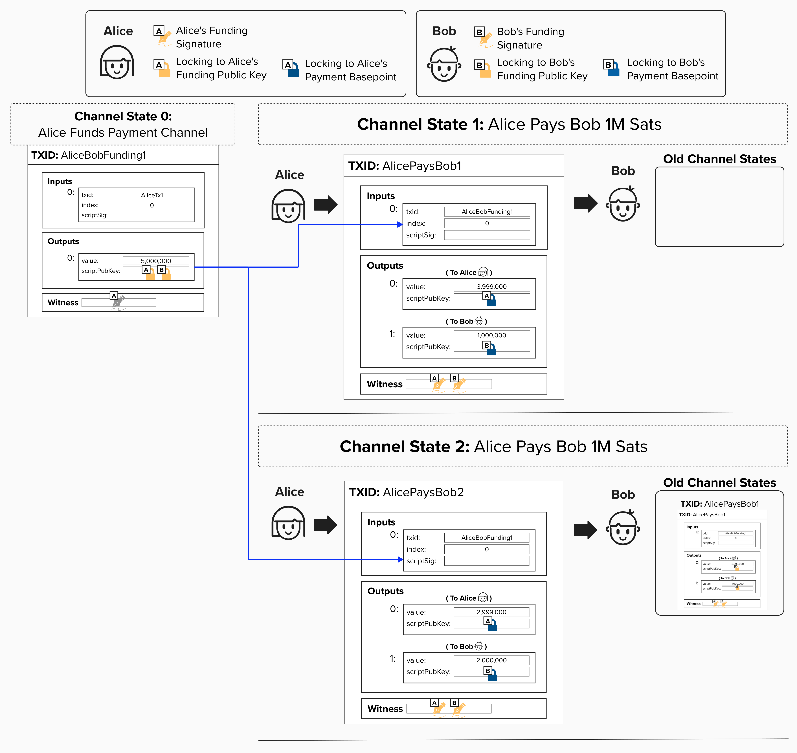
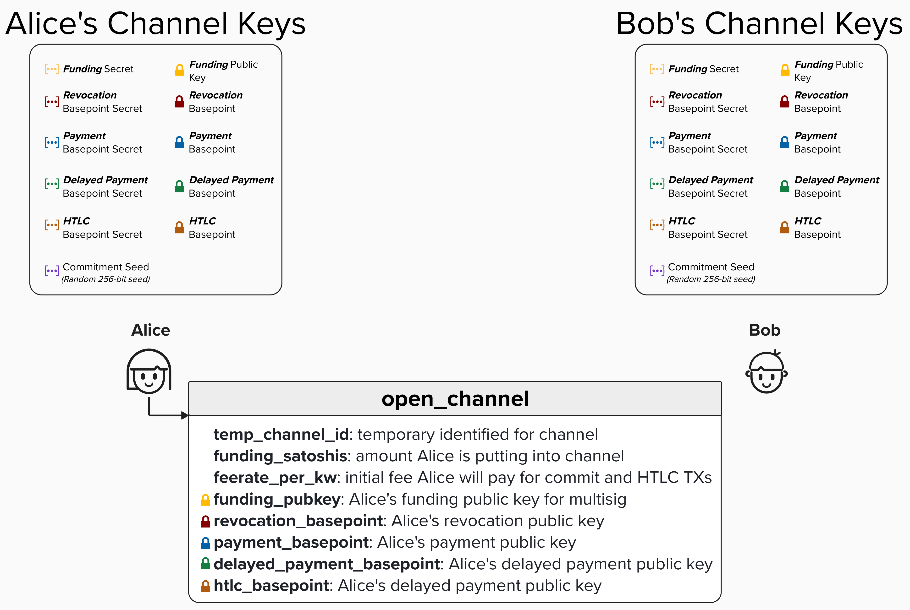
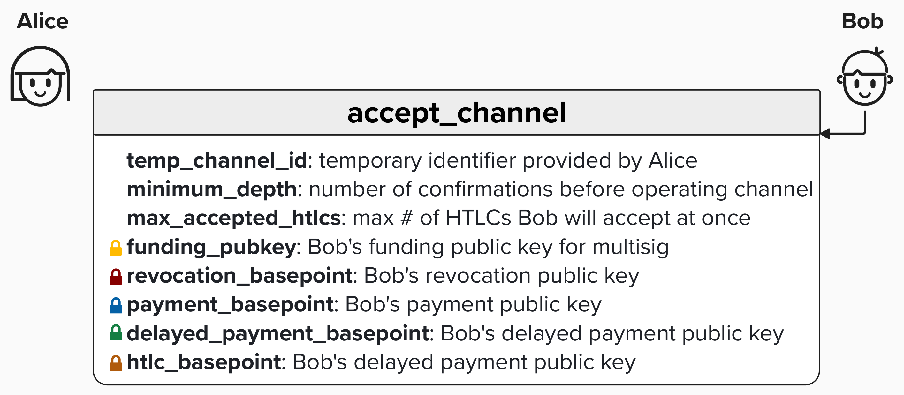
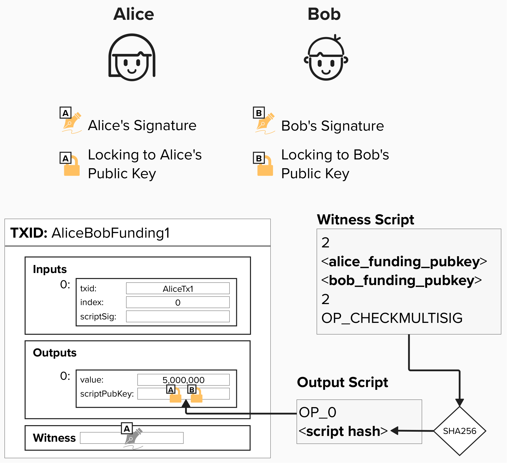
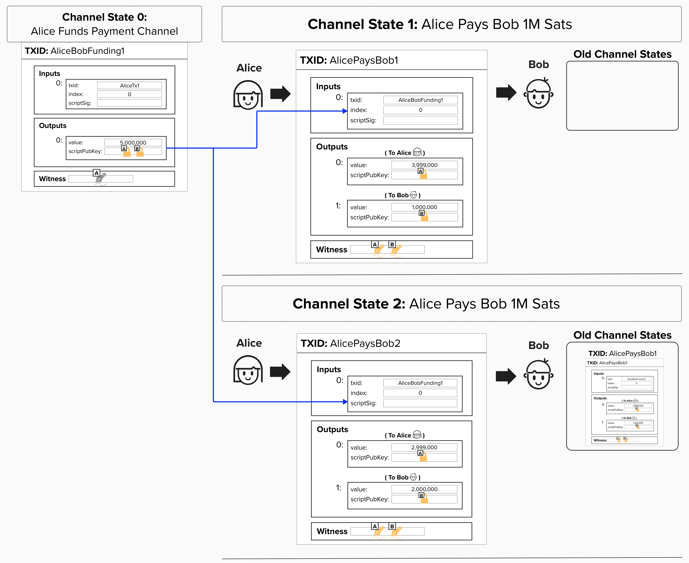

# Locking Funds In Our Payment Channel

A crucial part of operating a Lightning channel is ensuring that one party cannot **unilaterally** steal from their channel partner. In other words, Alice should not be able to show up to Bob's bar, give him an off-chain transaction in exchange for a glass of wine, and then spend the same UTXO referenced in that transaction, rendering Bob's transaction invalid and useless.

To protect against this, we'll begin our payment channel by locking funds in a **Pay-to-Witness-Script-Hash (P2WSH) 2-of-2 multisig output**, where Alice and Bob each provide one public key. We call this our **"Funding Transaction"** because it, quite literally, provides the funds needed to operate our payment channel. To move bitcoin out of this UTXO (effectively closing the channel), Alice and Bob must *agree* by both providing valid signatures.

The diagram below connects our new payment channel construction back to the keys we derived earlier. You'll see that Alice and Bob begin their channel by locking funds in a **2-of-2 multisig output** using **Alice's Funding Public Key** and **Bob's Funding Public Key**. Since Alice is opening the channel, she puts *her* funds in this output. You can think of this like Alice setting up a bar tab at Bob's bar.

When Alice makes payments to Bob, she creates new transactions that lock Bob's funds in an output only he can spend, using **Bob's Payment Basepoint**, which is a public key. **Each new transaction spends the 2-of-2 multisig output that Alice and Bob created together**. This ensures that Alice cannot double-spend Bob!

You'll also notice that Alice and Bob provide their signatures for each new transaction. This is required, since, to spend from the 2-of-2 Funding UTXO, Alice and Bob both need to provide a signature.

> ⚠️ **NOTE:** In the diagram below, Alice locks *her* balance to *her* **Payment Basepoint**. This is *only* for educational purposes, since we haven't yet introduced how Lightning channels work in their entirety. For now, it's sufficient to note that Alice locks her balance to an output she controls. We'll revisit Alice's output later!

<p align="center" style="width: 50%; max-width: 300px;">
  
</p>

## BOLT 2: Peer Protocol for Channel Management

By now, you may be wondering how Alice and Bob communicate all of the necessary information to operate a payment channel. Well, since Lightning is a decentralized protocol accessible to anyone, there's a standardized protocol for exchanging information, ensuring that all participants on the network *speak the same language*.

[BOLT 2](https://github.com/lightning/bolts/blob/master/02-peer-protocol.md) defines the **channel management** portion of Lightning's shared language. Channel management is broken into three phases:

1. **Channel Establishment**: These messages define how peers communicate their intent to open a channel and what information should be exchanged as part of this process.
2. **Normal Operation**: Once the channel is open, peers can begin sending payments to each other (or routing payments *through* each other).
3. **Closing**: As we'll learn later, there are multiple ways to close a channel. BOLT 2 defines the "happy path," where both parties agree and work together to close their channel cooperatively.

Another important part of the shared language, which is not thoroughlt covered in this course, is [BOLT 7: P2P Node and Channel Discovery](https://github.com/lightning/bolts/blob/master/07-routing-gossip.md).

### BOLT 2: Channel Establishment
When one party wants to open a channel with another, they will begin the **"Channel Establishment"** process by sending an [`open_channel`](https://github.com/lightning/bolts/blob/master/02-peer-protocol.md#the-open_channel-message) message to their counterparty. In this case, Alice will begin the process of **creating the funding transaction** and opening a channel to Bob by sending an `open_channel` message to Bob. Some of the fields in the `open_channel` message have been left out at the moment for simplicity. However, you should be able to recognize most of the ones in the image below. Many of them are the public keys we created in an earlier exercise! Remember, Alice and Bob each have their own set of these keys. Alice will begin the process of opening a new channel by sending these keys to Bob. We'll see why shortly!

Upon receiving a `channel_open` message, the recipient will decide if they would like to accept the incoming channel. There are a variety of things to consider as part of this process. For those who already have an intuition for how Lightning works, you may recognize 'feerate_per_kw' as the feerate that Alice is proposing to pay for the commitment and HTLC transactions. If Bob thinks these fees are either too high or too low, he can reject Alice's channel open. If this doesn't make sense yet, don't worry! We'll cover all of this in due time.

<p align="center" style="width: 50%; max-width: 300px;">
  
</p>

### BOLT 2: Accept Channel
If Bob accepts Alice's channel proposal, he can send back an [`accept_channel`](https://github.com/lightning/bolts/blob/master/02-peer-protocol.md#the-accept_channel-message) message, including a few of his own channel requirements. For example, Bob will specify the `minimum_depth`, which defines the number of block confirmations (on the funding transaction) that Bob requires before him and Alice can send payments. Also, he will specify the maximum number of active HTLCs he will accept. Fun fact: the protocol specification limits this value to 483! Again, if these things don't make sense just yet - don't worry!

Finally, Bob will send his public keys to Alice as well!

Similar to the `open_channel` message above, note that this is also a simplified version of the `accept_channel` message. Some of the fields have been left out of the visual below, since their purpose would not yet be clear to us at this time.

<p align="center" style="width: 50%; max-width: 300px;">
  
</p>

## Building Our Funding Transaction

Since Alice is opening a channel to Bob, she will initially provide the funds for this payment channel. Note, this is also known as **Channel Establishment V1**, whereby **only the channel opener can fund the channel**. **Channel Establishment V2** is a little more complicated and is not covered in this course. However, it's worth noting that V2 allows for "dual-funded" channels whereby **both parties contribute UTXOs to fund the payment channel**.

Since we're covering V1 Channel Establishment, Alice will provide the input to this **"Funding Transaction"**. Remember, you can think of this as Alice showing up to Bob's bar and opening a tab with a specific amount.

Now that Alice has Bob's **Funding Public Key**, which he provided in the `accept_channel` message, Alice can build the funding transaction by locking the funds in a 2-of-2 multisig where Alice and Bob each provide one public key. Since Alice cannot spend this UTXO without a signature from Bob, Bob can safely accept payments from Alice!

<p align="center" style="width: 50%; max-width: 300px;">
  
</p>

#### Question: You'll see in the above diagram that Funding Transaction UTXO is for 5,000,000 sats. Why is this amount important for our payment channel?
<details>
  <summary>Answer</summary>

The amount in this UTXO is going to be channel balance for this payment channel. Therefore, neither channel party will be able to send the other channel party **more than this amount** of sats.

There are ways to increase this amount while the channel is active, called "splicing", but that is outside the scope of this course.

</details>

### Sending a Payment
⚠️ WARNING: The below example is ***not*** actually how Lightning works, but it will help build our intuition so that things make more sense as we begin to introduce more complex features. Therefore, there are still some security issues below, which we will identify and fix!

Now that Alice has locked her funds in a 2-of-2 multisig, she cannot move her funds out of the payment channel unless Bob agrees by providing his signature. To send a payment, Alice and Bob can simply create a new transaction that spends from the funding transaction. **Each new transaction will have an output for Alice and Bob with their respective channel balances**.

Returning to our prior example, imagine Alice sends Bob 1 million sats.

Alice then decides to send Bob another 1 million sats for another round of drinks (big spender!).

For each payment, Alice is creating a new transaction, moving sats from her output to Bob's output. Since the funds are locked on-chain in a 2-of-2 multisig, both Alice and Bob will need to provide a new signature for each commitment transaction. 

***PRO TIP!***: Don't be afraid to zoom in. Some of these diagrams may be hard to read, but the diagram should render quite nicely if you zoom in.

<p align="center" style="width: 50%; max-width: 300px;">
  
</p>

#### Question: Who should be responsible for paying the on-chain fees? In the above example, who is paying them now?

<details>
  <summary>Answer</summary>

For "legacy" (pre-anchor outputs and pre-V3 commitments) commitment transactions, which this workbook is focused on, **the party that opens the channel pays the on-chain fees**. In other words, **fees are deducted from the output paying the channel opener**. In this case, that's Alice.

If you've been following Lightning Network development, you're likely aware that many of the advancements in Lightning have been motivated by mitigating issues related to fees. We'll dig into this more a little later. We haven't yet introduced all of the nuances of how Lightning works, so we can't fully elaborate on this just yet.

</details>

## ⚡️ Build Our 2-of-2 Funding Script

Alright, enough reading — let's code! For this exercise, we'll complete the `create_funding_script` function, located in `src/exercises/scripts/funding.rs`. This function takes two **Funding** public keys (one from Alice, one from Bob) and creates a 2-of-2 multisig script. Each funding key is of type `PublicKey`, provided by Rust Bitcoin. See the dropdown below for more information on this type.

To complete this function, we'll use the `Builder` object — also provided by Rust Bitcoin. If you're unfamiliar with it, a dropdown has been provided below with a brief overview and helpful hints.

For this function to pass (and to be compatible with BOLT 3), you must sort the public keys such that `pubkey1` is *first* and is the lexicographically lesser of the two funding pubkeys in compressed format.

#### Question: Why is it important to order the public keys such that the first is the lexicographically lesser?

<details>
  <summary>Answer</summary>

By ordering the public keys lexicographically, we standardize the order and reduce ambiguity. This means that Alice and Bob will both know exactly how to construct the 2-of-2 multisig witness themselves!

This is important because the 2-of-2 multisig witness needs to be provided whenever spending *from* the 2-of-2 multisig output. Therefore, it's vital that both Alice and Bob know exactly how to construct the correct witness.

<details>
  <summary>Click here to learn how what sorting a compressed public key lexicographically means</summary>

In the context of Bitcoin, a public key is a point on the secp256k1 elliptic curve. Like all points on 2-dimensional curves, the public key can be represented as an X, Y coordinate.

Furthermore, instead of representing each X and Y coordinate as 256-bit numbers, we can represent them as 32-byte hexademical values. Since the elliptic curve is symetrical around the X axis, we can actually get rid of the X coordinate and, instead, use a single byte **prefix**. `0x02` represents and even Y coordinate and `0x03` represents an odd Y coordinate. By using hexadecimal values and prefixes, we create a **compressed** version of our public key, communicating all of the necessary information but taking up less space as an X, Y coordinate of 256-bit numbers in decimal format.

To determine which public key is lexicographically smaller, we can compare their byte arrays sequentially from left to right: at the first differing byte, the one with the lower value is considered smaller.

<p align="center" style="width: 50%; max-width: 300px;">
  
</p>

</details>

</details>

Okay, you should be in a good position to tackle this exercise! Give it a try, and remember you can use the step-by-step dropdowns for help.

<details>
  <summary>Click to see Rust Bitcoin's PublicKey Type</summary>

The `PublicKey` type from the rust-bitcoin library is a wrapper around a secp256k1 public key that provides Bitcoin-specific functionality. You can read more about it [here](https://docs.rs/bitcoin/latest/bitcoin/struct.PublicKey.html).

```rust
pub struct PublicKey {
    pub compressed: bool,
    pub inner: PublicKey,
}
```
The `inner` is the actual secp256k1 public key!

</details>


<details>
<summary>Click to learn about Rust Bitcoin's Script Builder</summary>

As we learned earlier, Rust Bitcoin is a comprehensive library for building Bitcoin applications in Rust, providing tools for building transactions, keys, scripts, and other core Bitcoin primitives.

Rust Bitcoin provides a [`Builder` object](https://docs.rs/bitcoin/0.32.0/bitcoin/blockdata/script/struct.Builder.html) that we can use to construct a `ScriptBuf`, which represents a Bitcoin script. It offers a handful of helper functions for adding opcodes, integers, bytes, and keys to a script:

* `Builder::new()` - construct a new builder object
* `.push_opcode(op)` - add an opcode to the script
* `.push_int(num)` - add a number to the script
* `.push_key(public_key)` - add a `PublicKey` to the script
* `.push_slice(data)` - add some arbitrary data, such as a hashed pubkey, to the script
* `.into_script()` - return the resulting `ScriptBuf` from the `Builder`  


For example, we could build a Pay-to-Witness-Public-Key-Hash script like this:

```rust
pub fn p2wpkh(
    pubkey_hash: &WPubkeyHash,
) -> ScriptBuf {
    Builder::new()
      .push_opcode(opcodes::OP_DUP)
      .push_opcode(opcodes::OP_HASH160)
      .push_slice(pubkey_hash)
      .push_opcode(opcodes::OP_EQUALVERIFY)
      .push_opcode(opcodes::OP_CHECKSIG)
      .into_script()
}
```

You can see we use `Builder::new()` to construct a new empty Builder object. From there we can chain calls to `push_opcode` and `push_slice` to build up the script we want. Finally, we call the `into_script()` method to convert the `Builder` into the `ScriptBuf` that our function needs to return.

</details>

```rust
pub fn create_funding_script(pubkey1: &BitcoinPublicKey, pubkey2: &BitcoinPublicKey) -> ScriptBuf {
  // Sort pubkeys for determinism (BOLT 3 requirement)
  let (pubkey_lesser, pubkey_larger) = if pubkey1.inner.serialize() < pubkey2.inner.serialize() {
      (pubkey1, pubkey2)
  } else {
      (pubkey2, pubkey1)
  };
  Builder::new()
      .push_int(2)
      .push_key(pubkey_lesser)
      .push_key(pubkey_larger)
      .push_int(2)
      .push_opcode(opcodes::OP_CHECKMULTISIG)
      .into_script()
}
```

<details>
  <summary>💡 Hint 💡</summary>

To complete this exercise, you'll need to do two things:
1. Sort the public keys lexicographically
2. Build the 2-of-2 multisig script

#### Sorting the public keys lexicographically.

To compare two public keys, you can serialize them to their compressed byte representation using `.inner.serialize()` and compare the resulting byte arrays. Below is some rust code to help get you started.

```rust
if pubkey1.inner.serialize() < pubkey2.inner.serialize() {
    // pubkey1 is lexicographically smaller
} else {
    // pubkey2 is lexicographically smaller
}
```

#### Building the witness script.

Next, you'll need to use the `Builer` object to create the 2-of-2 multisig script. Check out the Pay-to-Witness-Public-Key-Hash example if you need some guidance. As a reminder, you can see the 2-of-2 multisig witness script below.

```
2 <pubkey1> <pubkey2> 2 OP_CHECKMULTISIG
```

Don't forget to call `.into_script()` at the end to convert the `Builder` into a `ScriptBuf`!

</details>

<details>
  <summary>Step 1: Sort the Public Keys</summary>

First things first, we need to sort the two public keys in lexicographical order. This is a **BOLT 3 requirement** that ensures both Alice and Bob can independently construct the exact same funding script without ambiguity as to whose public key goes first.

```rust
let (pubkey_lesser, pubkey_larger) = if pubkey1.inner.serialize() < pubkey2.inner.serialize() {
    (pubkey1, pubkey2)
} else {
    (pubkey2, pubkey1)
};
```

</details>

<details>
  <summary>Step 2: Build the Funding Script</summary>

Now, we'll use the `Builder` to construct our 2-of-2 multisig script. Remember, a 2-of-2 multisig script in Bitcoin looks like:

```
2 <pubkey1> <pubkey2> 2 OP_CHECKMULTISIG
```

Here's how we build it:

```rust
Builder::new()
    .push_int(2)
    .push_key(pubkey_lesser)
    .push_key(pubkey_larger)
    .push_int(2)
    .push_opcode(opcodes::all::OP_CHECKMULTISIG)
    .into_script()
```

</details>


## ⚡️ Build Our Funding Transaction
Now that we have our funding script, let's create our funding transaction so we can open our payment channel! During this course, we'll implement all of the code to create BOLT 3-compliant Lightning transactions. Once created, we'll broadcast these transactions in our local Regtest environment to simulate operating a Lightning channel. It'll be fun!

For this exercise, we'll use Rust Bitcoin to create our very own Funding `Transaction`. The function takes the following inputs:
- `input_txid`: The TxID of the previous transaction containing the UTXO we're spending. In our ongoing example, this UTXO belongs to Alice, who is opening (and funding) the channel.
- `input_vout`: The output index within that previous transaction. Remember, each input references a previous output, so we need both the TxID *and* the output index to identify which UTXO we're spending.
- `funding_amount_sat`: The amount we'd like to lock in our 2-of-2 multisig script.
- `local_funding_pubkey`: The public key of the channel opener (Alice, in this case), which will be included in the 2-of-2 multisig.
- `remote_funding_pubkey`: The public key of the channel acceptor (Bob, in this case), which will be included in the 2-of-2 multisig.

To successfully complete this exercise, you'll need to return a Funding Transaction (of type `Transaction`). For this exercise, we'll keep things simple and won't worry about adding any signature data to the witness, though we will dig into these details shortly!

<details>
  <summary>Click to see Rust Bitcoin's Transaction Type</summary>

The `Transaction` type from the rust-bitcoin library represents a Bitcoin transaction. You can read more about it [here](https://docs.rs/bitcoin/latest/bitcoin/struct.Transaction.html).

```rust
pub struct Transaction {
    pub version: Version,
    pub lock_time: LockTime,
    pub input: Vec<TxIn>,
    pub output: Vec<TxOut>,
}
```

As a reminder, here is what each field in a `Transaction` represents:

1. **`version`**: The transaction version number. The version field is used to signal support for certain features. For example, version 2 enables BIP 68 (relative lock times), and version 3 enables [Topologically Restricted Until Confirmation (TRUC) Transactions](https://github.com/bitcoin/bips/blob/master/bip-0431.mediawiki).

2. **`lock_time`** - Locktime specifies the earliest time or block height when this transaction can be mined. This is an absolute locktime, meaning that you must specify a block height or point in time.

3. **`input`** - A vector of transaction inputs (`Vec<TxIn>`). Each input spends a previous transaction output (UTXO). For our funding transaction, Alice will provide an input that spends one of her existing UTXOs to fund the channel.

4. **`output`** - A vector of transaction outputs (`Vec<TxOut>`). Each output specifies an amount of bitcoin and a script that defines how those funds can be spent. For our funding transaction, we'll create an output locked in a 2-of-2 multisig script!

</details>

```rust
pub fn create_funding_transaction(
    input_txid: Txid,
    input_vout: u32,
    funding_amount_sat: u64,
    local_funding_pubkey: &BitcoinPublicKey,
    remote_funding_pubkey: &BitcoinPublicKey,
) -> Transaction {
    // Create the funding script (2-of-2 multisig)
    let funding_script = create_funding_script(local_funding_pubkey, remote_funding_pubkey);

    // Convert to P2WSH (pay-to-witness-script-hash)
    let funding_script_pubkey = funding_script.to_p2wsh();

    let tx_input = TxIn {
            previous_output: OutPoint {
                txid: input_txid,
                vout: input_vout,
            },
            script_sig: ScriptBuf::new(), // Empty for SegWit
            sequence: Sequence::MAX,      // 0xffffffff (RBF disabled)
            witness: Witness::new(),      // Witness will be added when signing
        };

    let output = TxOut {
            value: Amount::from_sat(funding_amount_sat),
            script_pubkey: funding_script_pubkey,
        };


    // Create the transaction
    Transaction {
        version: Version::TWO,
        lock_time: LockTime::ZERO,
        input: vec![tx_input],
        output: vec![output],
    }
}
```

<details>
  <summary>💡 Hint 💡</summary>

To complete this exercise, you'll need to build a **Funding Transaction**. It will contain one input, which is provided in the function definition, and one output - the 2-of-2 multisig.

Below is a rough outline of steps for how you can complete the exercise.

#### 1. Build The 2-of-2 Multisig Witness Script

Use the `create_funding_script` function we implemented in the previous exercise to build the 2-of-2 multisig witness script.

#### 2. Convert to Witness Script to an Output Script

Our funding output is a Pay-To-Witness-Script-Hash output. The key word here is "Hash". Therefore, we must convert the witness script into the below output script, where the 32-byte hash is the SHA256 of the witness script.

```
OP_O <32-byte script hash>
```

You can obtain the output script from the witness script by using the `.to_p2wsh();` method.

```rust
funding_script.to_p2wsh();
```

#### 3. Create the transaction input (`TxIn`)

Next, you'll have to use the input information provided in the function definition to construct the `TxIn`. To do this, you'll also need to construct an `OutPoint` from the `input_txid` and `input_vout`. Below is some code to help get you started.

> Note: You can keep the witness blank for now, since we are not signing the transaction yet.

```rust
let tx_input = TxIn {
    previous_output: OutPoint {
        txid: txid,
        vout: vout,
    },
    script_sig: ScriptBuf::new(),
    sequence: Sequence::MAX,
    witness: Witness::new(),
};
```

#### 4. Create the transaction output (`TxOut`)

Now, you'll have to build the `TxOut`, which is the output locking the funds to the 2-of-2 multisig. Once again, below is some code to help get you started.

```rust
let output = TxOut {
    value: Amount::from_sat(amount_sats),
    script_pubkey: script_pubkey,
};
```

#### 5. Assemble the `Transaction`

Finally, put it all together and return the Funding Transaction!

```rust
Transaction {
    version: Version::TWO,
    lock_time: LockTime::ZERO,
    input: vec![tx_input],
    output: vec![output],
}
```

</details>

<details>
  <summary>Step 1: Create the Funding Script</summary>

First things first, we need to create our 2-of-2 multisig script using the function we just wrote. This script will define how the funds can be spent, protecting Bob from Alice double-spending the bitcoin in their payment channel.

```rust
let funding_script = create_funding_script(local_funding_pubkey, remote_funding_pubkey);
```

Remember, `create_funding_script` handles the sorting for us and returns a `ScriptBuf` containing our 2-of-2 multisig script. Nice!

</details>

<details>
  <summary>Step 2: Convert to P2WSH</summary>

Now, we need to convert our funding script into a Pay-to-Witness-Script-Hash (P2WSH) output. Instead of putting the entire script in the output, we put a *hash* of the script. The actual script is povided later when spending.

```rust
let funding_script_pubkey = funding_script.to_p2wsh();
```

The `to_p2wsh()` method is provided by Rust Bitcoin and made available on our `ScriptBuf` object. It hashes our script and wraps it in the proper P2WSH format. This is what will actually go into our transaction output.

</details>

<details>
  <summary>Step 3: Create the Transaction Input</summary>

Next, we need to specify where the funds are coming from. Alice is providing an input that spends one of her existing UTXOs. We create a `TxIn` struct that references this previous output.

As mentioned earlier, we won't worry about adding the signature data to the witness for now, so you can leave the witness empty by simply initializing the `TxIn` object with `Witness::new()` for the `witness` field.

```rust
let tx_input = TxIn {
    previous_output: OutPoint {
        txid: input_txid,
        vout: input_vout,
    },
    script_sig: ScriptBuf::new(), 
    sequence: Sequence::MAX,      
    witness: Witness::new(),
};
```

</details>

<details>
  <summary>Step 4: Create the Transaction Output</summary>

Now we create the output that will lock the funds in our 2-of-2 multisig. This output specifies how many sats are being locked in our payment channel.

As you can see in the Type definition for a `TxOut` object below, Rust Bitcoin requires that the value field be of Type [`Amount`](https://docs.rs/bitcoin/0.32.0/bitcoin/struct.Amount.html), so we need to cast our `funding_amount_sat`, which is a to a 64-bit unsigned integer, to an `Amount` type.

```rust
let output = TxOut {
    value: Amount::from_sat(funding_amount_sat),
    script_pubkey: funding_script_pubkey,
};
```

</details>

<details>
  <summary>Step 5: Construct and Return the Transaction</summary>

Finally, let's package everything together into a `Transaction` and return it!

To do this, we'll first need to set the transaction version to 2, which supports BIP-68 relative locktimes, and locktime to zero using the provided Rust Bitcoin enums.

Also, note that the `input` and `output` fields require a vector, so we'll need to wrap our input and output in a `vec![]`.

```rust
Transaction {
    version: Version::TWO,
    lock_time: LockTime::ZERO,
    input: vec![tx_input],
    output: vec![output],
}
```

</details>


## 👉 Get Our Funding Transaction
Now for the fun part! Recall how, at the beggining of this course, we said we'd play the part of Alice in this payment channel? We'll, that's exactly what we're going to do. Let's go ahead and create the funding transaction for our channel!

Once your `create_funding_transaction` is passing the tests, go to a **Shell** in your Repl and type in the below command.

```
cargo run -- funding
```

Under the hood, this command is running the code in `src/interactive/funding.rs` - feel free to explore this file, if you'd like!

If you do check out the file, you'll see that it's creating two sets of keys - one for us (Alice) and one for Bob. To do this, it's using the functions we created earler! Once the keys are created, the code fetches a UTXO from our regtest wallet and creates a 2-of-2 multisig funding transaction using the function we just created. Since the UTXO is coming from our regtest environment, we're passing the `Transaction` created by our `create_funding_transaction` function to Bitcoin Core and asking it to sign the transaction. This is done via the `signrawtransactionwithwallet` RPC command. The resulting transaction, which is ready to be broadcasted, is returned to the console once signed.

NOTE: All future transactions that we create as part of our Lightning implementation will be signed using signing code that we'll write, so don't feel bad if you wanted to get in the weeds and sign transactions - we'll do this shortly!

Once you run the command, you should see an output like this...

```
Tx ID:
8077cb7913e97caefb6199deeb1a14b4ecc740206f05cdfb56605da794ae0e8f

Tx Hex: 020000000001018d54238793c4547bb913e369a27c74bc08fc20c33197f5690f41565c7cfad12e0000000000ffffffff01784a4c0000000000220020657760ca015175e42ff5b4470563b23adcf0d2973a0506a176a5569690d64437024730440220548d3aeae38390d1d4f79b8756b5758d131051ddce223aa4f395bb88be1ccaeb02201698654ab9c29d41822771cd3a75bffec87488322a46783f64cd53aefb1f5d960121024e77786b0c8bef20ef469345cf4c306b14dee25dd5bab152155bee1e2115e93100000000
```

This is our funding transaction. **Note: we have NOT broadcasted this yet**. Go ahead and copy the **Tx Hex** and **Tx ID** and save them in the file `src/exercises/transactions.txt` under the headings **Funding Tx Hex** and **Funding Tx ID**. We'll wait to publish it!

Finally, go ahead and run the below command in your shell, replacing **raw tx hex** with the transaction hex we just generated.

```
decodetx <raw tx hex>
```

You should get an output like the below. See if you can map this output back to the diagram above. Most of these fields will not map directly, but the following are represented in the diagram:
- vin: txid
- vin: vout
- vin: scriptSig
- vin: txinwitness
- vout: value
- vout: scriptPubKey

```
{
  "txid": "b43eee65237aaba00e7d2a2b442635d0e973b03515413b4be14f669e7bf09f1f",
  "hash": "81b475238dbf1d0ecee44ec82cf21c803e0314336df32c1f684909943243c749",
  "version": 2,
  "size": 203,
  "vsize": 122,
  "weight": 485,
  "locktime": 0,
  "vin": [
    {
      "txid": "f5e9c01a663dd228485fdf07fb4ae95d46f3ee71ba93a0c2d77fa8998b57c44a",
      "vout": 1,
      "scriptSig": {
        "asm": "",
        "hex": ""
      },
      "txinwitness": [
        "30440220783ff032365771673328b10c7516622eb95337b80a9b781cccec6d7d61e39a2702205174d10e39e667cf32f4ad951f266e1070789010f22b9ad50eb70478164de92401",
        "02d865e012869cc63aafcbcd17561ec971a0ebefdf90d2be191708efe50652a641"
      ],
      "sequence": 4294967295
    }
  ],
  "vout": [
    {
      "value": 0.05000000,
      "n": 0,
      "scriptPubKey": {
        "asm": "0 657760ca015175e42ff5b4470563b23adcf0d2973a0506a176a5569690d64437",
        "desc": "addr(bcrt1qv4mkpjsp2967gtl4k3rs2caj8tw0p55h8gzsdgtk54tfdyxkgsmsvc0c37)#xfhwt3ez",
        "hex": "0020657760ca015175e42ff5b4470563b23adcf0d2973a0506a176a5569690d64437",
        "address": "bcrt1qv4mkpjsp2967gtl4k3rs2caj8tw0p55h8gzsdgtk54tfdyxkgsmsvc0c37",
        "type": "witness_v0_scripthash"
      }
    }
  ]
}
```

## Problem: Potential Loss of Funds

Take another look at the funding transaction output below. Do you notice a security flaw?

<p align="center" style="width: 50%; max-width: 300px;">
  
</p>

#### Question: How can Alice lose all of her funds in this setup?
<details>
  <summary>Answer</summary>

If Bob stops responding or refuses to cooperate, then there's no way for Alice to retrieve her funds from this payment channel! This is because, to spend from a 2-of-2 multisig, you need signatures from *both* parties.
</details>


#### Question: How can we fix this security flaw?

<details>
  <summary>Answer</summary>

There are a few different ways to go about this, but the general solution is that we will need to create a way for Alice to recieve a "refund" or unilateral exit from the channel. Can you think of how we can implement this?

</details>