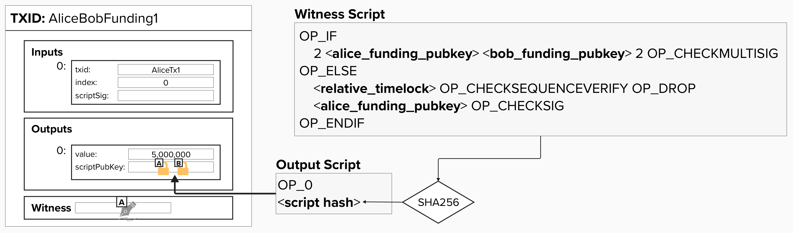

# Refund the Channel

If Bob becomes unresponsive or stops cooperating, Alice won't be able to retrieve her funds from the funding transaction! She needs a backup plan. In off-chain systems, this backup plan is often called the ability to "exit". Ideally, Alice should be able to **unilaterally exit**, meaning she can claim her funds on-chain without needing Bob's cooperation.

## Use Multiple Spending Paths and Timelocks

> ⚠️ The "Multiple Spending Paths and Timelocks" protocol is not how Lightning actually works. That said, it's a simpler payment channel construction, and it's a helpful starting point as we work towards a modern Lightning channel.

There are different ways to implement the ability to "refund" a channel balance. One approach is to **use multiple spending paths** and **timelocks** to ensure that the channel balance can be refunded to Alice if something goes wrong. For example, we can implement the following spending paths:

1. The first spending path checks if both Alice's and Bob's signatures are provided. If so, that is sufficient to satisfy the conditions on this output and spend the funds. Nice!

2. If not, we can check if a relative timelock has passed since this transaction was confirmed on chain. For example, we could add a condition that says: if 2016 blocks (~2 weeks) have passed since the funding transaction was confirmed, then Alice can spend this output to herself. **This would act as Alice "refunding" her channel balance.**

  

#### Question: What downside did the introduction of timelocks create?

  
Answer

By adding a timelock to our funding output, we essentially add an arbitrary end date to our channel, meaning it has a limited lifetime. Bob must close the channel before the timelock expires. Otherwise, Alice can take all of her funds back using the refund spending path. Ouch!

