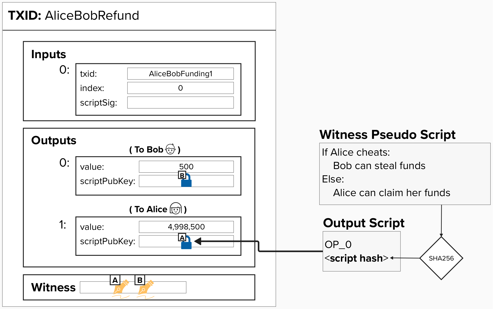

# Penalty Mechanism

A **penalty mechanism** is a rule or process designed to deter undesirable behavior by imposing negative consequences on  entities that violate the rules.

Think back to our fairness protocol example from earlier. If Alice attempted to "cheat" Bob when cutting the cake, Bob could "punish" Alice by taking the plate with more cake. Things were so simple back then!

#### Can you think of a rule or mechanism we can implement in our channel to allow one party to punish the other if they attempt to cheat? You don't have to think of the exact technical implementation just yet - a simple intuition is fine for now.

  
Answer

Within the context of commitment transactions, we can incentivize good behavior by adding the following penalty mechanism:

### If you publish an old commitment transaction, your counterparty is allowed to claim all of your funds.

To enforce this rule, we can add an additional spending path to the output such that, if Alice attempts to cheat by publishing an old channel state, Bob can claim all of her funds.

  

Implementing this rule is going to require some fun, but slightly advanced, cryptographic skillz. Head over to the next page to see how it's done!

